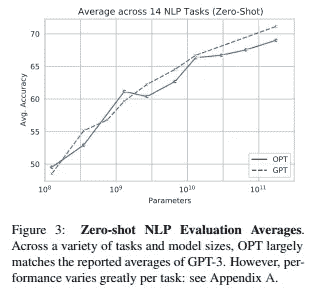
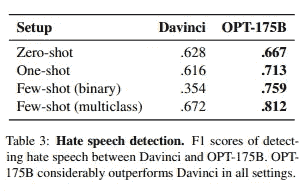
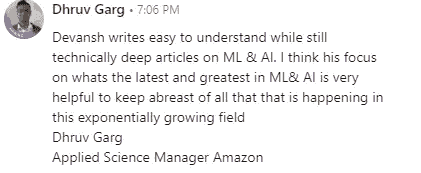
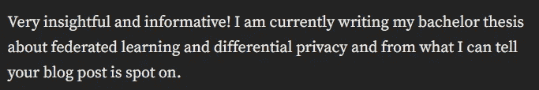

# 2023 年你应该知道的 5 个免费 ChatGPT 竞争对手。

> 原文：<https://medium.com/geekculture/5-free-chatgpt-competitors-you-should-know-about-for-2023-ff5fc48d0430?source=collection_archive---------0----------------------->

## 使用这些令人惊叹的深度学习模型来自动化任务并取得成功。

2022 年是机器学习和人工智能研究疯狂的一年。大型科技公司发布了许多令人惊叹的库，将使开发者受益匪浅。我们已经看到了一些很棒的研究论文，既有来自大型科技公司的，也有来自较小团队的。我最喜欢的是对自我组装人工智能的研究，这显示了探索人工智能替代模式的潜力。

 [## 自组装和自组织人工智能——机器学习的未来？

### 这可以改变我们对待深度学习和人工智能的方式

medium.com](/geekculture/self-assembling-and-self-organizing-ai-the-future-of-machine-learning-ef2e378823fd) 

当然，今年是大型语言模型的一年。ChatGPT 已经席卷了互联网，人们提出了各种各样的用例以及如何使用它的想法。虽然这些内容中有许多是有影响力的人创造的带有大量绒毛和错误信息的视频的产品，但这种嗡嗡声证明了这种技术背后的潜力。然而，ChatGPT 目前受到 API 和访问限制的限制。虽然它可以做一些非常酷的事情，但对于任何希望使用这些大型语言模型构建自己的应用程序的人来说，更多的开源/访问解决方案是至关重要的。在这篇文章中，我将与你分享其中的一些模型，这样你就有了选择的想法。

Photo by [Arseny Togulev](https://unsplash.com/es/@tetrakiss?utm_source=medium&utm_medium=referral) on [Unsplash](https://unsplash.com?utm_source=medium&utm_medium=referral)

# 选择

从这个列表开始，我将分享 Meta 版本的 GPT，称为开放预训练变压器，或 OPT。巴勒斯坦被占领土有几个令人兴奋的特点，使它成为 GPT 的一个可行的替代品。例如，当谈到零镜头 NLP 评估时，OPT 与 GPT 模型具有非常相似的准确性。

[Source](https://arxiv.org/pdf/2205.01068.pdf)

此外，在检测仇恨言论方面， *OPT 实际上优于达芬奇(GPT-3 的升级版)*。因此，如果这是您的解决方案的一个高优先级，OPT 就成为一个更有吸引力的选项。

This focus on hate speech detection makes perfect sense, given Zucks Metaverse Aspirations. [I analyzed how close they were here](https://open.substack.com/pub/codinginterviewsmadesimple/p/are-we-close-to-the-metaverse-storytime?r=4tnbw&utm_campaign=post&utm_medium=web)

这种模式的另一个有趣的方面是能源效率。**训练 OPT 只用了 GPT-3** 碳足迹的 1/7。这提高了它在一个更大的系统中作为一个基础模型积极互动的可行性。

> 我们开发 OPT-175B 时考虑到了能源效率，成功训练了这种大小的模型，其碳足迹仅为 [GPT-3](https://l.facebook.com/l.php?u=https%3A%2F%2Farxiv.org%2Fpdf%2F2104.10350.pdf%3Ffbclid%3DIwAR3TqMpahC8IEfCuUccMJebdfRnpfqj2Kl1Ss-ifhAzQXdAXGFpE3FLTRoE&h=AT37WK081IoUWtlCeupgRJL7KA1fFwTsPiyT2zl-bqI7dHK30c8PW2vx0gDzT3CuIRvrt7A7Q5roJcguciK9ecz-7kixFOY4IzwMx-wOscpme3EWoHmpVkr1vZU_zsyfiELySLDm2U3Ed0sclsbOHYNdQR7IEUWA) 的 1/7。这是通过结合 Meta 的开源[完全分片数据并行](https://engineering.fb.com/2021/07/15/open-source/fsdp/) (FSDP) API 和 NVIDIA 的张量并行抽象在[威震天-LM](https://l.facebook.com/l.php?u=https%3A%2F%2Fgithub.com%2FNVIDIA%2FMegatron-LM%3Ffbclid%3DIwAR1Ru3Jr-G5OadVV5G--VOYoG-Er8x9wW9GJAFrnlg_iT_j5CZepaLHTiSs&h=AT0aAh183c-gXSaMMDf3xD32ZmsL2zSTGJ-E6_CD73L4drg3aK3fS9r7J8fKG9Dv41DHiUVJon0_7ZUsd948c1qmUV_W2wazStkyXyx76FSzAhsu9iel4MnuNH0AJ3R9s0TrgkJoc7rx_9FT8fY) 内实现的。我们在 NVIDIA 的 80gb A100 GPU 上实现了大约 147 TFLOP/s/GPU 的利用率，比 NVIDIA 研究人员在类似硬件上发布的数据大约高出 17%。

期待在这个列表中再次看到 Meta。他们采用了完全开源的方法，在那里他们共享他们的模型、训练数据、日志等等。这是一个前所未有的举措，对机器学习领域有很多影响。要了解关于这一点(和 OPT 模型)的更多信息，请查看下面的文章。

 [## Meta 的挑战对 GPT-3 和开放人工智能的启示。

### 这对机器学习的未来有着巨大的影响

medium.com](/discourse/metas-challenge-to-gpt-3-and-open-ai-149c9a1f766f) 

当谈到替代 GPT 时，OPT 模型有很大的潜力，因为它似乎是作为它的替代物而设计的。然而，Meta 并不是唯一一家参赛的科技巨头。

# 手掌

为了理解为什么 PaLM 模型如此神奇，我们需要首先理解 Pathways 生态系统。Pathways 是 Google 架构，它创建了他们所有的大型语言模型。如果您对这些细节不感兴趣，想直接进入 PaLM 模型，只需向下滚动一点。细节在这一节的末尾。

谷歌的 Pathways 生态系统是大张旗鼓宣布的。今年，它在很大程度上实现了这一目标，比如 Flamingo、加托和 amazing PaLM(Pathways 语言模型)。这些模型撼动了机器学习领域，并为围绕深度学习和变形金刚的讨论做出了很大贡献。

 [## 深心火烈鸟在斯特鲁普测试中击败人类

### 摘自:https://www . deep mind . com/blog/用单一视觉语言处理多项任务-像视频和…

youtube.com](https://youtube.com/shorts/WQknR9SgpHE?feature=share) 

他们的结果令人振奋，谷歌为 LLM 及其作为 AGI 潜在垫脚石的潜力提供了几个关键的见解。上面的视频是他们的模型在某些任务上击败甚至人类的一个例子。

虽然许多人一直在谈论单个模型本身，但真正的创新是在 Pathways 架构中。路径对大型语言模型范例有 3 个主要贡献

1.  **多模态训练** -路径模型在多种类型的数据上进行训练，包括视频、图片和文本等。这使得它与主要基于文本的 GPT 非常不同。
2.  **稀疏激活-***不是将整个架构用于每个推理，而是仅将神经元的子集用于任何一个任务*。因此，您的模型可以享受大量神经元的好处(更好的性能，更多的任务)，同时保持较低的运行成本。这是突出的组成部分(根据我)。[我研究了各种稀疏激活算法，并在这里制作了一个最有希望的视频](https://youtu.be/BbLmtOxwxgw)。
3.  **使用多种感官-** 一个模型能够为不同的任务接受多种类型的输入是一回事。对于一个模型来说，在同一个任务中使用多种输入要困难得多。使用 Pathways 架构的模型能够做到这一点，这给了它们更大的灵活性。

在下一篇文章中，我已经深入研究了 Pathways 体系结构以及它是如何对疯狂的功能做出贡献的，所以如果您有兴趣了解更多信息，请查看它。

 [## 谷歌人工智能引发了机器学习的革命。

### 他们的新方法以部分激活和多任务训练为特色。你不想错过这个。

medium.com](/geekculture/google-ai-sparks-a-revolution-in-machine-learning-403f4dbf3e70) 

最近有人利用人类反馈的强化学习来提高 PaLM。这类似于 ChatGPT 如何从 GPT-3 被训练。因此，在许多方面，这种设置可能比 ChatGPT 更好(记住多模态功能)。幸运的是，他们分享了他们的工作，所以你可以看看下面的项目。

 [## GitHub-luci drains/PaLM-RLHF-py torch:RLHF(人类强化学习)的实现

### 在 PaLM 架构之上实现 RLHF(具有人类反馈的强化学习)。基本上 ChatGPT…

github.com](https://github.com/lucidrains/PaLM-rlhf-pytorch) 

许多互联网专家一直在谈论 ChatGPT 及其取代谷歌作为搜索引擎的潜力。这种可能性不大的原因有很多。然而，有另一种语言模式更适合颠覆谷歌在搜索领域的统治地位。它是由他们的竞争对手大型科技公司 Meta 制造的。告诉过你他们会再出现的。

Make sure you check out my newsletter for more insights into AI, Software, and the Tech Industry. The details about my newsletter will be at the end of the article.

# 范围

Meta 的机器学习研究人员发布了一个新的大型语言模型(LLM ),称为 Sphere。凭借其在搜索相关任务上的惊人性能，以及解析数十亿文档的能力，结合 Meta 在 NLP 方面的其他工作，Meta 已经将自己定位为扰乱搜索市场。

Sphere 能够遍历大量的信息来回答问题。它可以验证引用，甚至建议与内容更匹配的替代引用，这是我在其他地方没有见过的。

Tell me this isn’t getting you excited. Source- [How AI could help make Wikipedia entries more accurate](https://tech.fb.com/artificial-intelligence/2022/07/how-ai-could-help-make-wikipedia-entries-more-accurate/)

Sphere 的功能赋予了它有趣的潜力。它可能不足以取代谷歌成为一个全能的搜索引擎。然而，当涉及到搜索引擎的研究，这将是一个天赐良机。Sphere 的开源特性也允许人们改变模型搜索的底层语料库。这给了它很大的灵活性。根据我对这个模型的调查， **Sphere 是所有 LLM 模型中最具商业可行性的模型。**如果您想了解更多相关信息，请使用本文末尾我的社交媒体链接联系我。我很乐意通过电话/面谈来讨论这个问题。

对于有兴趣了解更多关于 Sphere 的知识的人，我在下面的文章中对 Sphere 模型和相关出版物做了详细的分析。

 [## Meta AI 向谷歌宣战。

### 通过开源大型语言模型 Sphere，Meta 进入了 Google 的地盘。并不断改进维基百科。

medium.com](/discourse/meta-ai-declares-war-on-google-1c7e58015813) 

# 花

[如抱抱脸](https://huggingface.co/bigscience/bloom)上所描述的，“ ***BLOOM 是一个自回归大型语言模型(LLM)，被训练成使用工业规模的计算资源在大量文本数据上从提示*** *继续文本。* ***这样，它能够输出 46 种语言和 13 种编程语言的连贯文本，这些文本与人类编写的文本几乎没有区别。通过将它们转换为文本生成任务，BLOOM 还可以被指示执行它没有被明确训练过的文本任务。***

不会只有你一个人看不出布鲁姆和 GPT 的区别。这不是意外。BLOOM 的诞生是为了打破技术对大型模型的束缚。在过去的几年里，科技公司一直在使用普通研究人员/团队无法复制的疯狂计算能力进行研究。这使得独立人士无法核实和批评大型科技公司发布的研究。这也导致数据科学家经常断章取义地从这些论文中获得发现，从而创造出低效和昂贵的管道。

 [## 大科学/布鲁姆拥抱脸

### 大科学大型开放科学开放访问多语言模型版本 1.3/6 2022 年 7 月当前检查点…

huggingface.co](https://huggingface.co/bigscience/bloom) 

布鲁姆试图对此进行反驳。就当是人民的榜样吧。这是一种不受大型科技公司控制的模式，从而促进自由研究。因此，如果您正在寻找 ChatGPT 的开源替代方案，BLOOM 可能是您需要的模型。我第一次开始报道是在 6 月份左右，那时这些模特还不酷。我已经得到了不错的结果。它没有 ChatGPT(或这个列表中的其他工具)强大，但鉴于它的免费性质，它可能会吸引你们当中的青少年。

This was the video I made, first reporting on Bloom. If you’re looking to keep in touch with Machine Learning, my ML News Playlist would be good for you.

# 卡拉狄加

最后，我们有另一个 Meta 模型。不，他们还没有付给我钱。还记得我提到过 Sphere 如何成为研究人员的谷歌吗？扎克不满足于只打一场比赛。他也有一个 ChatGPT，面向研究人员。

想象一个 ChatGPT，但是在很多研究文本上训练。这样的模型可以解释数学公式，帮助你写论文，为你创造乳胶，等等。这就是卡拉狄加。它可以做很多事情，不仅仅是与研究相关的任务。Yannic Kilcher 有一个很棒的视频，所以我会将它链接到那里，供有兴趣了解更多信息的人使用。

不幸的是，围绕这个模型有很多争议，这导致 Meta 将其关闭。然而，我希望他们尽快把它带回来。请留意这方面的消息(或一些变种)。这显然是一个强大的模型，可以对各种各样的人有用。

这件作品到此为止。我感谢你的时间。像往常一样，如果你有兴趣联系我或查看我的其他作品，链接会在这封邮件/帖子的末尾。[如果你喜欢我的作品，我会非常感谢一封匿名推荐信。你可以把它放在这里。](https://docs.google.com/forms/d/1Oco7l3A-rE6Ao4E0mB2hgwO6W4nWXwQz3sCa_IYQM5s/edit)如果你在这篇文章中发现了价值，我会很感激你与更多人分享。

对于那些有兴趣让你的技能更上一层楼的人，请继续阅读。我有你会喜欢的东西。

用我的时事通讯“让技术变得简单”升级你的技术职业！借助专家见解、技巧和资源，在人工智能、软件工程和技术行业保持领先。 [**点击此链接，新用户可享受 20%的优惠。立即订阅，简化您的技术之旅！**](https://codinginterviewsmadesimple.substack.com/subscribe?coupon=1e0532f2)

# 向我伸出手

使用下面的链接查看我的其他内容，了解更多关于辅导的信息，联系我了解项目，或者只是打个招呼。

[如果你喜欢我的作品，我会非常感谢一封匿名推荐信。你可以把它放在这里。](https://docs.google.com/forms/d/1Oco7l3A-rE6Ao4E0mB2hgwO6W4nWXwQz3sCa_IYQM5s/edit)

为了帮助我了解您[填写这份调查(匿名)](https://forms.gle/7MfQmKhEhyBTMDUD7)

查看我在 Medium 上的其他文章。:[https://rb.gy/zn1aiu](https://rb.gy/oaojch)

我的 YouTube:[https://rb.gy/88iwdd](https://rb.gy/88iwdd)

在 LinkedIn 上联系我。我们来连线:[https://rb.gy/m5ok2y](https://rb.gy/f7ltuj)

我的 insta gram:[https://rb.gy/gmvuy9](https://rb.gy/gmvuy9)

我的推特:[https://twitter.com/Machine01776819](https://twitter.com/Machine01776819)