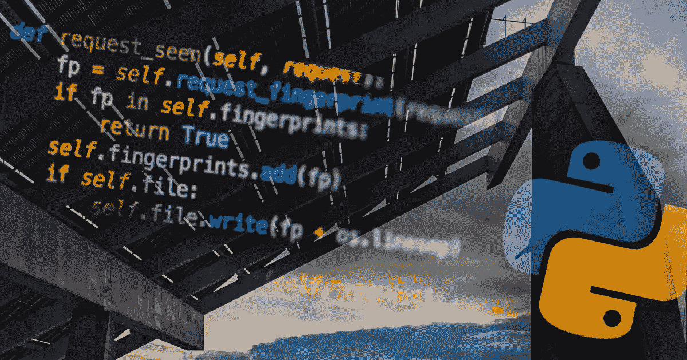

# 2022 年学习 Python 的 5 门免费课程

> 原文：<https://medium.com/geekculture/5-free-courses-to-learn-python-in-2022-85d5c4f3520b?source=collection_archive---------13----------------------->

## 只有文字教程，只有硬核

My own creation

我相信最好的学习方法是边做边学(当然是边听好音乐)，但是在现代社会，视频正成为越来越有影响力的获取新信息的来源。很多人忘记了文本仍然存在。视频很棒，很多时候老师在他们的教程中很好地解释了这个话题…