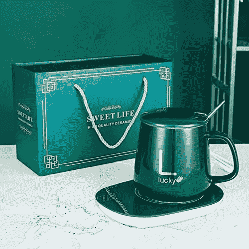
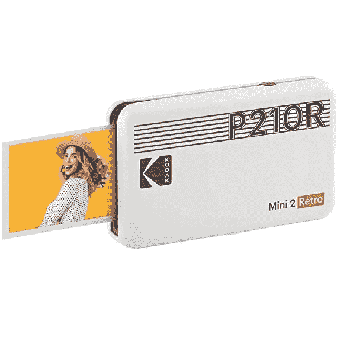
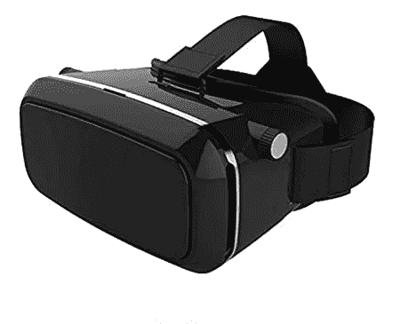
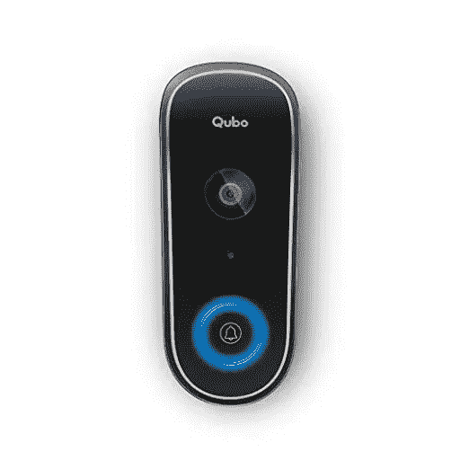

# 给你的技术朋友的 5 份礼物

> 原文：<https://medium.com/geekculture/5-gifts-for-your-techie-friends-4b7fc64d65ff?source=collection_archive---------15----------------------->

当要为我的朋友和爱人决定礼物时，我很难选择。不管他们喜不喜欢，成千上万的问题涌上心头。特别是，当你的朋友是程序员或编码员时，这就变得太难了。既然这些家伙相信通过使用他们的编码使手工工作自动化会使人们的生活更容易，为什么不在这个领域给他们一些东西呢？

在这里，我为这些朋友寻找了一些科技礼物-

# 1.咖啡、牛奶、茶、可可、水自动恒温智能杯加热器

我们知道这些程序员的朋友和爱人对他们的编程如此热情，以至于有时他们只是迷失在他们的笔记本电脑中，以至于忘记了他们的咖啡。所以为什么不送他们一个咖啡保温器，让他们的咖啡保持在适合他们的温度。

自动恒温智能杯加热器咖啡加热器旨在使您的饮料保持恒温，并全天保持这一温度，一个舒适的温度。恒温杯垫让你随时享受热咖啡。我们的电热杯可以降低热饮的冷却速度，全天维持。既不太热也不太冷。特别适合在寒冷的天气使用。[这是一个链接，你可以在这里看到。](https://www.amazon.in/Coffee-Beverage-Automatic-Thermostatic-Multicolor/dp/B09SLSDS58/ref=sr_1_2_sspa?adgrpid=64489438019&ext_vrnc=hi&gclid=Cj0KCQjwl7qSBhD-ARIsACvV1X3WiBlJOxBGwOT4edxrrl0tiz6Q3yCSv8_lQe_RSeBWNjSJM1swfDAaAkZLEALw_wcB&hvadid=381600791255&hvdev=c&hvlocphy=9061992&hvnetw=g&hvqmt=b&hvrand=14713367826630734423&hvtargid=kwd-424702002901&hydadcr=10528_1908266&keywords=cup+and+warmer&qid=1649345245&sr=8-2-spons&psc=1&spLa=ZW5jcnlwdGVkUXVhbGlmaWVyPUEyNzVJVTUzVUFXMFBZJmVuY3J5cHRlZElkPUEwMDYxMDQ1MU83TDRKWFRYM0kyMCZlbmNyeXB0ZWRBZElkPUEwNzU5MDMxSFU4Wk4zUTROVkpKJndpZGdldE5hbWU9c3BfYXRmJmFjdGlvbj1jbGlja1JlZGlyZWN0JmRvTm90TG9nQ2xpY2s9dHJ1ZQ==)这在亚马逊上可以买到，价格为【1149 卢比/-

Automatic Thermostatic Smart Cup Heater

**2。柯达 Mini 2 复古便携式照片打印机，2.1x3.4 英寸**

如今，我们都变得太数字化了。我们所有的照片只保存在设备上。当它们被点击时，我们看到它们，否则，我们甚至不会被打扰。如果你送给你的朋友一些东西，可以让他们在任何时候打印出他们的旧照片，一个可以让他们打印照片的设备，他们可以在办公桌上使用它来记住一些过去的时刻。他们也可以通过回忆这些珍贵的时刻感到快乐。

柯达 Mini 2 复古照片打印机支持边框和无边框类型的照片。用边框字体写下你的记忆，这样它们会永远存在。打印无边框类型以获得更大尺寸的照片。您可以下载柯达照片打印机应用程序，随时随地进行打印。您可以使用有趣的增强现实功能和其他装饰功能，如美颜、滤镜、相框等。[你可以在这里找到更多细节](https://www.amazon.in/Kodak-Mini-Retro-Portable-Printer/dp/B08BL93M5R/ref=sr_1_1_sspa?crid=1HRZZTTOZ6QFO&keywords=photo%2Bportable%2Bprinter&qid=1649345887&sprefix=photo%2Bportable%2Bprinte%2Caps%2C339&sr=8-1-spons&spLa=ZW5jcnlwdGVkUXVhbGlmaWVyPUExNURMOTZINTdKRUVDJmVuY3J5cHRlZElkPUEwMDgyMjEyMUdNU1BDQ0REWDQ2ViZlbmNyeXB0ZWRBZElkPUEwOTQ0MDk2TU9aVE1BWTVWSkhVJndpZGdldE5hbWU9c3BfYXRmJmFjdGlvbj1jbGlja1JlZGlyZWN0JmRvTm90TG9nQ2xpY2s9dHJ1ZQ&th=1)。这在亚马逊**上可以买到，价格为 8999 卢比/-**

**Kodak Mini 2 Retro Portable Photo Printer, 2.1x3.4”**

**3。用于 3D 视频电影的全新虚拟现实耳机，兼容所有智能手机的游戏耳机**

如果你的朋友喜欢看 3D 电影和玩电子游戏，那么这可能是给他们最好的礼物。这些 3d 虚拟现实 2.0 耳机将在玩游戏和观看 3d 视频时，将您的朋友带入一个身临其境的精彩虚拟世界，使用这款 3d 虚拟现实设备，他们会发现这个世界非常神奇。这些 3d 眼镜将是你作为礼物的最佳选择。你可以在这里找到更多细节。这在亚马逊**上可以买到，价格为 8999 卢比/-**

**Virtual Reality Headset for 3D Video Movies, Gaming**

**4。LED 触摸灯蓝牙音箱，无线 HiFi 音箱灯，USB 充电便携带 TWS 适合聚会节日露营**

如果您的朋友喜欢听音乐，您可以将这款 LED 触摸灯蓝牙音箱作为礼物送给他们。这会产生不同的灯光，让房间充满五颜六色的灯光，让心情更加舒缓和放松。

智能触摸 led 情绪灯加蓝牙扬声器是一种多功能、智能、低调、简单的无线音乐播放器。它发出一种柔和的光，既有趣又无害。不同亮度级别的暖白光，轻敲传感器会改变亮度或关灯。触摸扬声器两秒钟将切换到彩色模式，颜色会发生变化。你可以在这里找到更多细节。这款在亚马逊**上有售，售价 498 卢比/-**

**LED Touch Lamp Bluetooth Speaker**

5.**英雄集团 Qubo 智能 WiFi 无线视频门铃**

通过门铃的即时访客视频通话功能，您可以随时随地从朋友的前门与他们保持联系。它通过一个 1080P 全高清摄像头和一个先进的内置入侵报警系统巧妙地保护了你家的入口。围绕您的生活定制— 36 种独特的铃声可供选择，多种模式如“请勿打扰”,让您完全安心。当你忙的时候，它会用清晰的双向对话和倾听你的访客，或者用预先着色的信息来回应。它结合了先进的人工智能功能，可以智能地检测和通知任何时候有人被检测到。如果有人闯入，你也可以鸣警笛。你可以在这里找到更多细节。这在亚马逊**上有售，售价 6980 卢比/-**

**Qubo Smart WiFi Wireless Video Doorbell from Hero Group**

在这里，我给了你一些礼物的想法，送给你痴迷于科技的朋友和爱人。希望你会觉得有用。感谢阅读这篇文章。