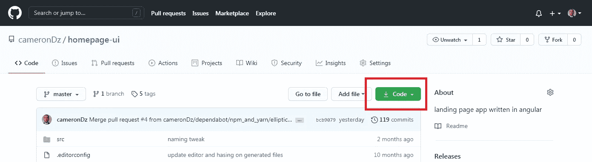
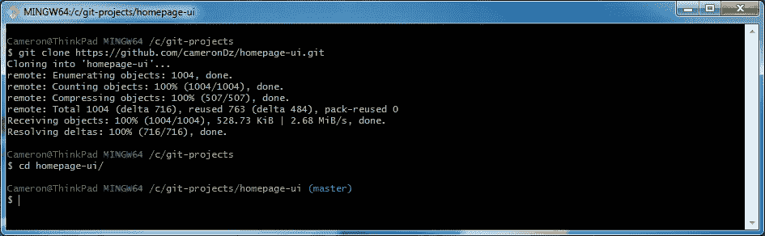
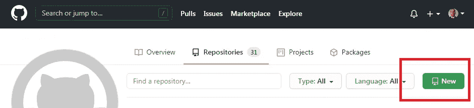
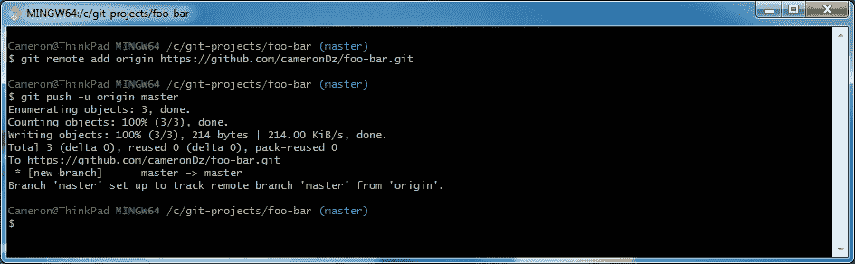

# 使用远程存储库时的 5 个 Git 命令

> 原文：<https://medium.com/geekculture/5-git-commands-when-working-with-remote-repositories-95486063b17c?source=collection_archive---------2----------------------->

精通 git 会让你很快成为团队中有价值的一员。学习像 git 这样的技术的最好方法是为您所用。这里有几个命令可以让你开始使用远程存储库。


Photo by [Florian Wehde](https://unsplash.com/@florianwehde?utm_source=medium&utm_medium=referral) on [Unsplash](https://unsplash.com?utm_source=medium&utm_medium=referral)

# 先决条件

为了使用这些命令，您需要在您的机器上安装 git 和 Git Bash。你可以在这里下载 Git，它会让你选择安装 Git Bash。你还会想注册一项服务，让官员们免费获得在线曲目。GitHub 是一家受欢迎的托管公司，你可以注册一个免费账户，提供免费的公共存储库[这里](https://github.com/join)。

一旦您在本地机器上设置了 git，并且有了可以使用的服务器，我们就可以开始了。

# 1.git 克隆

为了开始使用远程存储库，您需要的第一个命令是 git [clone](https://git-scm.com/docs/git-clone) 命令。要运行该命令，在“克隆”之后，将 URL 放入服务器的。git 文件。像 GitHub 这样的服务会给你一个库的 URL 来复制一个库。



GitHub button to get URL for repository.

获得 URL 并运行命令“git clone <url>”后，git 会创建一个新目录来存放存储库的内容。</url>



Pulling down a repository from GitHub.

现在您可以进入存储库并开始工作了。

# 2.git 远程添加

虽然 clone 命令用于从服务器获取现有的存储库，但是如果您想要为本地机器上的存储库设置一个远程服务器，您将使用 [remote add](https://git-scm.com/docs/git-remote) 命令。

您需要做的第一步是在服务器上创建一个存储库。在 GitHub 上，在你的个人资料中，点击“新建”按钮。



Click “New” button on the Repositories tab to create new repository.

在您的本地机器上，如果您没有存储库设置，您可以在 Git Bash 中用以下命令初始化一个新的存储库。

```
$ mkdir foo-bar
$ cd foo-bar
$ git init
$ touch .gitkeep
$ git add .
$ git commit -m "initial commit"
```

现在，在存储库中，你可以运行“git remote add <name><url>”。该名称是服务器的名称引用，通常是“origin”。URL 值可以从设置空存储库的 GitHub 页面中获取。添加远程服务器后，您可以将本地存储库移动到服务器。推送的时候会要求你认证，之后会看到如下图的提示信息。</url></name>



Running commands to up remote server.

# 3.git 推送

git [push](https://git-scm.com/docs/git-push) 命令将获取任何本地提交，并将它们移动到远程存储库。我们用它将新的存储库移动到服务器上。使用“git push”时有几个选项需要了解。

在上面的例子中，使用了“-u”标志。该标志实际上是"- setup-upstream "的简写，它将您的本地分支设置为指定远程服务器上的关联分支。

```
git push --set-upstream origin master
```

在示例中运行该命令时，它将当前的本地分支“master”设置为我们在远程服务器上设置的分支“origin”和我们称为“master”的分支。

您应该知道的另一个推送选项是“- delete”选项。这用于清理远程服务器上不再需要的旧分支。与 upstream 命令类似，要删除一个分支，您需要在分支的名称后面加上服务器的名称。下面是一个从名为“origin”的服务器中删除“old-branch”分支的示例。


Removing an old branch from the remote sever

# 4.获取 git

[fetch](https://git-scm.com/docs/git-fetch) 命令用于更新对远程分支或标签的任何引用。这意味着您将从远程服务器下载这些更改，并且本地存储库将知道已经发生的更改，但是这些更改不会对本地存储库分支进行。

假设你正在做一个项目，你在本地机器上的分支“foo-bar”上。您还将这个分支推到了远程，一个朋友/同事也在处理这个分支。处理分支的另一个人提交一些更改，并将它们推送到远程。然后，他告诉您这些变化，您运行命令“git fetch”。更改将会出现，您将会得到类似于下面的消息；

```
Your branch is behind 'origin/foo-bar' by 1 commit, and can be fast-forwarded.
```

在同一分支上的本地存储库中，您可能有一些尚未推送到远程存储库的提交。在这种情况下，您会看到类似下面的消息。

```
Your branch and 'origin/foo-bar' have diverged, and have 3 and 1 different commits each, respectively.
```

“fetch”命令的主要目的是记住，您拥有来自远程分支的变更的引用，在示例中是“origin/foo-bar ”,但是它们还不在您的本地存储库中。下一个命令将用于将这些更改保存到您的本地存储库中。

# 5.git 拉

最后一个命令是[拉动](https://git-scm.com/docs/git-pull)的命令。pull 命令用于获取远程存储库中发生的任何更改，并将它们移动到您的本地存储库中。当您运行“git fetch”时，远程系统上的更改引用会出现在您的本地存储库中。当您运行“git pull”时，您实际上是将更改放入了您的存储库中。

在运行“拉”之前运行“取”通常是一个好的实践，这样您可以看到实际进入您的分支的是什么——如果您愿意，您可以检查远程存储库日志，但是通常查看是否有任何提交应该足以知道您将什么放入您的本地存储库中。

如上所述，当您获取远程分支的最新代码时，您会发现您的本地分支与远程分支有分歧。在这种情况下，您可以将远程的更改拉入您的本地分支，但是为了这样做，您需要创建一个合并提交。如果存在合并冲突，您将需要在能够拉取之前解决它们——当同一文件在同一行上有更改，而 git 不知道应该使用什么更改时，就会发生合并冲突。

如果没有合并冲突，您的终端将打开 Vim 以创建合并消息。您将看到输入提交消息的提示。

```
Merge branch 'foo-bar' of https://github.com/cameronDz/bar-foo-project into foo-bar
# Please enter a commit message to explain why this merge is
# necessary, especially if it merges an updated upstream into a
# topic branch.
# Lines starting with '#' will be ignored, and an empty message
# aborts the commit.
```

如果你之前没有使用过 Vim，可能会有点混乱——为了保持默认消息，你可以按 ESC 键，然后当你看到终端底部的光标时，输入“:wq”。这将保存并退出 Vim，保存提交消息并完成合并。

# 结论

本文中的命令只是使用 git 远程存储库的基础——但它足以让您入门，了解和理解它们将有助于您和您的团队编写软件。链接的文档包含所有不同的选项，以及对存储库中具体发生了什么的更深入的定义。git 用得越多，就越不吓人，越容易使用。

希望这篇文章有所帮助。编码快乐！