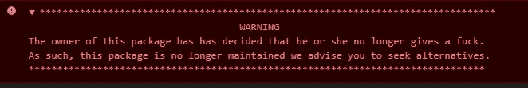
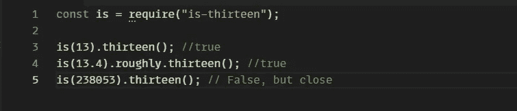
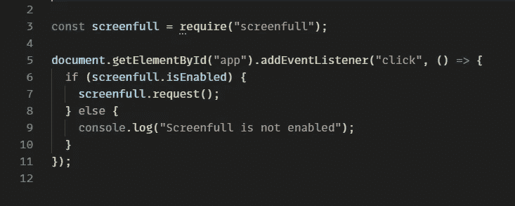
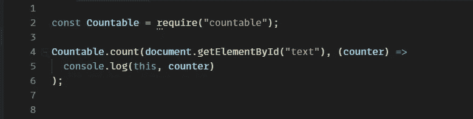

# 5 个你从未听说过的超棒的 JavaScript 库

> 原文：<https://medium.com/geekculture/5-interesting-javascript-libraries-youve-never-heard-of-6a9d18ba38ad?source=collection_archive---------24----------------------->

准备好看看一些强大而又小巧的 JavaScript 库吧。


Photo by [Axel Vandenhirtz](https://www.pexels.com/@axel-vandenhirtz-332204?utm_content=attributionCopyText&utm_medium=referral&utm_source=pexels) from [Pexels](https://www.pexels.com/photo/black-spiral-staircase-929282/?utm_content=attributionCopyText&utm_medium=referral&utm_source=pexels)

```
· [What’s special about these libraries?](#c66a)
· [1\. F*ckIt.js](#1566)
· [2\. is-thirteen](#b5bc)
· [3\. Thanos.js](#c1f8)
· [4\. screenfull.js](#b29f)
· [5\. Countable.js](#dd8c)
· [Conclusion](#5565)
```

# 这些图书馆有什么特别之处？

这些 JavaScript 库的特别之处在于它们只是为了好玩，有些甚至不会给你的项目带来任何真正的价值。所以今天我们将从不停的编码马拉松中休息一下，看看这些令人敬畏的库。

# 1.F*ckIt.js

清单上的第一个是我个人的最爱， **F*ckIt.js** 。基本上，它是一个“JavaScript 错误压路机”，根据文档 **F*ckIt.js** 将使用最先进的技术使我们的 JavaScript 代码编译，不管它喜欢与否。它反复编译你的代码，如果它检测到错误，它会像从未发生过一样删除那行代码，这个过程会一直重复，直到你的 JavaScript 代码完全没有错误，即使什么都没有留下。它能完成任务。一旦你把这个库导入到你的代码中，还有一个可爱的注释。



Lovely note left by the author

图书馆链接—【https://github.com/mattdiamond/fuckitjs 

# 2.是-十三

如果你想知道这个库是否检查一个数字是否是 13，那么你是 100%正确的，但是如果你认为它做了除此之外的任何事情，恐怕你错了。每当我记不住 13 是什么的时候，它就非常方便。下面是如何使用它的一个例子。



Example of is-thirteen

链接到图书馆—[https://github.com/jezen/is-thirteen](https://github.com/jezen/is-thirteen)

# 3.Thanos.js

接下来，我们有了另一个很棒的库，可以帮助我们减少多达 50%的代码，你猜对了。我们都记得几年前灭霸毁灭了半个宇宙。现在，他的新目标是帮助开发人员清理他们的代码。安装此库后，您可以运行两个命令。使用风险自担。

```
thanos-js snap-fingersthanos-js snap-fingers --with-glove
```

图书馆链接—[https://thanosjs.org](https://thanosjs.org/)

# 4.screenfull.js

这实际上是一个非常有用的库，您可以在项目中实现它。js 将允许你全屏显示元素或整个页面。更不用说，这个库是轻量级的，易于实现。下面是一个如何使用它的例子。



Screenfull.js example

图书馆链接—[https://github.com/sindresorhus/screenfull.js](https://github.com/sindresorhus/screenfull.js)

# 5.Countable.js

这个方便的库将为你的任何 HTML 元素添加一个动态段落、单词和字符计数器。当您想要限制用户可以在某个文本字段中输入的字符数时，这可能特别有用。使用这个包，您可以向用户显示一个实时计数，以帮助他们避免达到限制。下面是另一个例子。



Countable.js example

Countable 也是一个零依赖性的库，一旦缩小和压缩，只有 1KB，这对一些开发人员来说是一个很大的优势。

图书馆链接—[https://github.com/RadLikeWhoa/Countable](https://github.com/RadLikeWhoa/Countable)

# 结论

有成千上万的 JavaScript 库，从上面的例子来看，有些在开发新应用时非常方便，有些只是为了好玩。我已经提供了每个库的链接，所以请查看并尝试它们。同时，这里有一些其他的文章也是我写的。

[](https://javascript.plainenglish.io/axios-vs-fetch-aeaec89023b3) [## Axios 与 Fetch:哪个更好？

### 探索 Axios 和 Fetch 之间的差异，并最终找出哪个更好。

javascript.plainenglish.io](https://javascript.plainenglish.io/axios-vs-fetch-aeaec89023b3) [](https://jrpotatodev.medium.com/how-to-create-a-simple-web-server-using-node-js-2021-5c3e89833128) [## 如何使用 Node.js (2021)创建一个简单的 web 服务器

### 使用 Node.js 的简单 web 服务器(2021)

jrpotatodev.medium.com](https://jrpotatodev.medium.com/how-to-create-a-simple-web-server-using-node-js-2021-5c3e89833128)