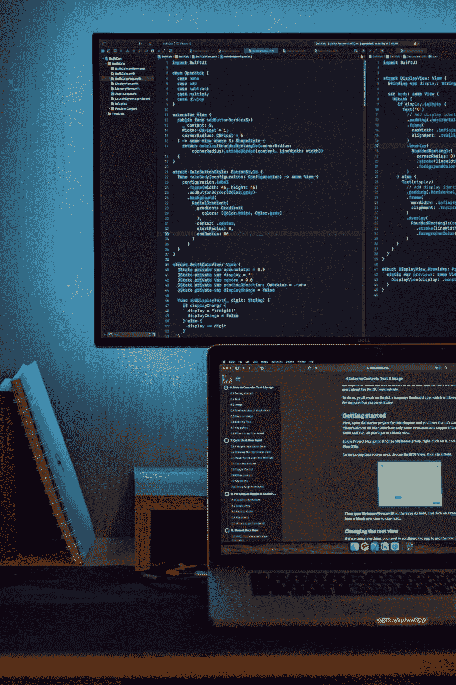

# 5 成为更好的 iOS 开发者的 iOS 项目

> 原文：<https://medium.com/geekculture/5-ios-project-to-become-a-better-ios-developer-84ff8e339558?source=collection_archive---------10----------------------->

## 增强你的发展

Photo by [Safar Safarov](https://unsplash.com/@codestorm?utm_source=medium&utm_medium=referral) on [Unsplash](https://unsplash.com/?utm_source=medium&utm_medium=referral)

如果你想擅长开发，最好的方法之一就是阅读大量的代码。开源项目是最有价值的资源，在那里我们可以阅读代码，了解最佳实践、编码风格等等。

IOS 应用程序开发是软件开发中需求最大的领域之一。今天我们将…