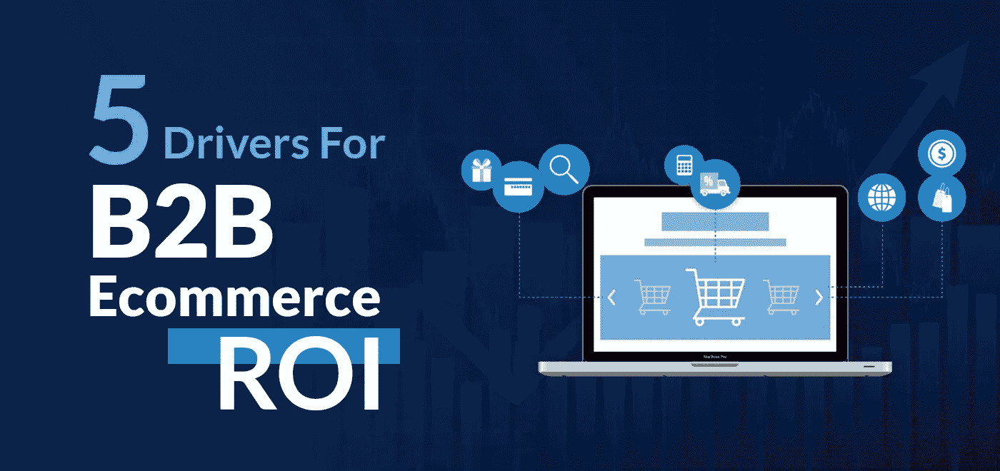
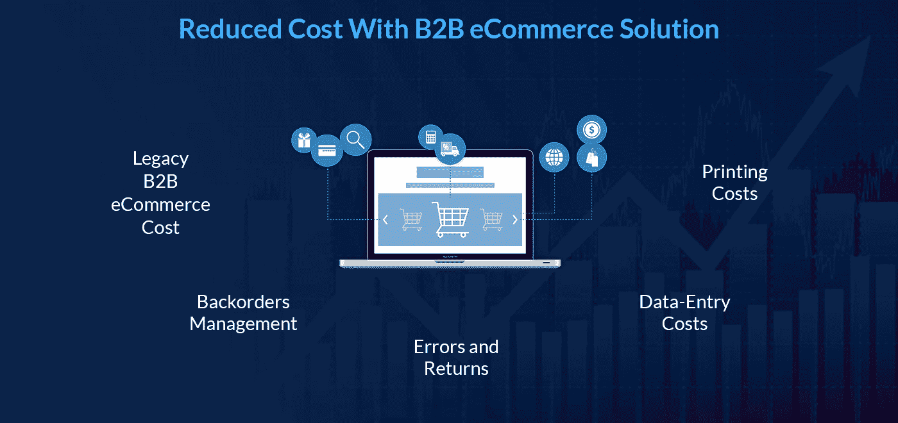

# B2B 电子商务投资回报率的 5 个关键驱动因素

> 原文：<https://medium.com/geekculture/5-key-drivers-for-b2b-ecommerce-roi-b921b01f9e6e?source=collection_archive---------16----------------------->

B2B 企业在疫情时期的唯一生存之道是保持数字化。在 Covid 期间，约有 55%的公司依赖传统销售，这一比例最近已降至 21%。

一直在观察这种数字变化的 B2B 领导者表示，这种变化将伴随我们很长时间。买家也更喜欢在线体验，大约 47%的买家倾向于自助服务模式。

客户希望获得更加个性化的体验，允许他们在线订购、重复订购、获得推荐等等。由于潜在客户以数字化方式进行产品搜索，以发现供应商在一些最有前途的平台(如谷歌和亚马逊)上提供的新品，这为 B2B 制造商和分销商采取行动提供了平等的机会。

# 为什么 B2B 电子商务？

每个 B2B 品牌必须问自己的问题是 **B2B 电子商务发展**如何影响投资回报率。让我们挑选一些可以帮助您计算投资回报率的离线 B2B 流程，但在此之前，让我们了解一下您如何通过数字方式降低成本，同时使 B2B 流程更加简单和透明。

# 通过 B2B 电子商务解决方案降低成本

的确，一种尺寸并不适合所有人，因为每个企业都是独特的，需要独特的解决方案来满足其需求和目标。然而，这里有一些任何传统的 B2B 电子商务业主面临的常见情况，可以通过转移到数字环境来消除。

**传统 B2B 电子商务成本** —使用过时的 [**电子商务网站设计的传统解决方案**](https://www.a3logics.com/ecommerce-website-design) 需要大量成本来不时地维护和升级。如果当前的解决方案多次中断，妨碍了您的业务，那么您的成本可能会超过修复它的投资。

实施灵活、可定制且强大的数字解决方案可以解决许多问题。集成了最新的尖端技术。一个数字解决方案还受到一个高效开发团队的支持，他们总是在那里帮助解决方案。

**延期交货管理** —延期交货被认为是 B2B 商务的支柱。这是一种传统的商业方式，忠诚的买家向卖家订购，这有助于商业的可持续性。当买方在不知道卖方库存的情况下订货时，延期交货的过程变得极其困难。他们不得不等待库存供应和进一步的交货，这意味着进一步的业务延迟。

让事物数字化可以解决这些问题。数字解决方案可以让买家检查库存的可用性，这有助于提出进一步的请求。数字解决方案可以节省买家和卖家处理延期交货和决策的大量时间，同时将时间花在其他业务功能上。

**错误和退货** —当买家退回他们的订单时，会让卖家心碎。在这一过程中，卖家承担了损失、物流成本和一大堆麻烦。在商业中，由于许多原因，退货是必然发生的。

借助功能齐全的电子商务解决方案，这个问题也可以最小化。借助 B2B 电子商务数字化解决方案，您可以实现流程透明，减少冲突，保持沟通顺畅，并保持健康的关系。

**数据录入成本**——传统的记账方法是最烦人、最复杂的，在管理时不能出错。即使你任命了一名专业人员，你也必须持续监控数据。

集成一个伟大的数字商务平台可以自动同步到您的帐户系统&将释放资源来处理最重要的任务，而不是手动添加数据。

**印刷成本** —印刷目录、表格、横幅等是一项非常耗时的手工工作，其中也包含大量成本。打印最糟糕的地方是一旦完成就不允许任何更改。因此要做出改变，也是一项全新的工作和成本。

有了数字电子商务平台，你可以随时定制目录和表格的设计、文本和风格，而无需为任何改变支付额外的费用。电子商务是一种灵活的方法，可以始终与客户的需求和市场的发展保持同步，不像传统方法那样缓慢而费力。

# B2B 市场是如何运作的？

B2B 市场是不言自明的，客户和卖家都是销售和购买产品的企业主。它还指所有针对其他企业或组织的营销努力、策略和战略。

B2B 营销有助于公司推广其产品或服务，这些产品或服务可用于日常业务运营、生产或转售给他人。

**B2B 电子商务解决方案**的目标受众包括业务主管、采购人员以及代表公司做出采购决策的其他人员。

相比之下，B2C 的目标是个人购物者或消费者。数字颠覆或数字变革无疑是品牌的福音，然而，它们比以往任何时候都更缺乏时间。

现在是时候量化机会成本，同时计算如果您的员工不受遗留管理系统的束缚，他们可以做些什么。员工可以更专注于留住客户，开展促销活动以增加收入，甚至花时间与批发客户或零售商在一起。让我们进一步解读 B2B 电子商务提供的收入机会。

# 衡量电子商务投资回报率时要考虑的因素

潜在的收入流变化可以带来一个方面。因此，为了更好地了解情况，必须考虑其他几个可能会对 B2B 电子商务平台产生重大影响的因素。

# 风险缓解

在处理库存和供应链管理、供应链管理、税收遵从、发票管理等的某些行业中，操作过程中的错误会带来麻烦和更多风险。从长远来看，这些方面的失误会导致巨大的损失。

集成在 **B2B 电子商务软件**中的智能自动化可以提高内部流程和数据的可见性。该平台减少了业务中的运营错误，从而在计算投资回报时增加了权重。

# 市场份额(最近)

整合智能 B2B 电子商务使你的公司敏捷，聪明，并在营销你的品牌和产生线索的效率。有了这些设施，你可以展示收入的增加。

然而，我们分享了业务可伸缩性并不完全依赖于收入，因为有巨头坐在最顶端的位置，带走了最大的受众。整体性能的提高使得 B2B 电子商务的投资物有所值。

# 增强性能的网站

一个陈旧且运行缓慢的网站会导致多种负面后果，比如延迟销售、效率低下和客户不满。当你的网站运行缓慢或表现不佳时，很容易判断出来。你将开始收到更多的跳出率，你的网站的加载时间将变得缓慢，导致低流量和更多的现场搜索。

将当前网站发展成 B2B 电子商务可以给你的企业带来实实在在的好处。一个灵活且易于定制的平台可以解决所有与 SEO 和开发相关的问题，以鼓励更多的受众，从而提供长期的投资回报。

# 总效率

使用 B2B 电子商务提高了效率，因为它们与人工智能和人工智能等先进技术相结合。这些技术可以自动化日常和重复性的任务，如库存管理、订单处理、聊天机器人等。

自动化还能释放资源，让他们专注于其他关键任务，这将有助于增加销售额和收入。

公司必须对现有流程进行效率评估，以帮助他们计算新的 AB2B 电子商务平台产生的基本成本和收入效率。

# 客户满意度

随着数字商务中多种选择的增加，消费者更喜欢品牌。个性化是他们寻求的东西，包括速度、支付的便利性等等。

当你的网站失败时，客户会转向其他选择，导致难以留住客户。一个强大的 B2B 电子商务平台可以消除提高投资回报率的可能挑战，增加更高的客户终身价值的机会。

# 简单地说-

投资 B2B 电子商务已经成为当务之急。B2B 电子商务将有助于满足现代客户的需求，同时为企业带来大量的机会。然而，公司应该及时评估网站的表现，并准备一个全面的方法来超越仅仅是收入的提高。

激发这些关键因素可以帮助公司进行令人信服的 B2B 电子商务投资，以建立一个里程碑，确保业务的持续可扩展性。