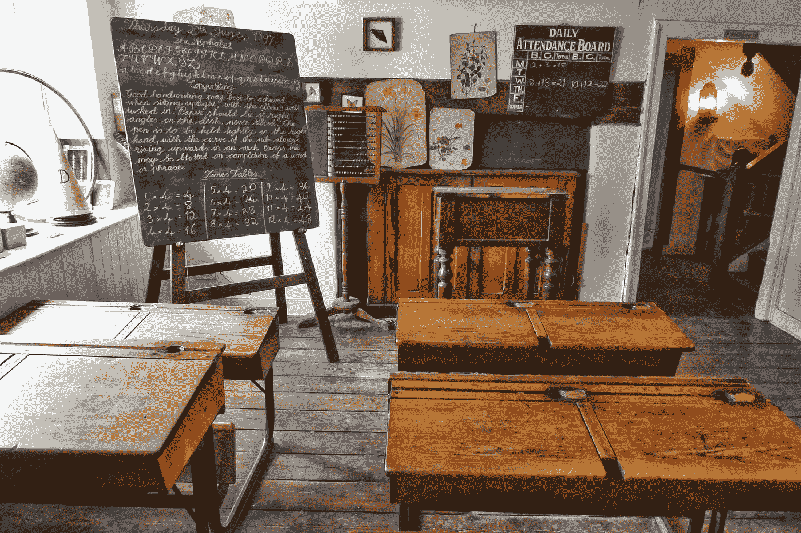

# 从我们第一个失败的应用中吸取的 5 个教训

> 原文：<https://medium.com/geekculture/5-lessons-learned-from-our-first-failed-app-59d7ac1daef0?source=collection_archive---------30----------------------->

从我们第一个失败的应用中最大的五个收获

Photo by [Belinda Fewings](https://unsplash.com/@bel2000a?utm_source=medium&utm_medium=referral) on [Unsplash](https://unsplash.com?utm_source=medium&utm_medium=referral)

我们构建的第一个应用程序——超级细致的事件协调器(SMEK ),最终因应用程序的多个问题而被召回。在这篇文章中，我们将讨论这款应用失败的 5 个最大教训，希望读者不要犯和我们一样的错误。