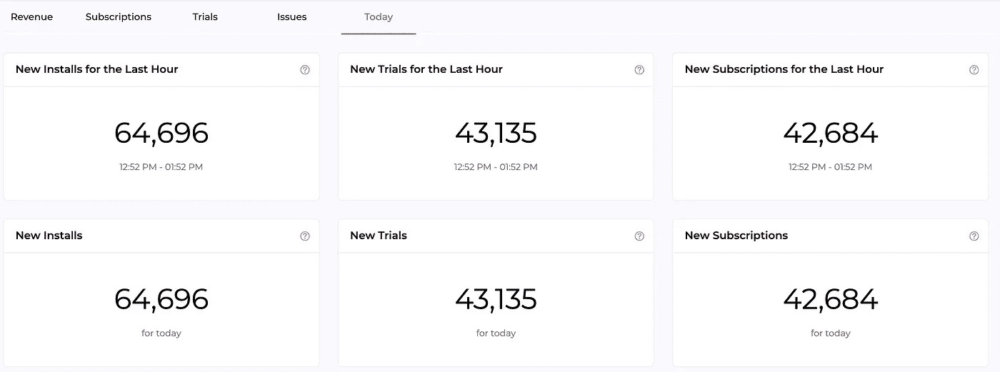
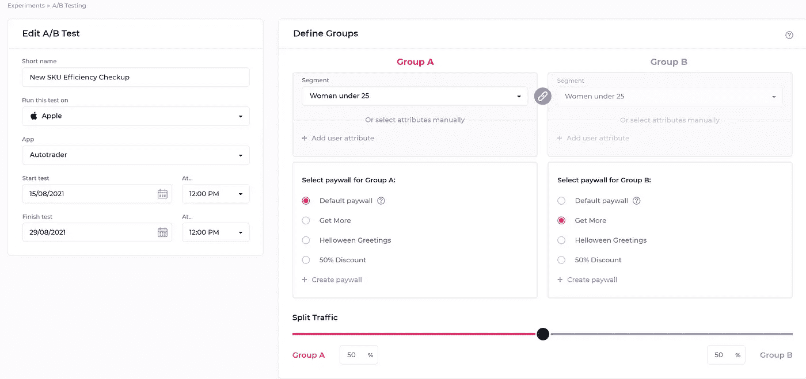
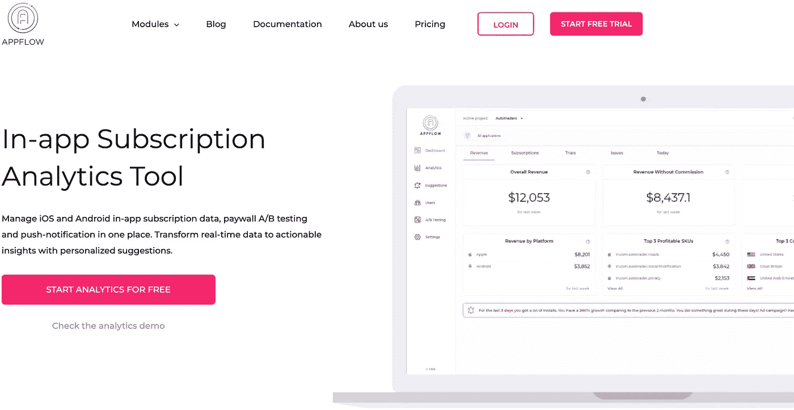
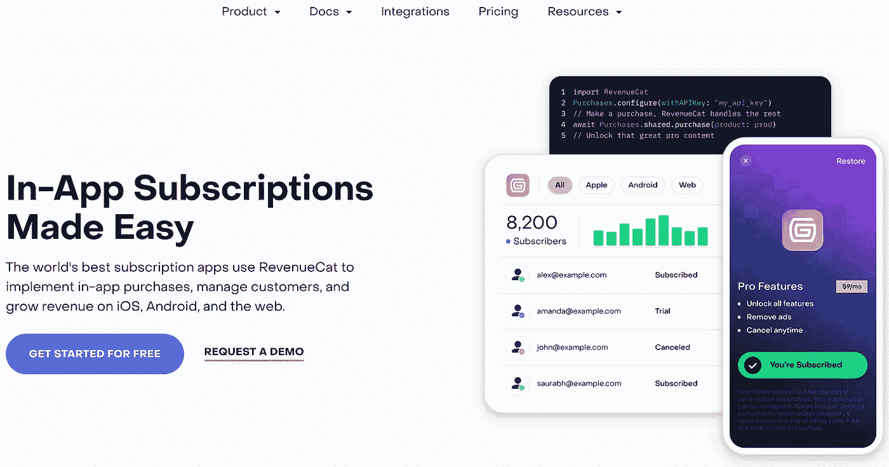
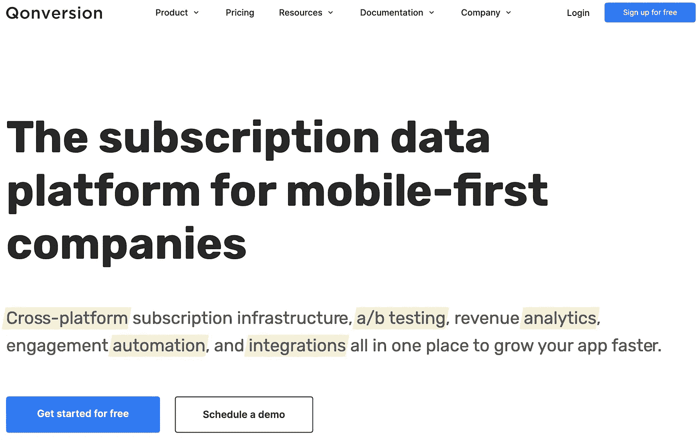
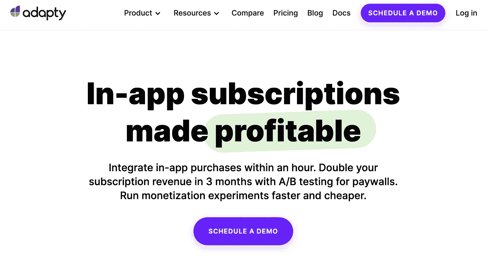

# 你应该知道的 5 个移动订阅分析工具

> 原文：<https://medium.com/geekculture/5-mobile-app-subscription-analytics-tools-you-should-know-4e91cdb7527b?source=collection_archive---------12----------------------->

“什么是支持移动和推动移动消费？简单的答案是应用内订阅。”引自 [Data.ai](https://www.data.ai/en/insights/market-data/subscriptions-powering-mobile-apps/) 。

订阅是应用经济中一种日益增长的盈利模式。因此，自然地，以一种高效而有洞察力的方式管理订阅数据已经成为所有基于订阅的应用程序的一项关键任务。

通常，应用公司可以建立自己的订阅数据平台，或者使用第三方应用内订阅分析工具来完成这项工作。因此，在这里，我们想讨论使用第三方订阅平台的好处和市场上的选择。


[In-app Subscription Tools](https://www.appflow.ai/blog/5-mobile-app-subscription-analytics-tools)

# 什么是移动订阅分析工具？

移动订阅分析工具是监控基于订阅的应用的应用内性能的软件。使用数据分析工具通常需要在应用程序上安装 SDK。安装后，订阅工具能够从移动应用程序中捕获、测量和收集用户订阅数据/事件。收集的信息通常会显示在订阅分析工具的控制面板上。通过这种方式，厂商可以了解其应用的实时订阅数据，如收入、更新订阅、取消订阅、流失率等。并洞察用户的行为。

# 使用订阅分析工具有什么好处？

除了那些已经建立了自己的订阅分析仪表板的公司，每个应用公司都有必要使用订阅分析工具来跟踪应用的[订阅数据和用户行为](https://www.appflow.ai/analytics)。原因如下:

*   **订阅分析工具实时监控应用性能。**数据说明一切:有多少用户安装了 app 或者订阅了或者流失了。所有这些实时数据都起到了提醒的作用，告诉应用程序所有者该应用程序的表现如何。订阅数据的下降意味着应用程序的糟糕性能，这是一个关键的迹象，提醒你做一些事情来优化应用程序的性能。



Appflow.ai Dashboard

*   **订阅分析工具可以跟踪产品 SKU 的效率。**并非每种订阅模式都受到每个用户的欢迎，但作为应用营销人员，通过 A/B 测试找到最有利可图的 SKU 是实现收入目标的最重要方法。幸运的是，来自这些工具的数据可以作为一个可靠的标志，来检测哪种订阅模式最适合该应用程序。



*   **订阅分析平台检查销售活动的有效性。**通过执行[群组分析](https://www.appflow.ai/blog/how-to-perform-cohort-analysis-for-subscription-apps)对应用用户进行细分，销售团队能够识别他们的目标用户并发现新的商机。
*   **订阅分析解决方案有助于消除编码工作。**其中一些解决方案使应用公司无需代码即可进行远程配置，例如发送推送通知、更改支付条款和付费墙等。与此同时，开发人员可以更专注于在他们的应用程序中构建强大的功能。

# 5 款移动应用订阅分析工具

既然您已经清楚订阅分析工具的概念。是时候了解 5 大移动应用订阅分析工具了。

# 1.Appflow.ai

```
**Freemium:** Yes (<= $10,000 MTR)**After $10,000 MTR:** $3.88/$1000 MTR
```

> ** MTR 代表每月跟踪收入*

[Appflow.ai](https://www.appflow.ai/) 是一款新推出的移动应用订阅分析工具，帮助应用公司分析其来自 iOS 和 Android 的实时应用内订阅数据。在将 [appflow.ai SDK](https://doc.appflow.ai/docs/android-setup-instructions) 添加到应用程序的简单步骤之后，appflow.ai 开始跟踪所有与订阅相关的数据，并将它们放在一个仪表板上供用户检查。除此之外，Appflow.ai 还提供了一个分析仪表板，可以自动计算应用业务最重要的指标，如 MRR、流失率、增长率、转化率等。



Image credit: Appflow.ai

**更多功能:**

*   军团

从各种标准中进行选择，如安装、订阅、国家、细分市场、获取渠道、SKU 和平台，以更好地了解应用的主要市场和潜在客户。

*   烟囱

漏斗是更好地了解应用用户的有力工具。它显示了应用程序用户如何以漏斗的形式表现，有不同的元素可供选择，这使应用程序营销人员能够确定他们独特的营销策略。

*   收入增长建议

分析订阅数据，appflow.ai 在[建议界面](https://www.appflow.ai/suggestions)展示其智能的、可操作的建议，用户也可以在这里找到自己的营销灵感。

*   A/B 测试

Appflow.ai 可以测试定价策略、订阅模式、功能和其他元素，定制范围很广，比如按照不均匀的百分比将用户分成几个组。

*   推送通知

及时沟通是用户留存的关键。appflow.ai 的无代码推送通知可以基于事件触发或时间触发发送。

*   用户

Appflow.ai 捕捉每一个应用用户，并在同一页面上为应用营销人员显示他们的信息，如姓名、电子邮件、收入、SKU 和活动。这里的细分功能支持在一个地方对所有应用程序用户进行细分。

# 2.RevenueCat

```
**Freemium:** Yes (<= $10,000 MTR)**After $10,000 MTR:** $8/$1000 MTR
```

RevenueCat 是一个移动应用的订阅平台。它的开源框架提供了一个后端和一个围绕 StoreKit 和 Google Play 计费的包装器，使得实现应用内购买和订阅变得容易。安装 SDK 后，RevenueCat 将开始获取产品，进行购买和检查状态，并显示应用程序中的基本订阅数据(活跃试用、活跃订阅、MRR、收入等)。)在仪表板中。



Image credit: RevenueCat

**更多功能:**

*   客户

Revenuecat 跟踪应用程序用户的信息，如电子邮件、状态、花费、最近购买的商品，并将它们放在同一个地方，供应用程序营销人员查看。

*   A/B 测试

A/B 测试允许对价格、试用期限、订阅期限、不同产品分组等进行测试。

总之，RevenueCat 可能更注重数据收集，几乎没有其他营销工具。

# 3.转换

```
**Freemium:** Yes (<= $10,000 MTR)**Started Price:** $99/month（Includes $20,000 MTR）**After $20,000 MTR:** $4/$1000 MTR
```

Qonversion 是一个面向移动优先公司的订阅数据平台。它提供全面的订阅分析，如新用户、试用、收入、订阅保持率等。用户必须先实现 SDK，然后才能跟踪他们的应用程序性能。



Image credit: Qonversion

**更多功能:**

*   A/B 测试

Qonversion 允许用户在付费墙和应用内购买上进行测试。

*   推送通知

发送由应用内购买活动生成的自动化个性化消息。

*   支持者

从产品、货币、设备、国家和应用程序版本等过滤器中进行选择，进行群组分析。

*   顾客

Qonversion 提供用户信息，如上次付款、货币、付款等。

总之，Qonversion 有利于订阅数据分析，并且可以作为一种营销工具。

# 4.适应性

```
**Freemium:** Yes (<= $10,000 MTR)
**After $10,000 MTR:**$7.99/$1000 MTR, started at $99/month
```

Adapty 是一款订阅数据分析软件，帮助移动开发者分析和增加应用内订阅。就像另一个订阅数据分析平台一样，它通过实时分析来衡量从试用到退款的应用内经济，使用 App Store Connect 的准确率为 99.5%。



Image credit: Adapty

**更多功能:**

*   A/B 测试

Adapty 允许在没有应用程序发布的情况下在付费墙上进行 A/B 测试。

*   烟囱

选择产品、国家、属性和其他过滤器来形成和检查有价值的假设。

*   军团

按安装日期、安装月份、平台、国家和产品分组。按月、周和日更改群组。

总之，Adapty 很适合订阅数据分析，同时也有助于营销策略。

# 5.Apphud

```
**Freemium:** Yes (<= 10,000 MTR)**After $10,000 MTR:** $9.99/$1000 MTR, started at $99/month
```

Apphud 是另一个订阅分析工具，用于测量 iOS 和 Android 应用程序中的应用内购买，包括订阅。就像大多数其他订阅工具和平台一样，它提供可靠的订阅基础设施和实时移动分析，如收入、购买、订阅等。


Image credit: Apphub

**更多功能:**

*   A/B 测试

Apphud 允许对定价和付费墙进行 A/B 测试。

*   推送通知

根据规则自动发送推送通知。

*   军团

“群组”部分有两个图表:订户和净收入留存。

总之，Apphud 可以是一个很好的订阅分析工具，其 A/B 测试功能可以帮助决定最佳的定价方案。

# 最终带走

由于应用内订阅占据了更多的应用营销收入百分比，应用所有者需要一个移动应用订阅分析工具。有这么多工具，他们应该确保他们的应用程序采用最合适和正确的工具。因此，在安装应用程序之前，有必要仔细研究所有这些移动分析软件。无论如何，请记住，订阅工具旨在增加应用收入，减少流失，获得应用用户洞察，并促进营销过程。