# 5 款现代 CLI 工具，帮助提高您的工作效率

> 原文：<https://medium.com/geekculture/5-modern-cli-tools-that-help-boost-your-productivity-4a0120d48235?source=collection_archive---------3----------------------->

作为开发人员，我们大多数人使用终端与我们的计算机进行交互来完成许多任务，因为我们发现它更有效率。我们熟悉像`ls`、`cd`、`cat`、`grep`和`find`这样的命令。这些主要是预装在我们的电脑上，主要完成工作，因此，我们从来没有考虑寻找任何替代品。

但是，今天我们来看 5 个替代方案，它们可以完成同样的任务，但是功能更丰富、更快、更干净。巧合的是，这些都是用 rust 编程语言写的。

# `bat`

`bat`是`cat`命令的一个流行的替代选项，只是有更多的特性。那么，它们是什么？

## 语法突出显示

`[bat](https://github.com/sharkdp/bat)`自动为所有主要编程语言提供语法高亮显示。

## 行号

这可能不是一个大问题，但是`bat`显示了行号，我发现它非常有用。

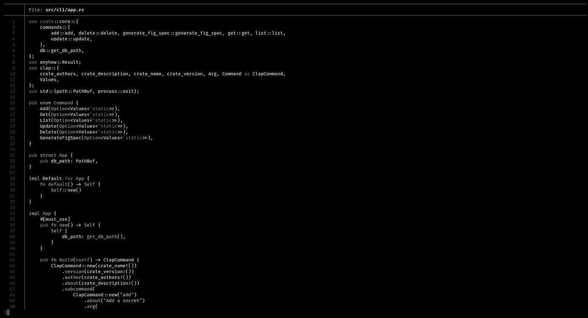

## 搜索

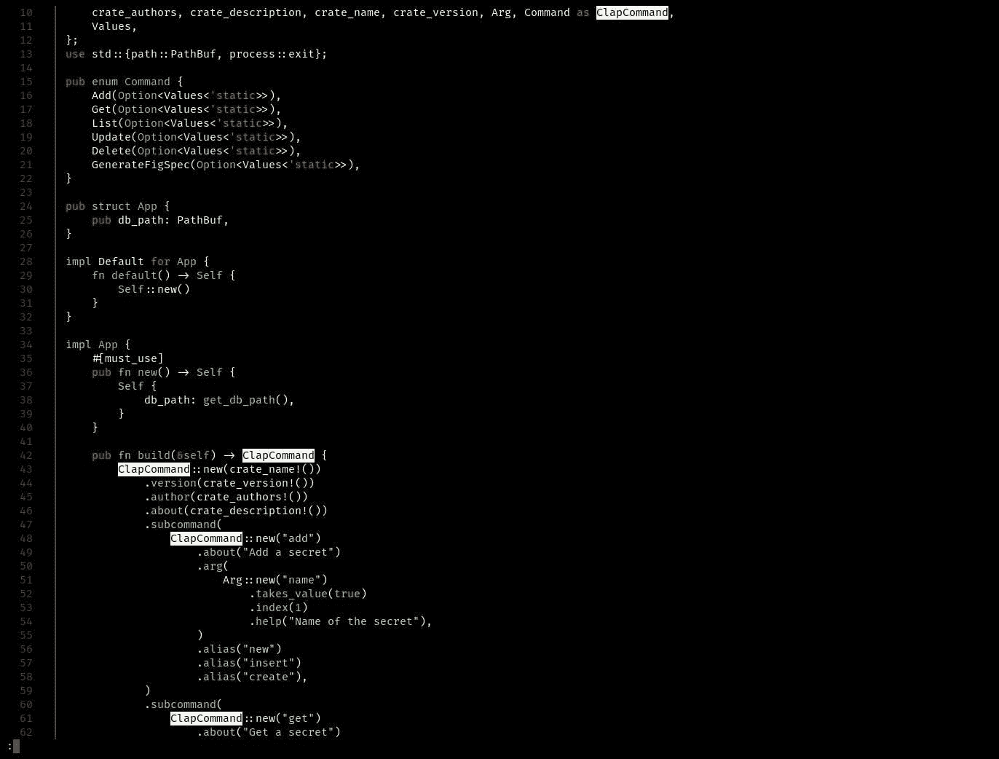

我们可以使用`/`然后输入一个查询(可以是 regex)来执行一个搜索操作。这与 vim 中的做法类似，是的，它支持 vim 键绑定，比如`n`跳到下一个结果，而`N`跳到上一个结果。

# 佐西德

`[zoxide](https://github.com/ajeetdsouza/zoxide)`乍看起来像`cd`一样，但它有一个特性使它成为游戏规则的改变者。如果您不必在每次想要进入某个目录时都指定该目录的路径，那该有多酷？Zoxide 将路径存储在 db 中，下次使用它时，可以只指定目录名，而不是完整路径。下面是它的实际应用(`z`是 zoxide 的默认别名)

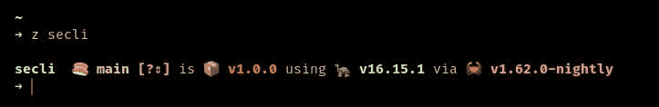

您也可以使用`zi`命令，通过`[fzf](https://github.com/junegunn/fzf)`交互选择之前的路径

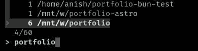

# 穰（等于 10 的 18 次方）

`[exa](https://github.com/ogham/exa)`是`ls`命令的现代替代品，但具有更多功能。首先，它支持颜色和图标(我把`ls`化名为`exa --icons --color=always`)

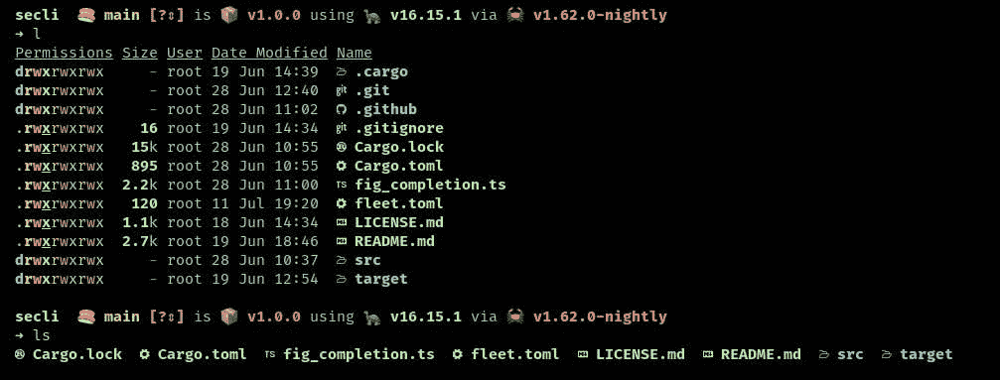

这使得区分文件夹和文件非常容易，图标只是一个伟大的触摸。此外，列表视图(传入`-l`以在列表视图中看到它)更干净。

Exa 还附带了一个方便的树特性

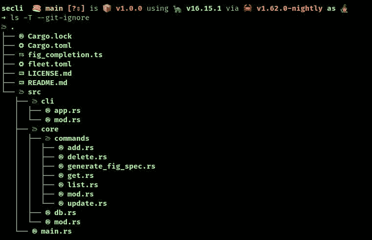

这里，`-T`是将它显示为一棵树。`--git-ignore`标志忽略`.gitignore`忽略文件中提到的文件和文件夹。

# 软驱

`[fd](https://github.com/sharkdp/fd)`是`find`命令的替代选项，具有丰富的功能，速度也非常快。

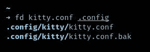

第一个参数是我们要搜索的术语，其后的任何其他参数都是要搜索的目录。

我们也可以用`-e`标志指定一个扩展名-

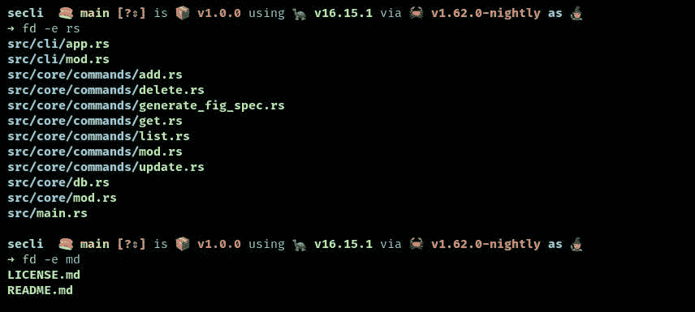

# 里格雷普

`[ripgrep](https://github.com/BurntSushi/ripgrep)`是`grep`命令的替代命令，主要亮点是它的速度。它还自动忽略在忽略文件中指定的文件，如`.gitignore`和`.ignore`。

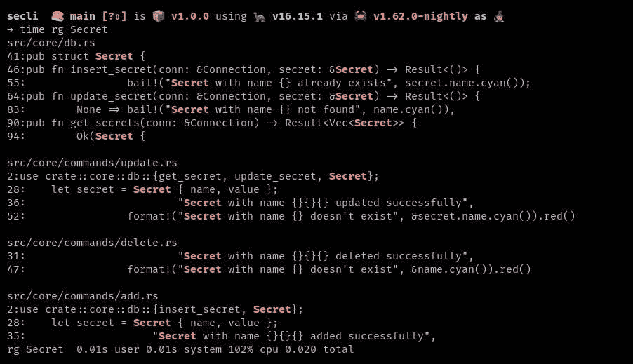

是的，这只花了 20 毫秒！

Ripgrep 还有许多其他功能，比如在特定文件类型中搜索和在 zip 文件中搜索。

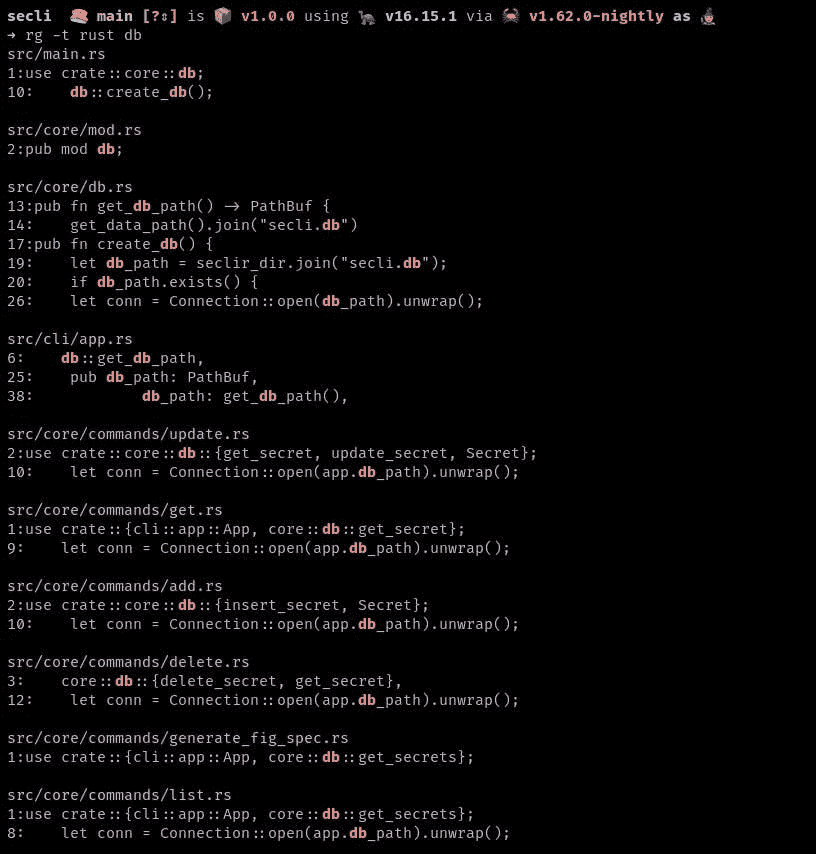

这里，我们可以使用`-t`标志指定文件类型。

# 奖金:tealdeer

`[tealdeer](https://github.com/dbrgn/tealdeer)`是`[tldr](https://github.com/tldr-pages/tldr)`工具的替代工具。两者都完成相同的任务，即显示社区驱动的帮助/手册页，比传统的、详细的帮助/手册页更容易阅读和理解。这里有一个`exa`的例子

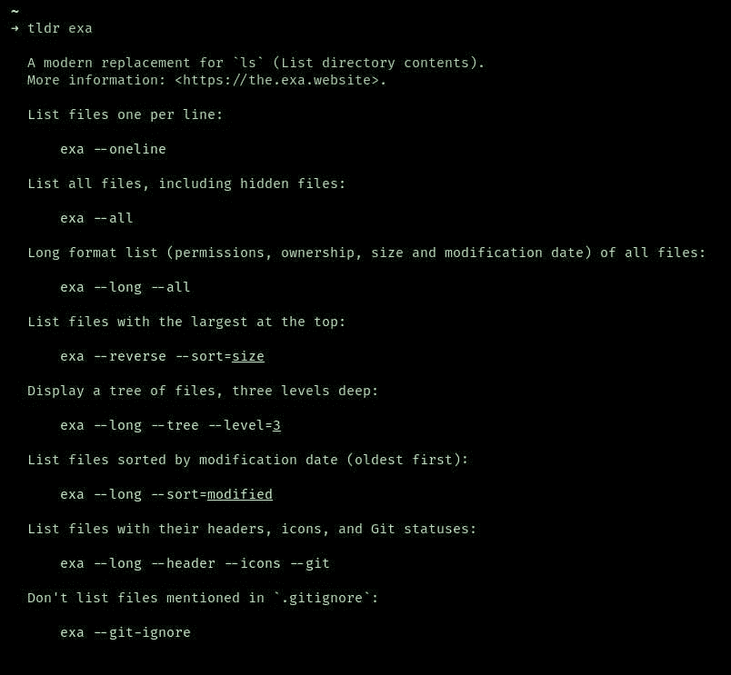

Tealdeer 安装为`tldr`，因此`tldr`是命令而不是`tealdeer`。

# 结论

我希望这篇文章对你有用，并且有助于提高你的工作效率。你可以通过评论留下任何建议，也可以在 [Twitter](https://twitter.com/AnishDe12020) :)上发给我

*原载于*[*https://blog . anishde . dev*](https://blog.anishde.dev/5-modern-cli-tools-that-help-boost-your-productivity)*。*