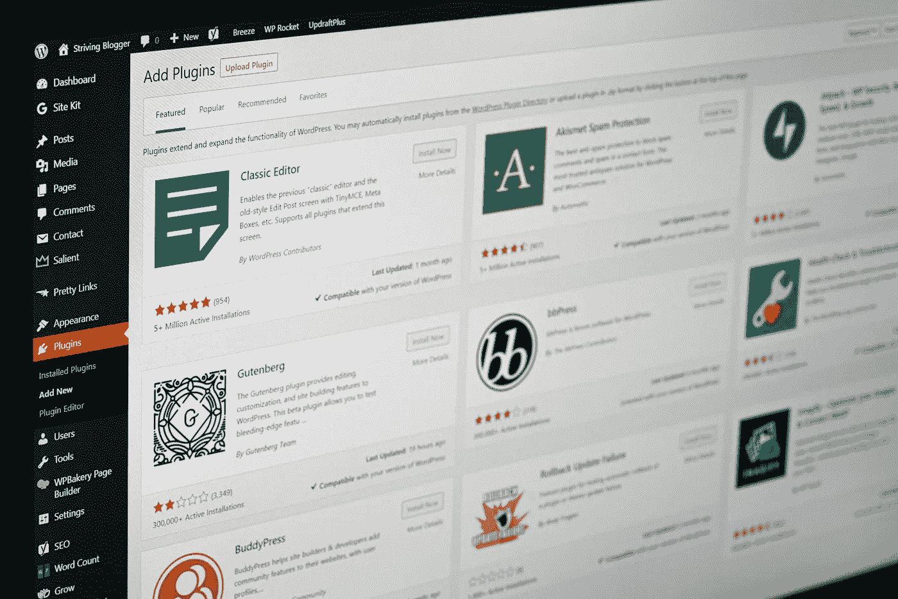

# 2021 年备份 WordPress 网站的 5 个最受欢迎的一体化迁移技巧

> 原文：<https://medium.com/geekculture/5-most-popular-all-in-one-migration-tips-for-backing-up-wordpress-sites-in-2021-b9e904432121?source=collection_archive---------29----------------------->

通过一体化迁移使用 *Rsync 或 SCP* 来防止严重的网络错误

在为客户节省时间和保存他们的数据之间找到正确的平衡是非常重要的。大多数备份解决方案都很昂贵、不可靠，而且设置起来很麻烦。如果你是一个有能力的开发人员，那么你会很兴奋地知道…