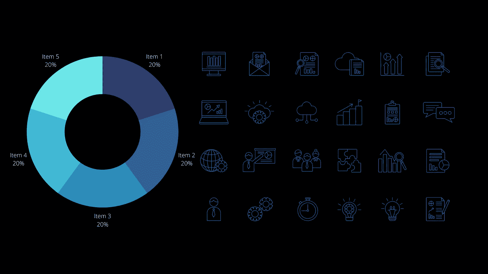
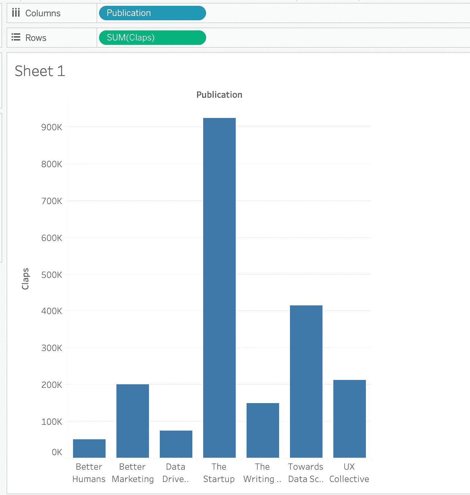
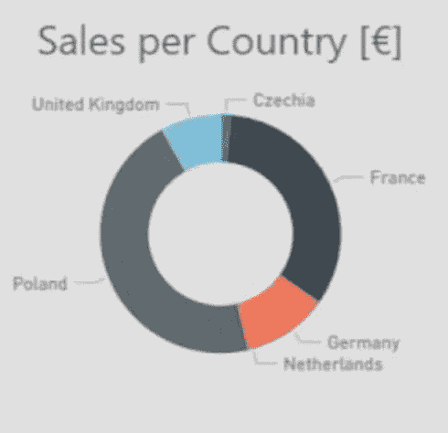
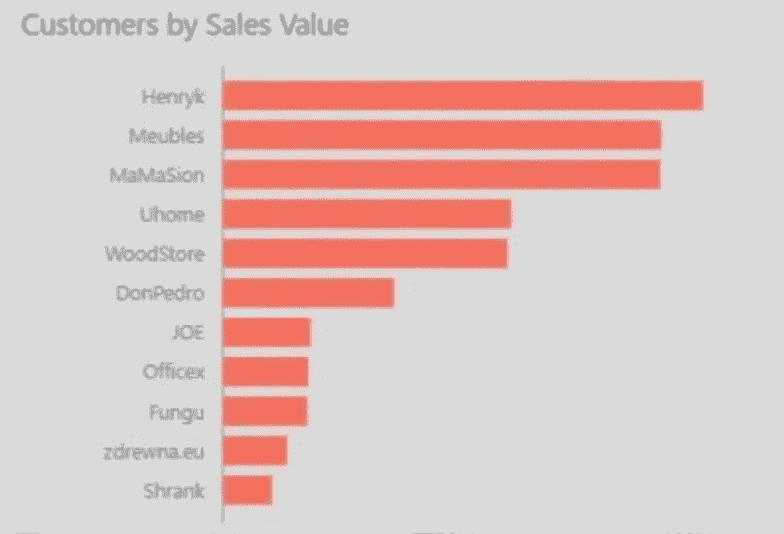
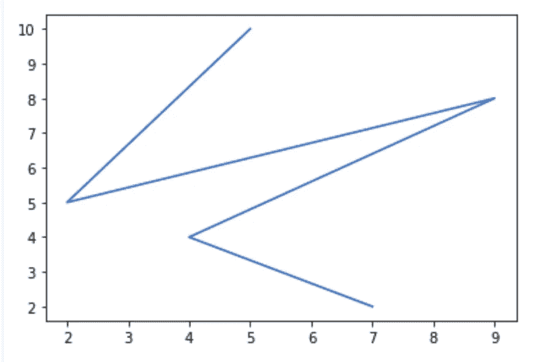
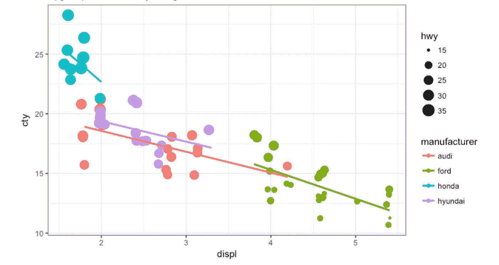
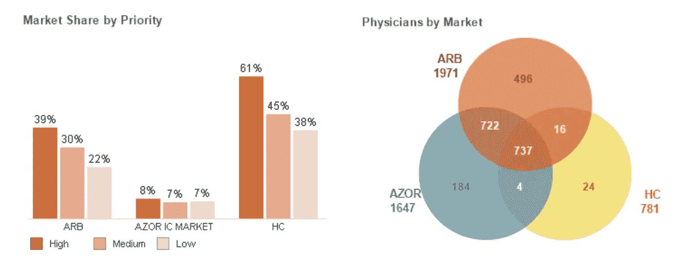

# 5 个强大的数据可视化工具

> 原文：<https://medium.com/geekculture/5-powerful-tools-for-data-visualization-e90a879737bd?source=collection_archive---------31----------------------->

## 从 IT 行业到医疗保健行业，到处都在产生大量的数据。数据以表格格式、JSON 文件、CSV 文件、JPG/PNG 文件、PDF/DOC 文件、HTML 文件等生成。,

但是对于想要探索的用户来说，查看原始数据是非常困难的，因为它不是可查看或可视的格式。为了克服这些问题，有一些可视化数据的工具。

在我看来，最强大的数据可视化工具如下:

— Tableau

—电源 BI

— Matplotlib

— ggplot

— QlikView

让我们简单了解一下每个工具。

**画面:**

Tableau 是快速发展的数据可视化工具，可以创建完美的后台 SQL 查询，称为 VizQL。它有两个版本，即 Tableau Desktop 和 Tableau Public。

Tableau Public 是免费版本，仅支持 CSV、Excel 和文本文件。它以在线模式保存，最多 1500 万行数据。

Tableau Desktop 是付费版本，支持各种数据源。可以保存在本地桌面上，数据行数不限。

Tableau 如何帮助可视化数据的示例:

使用的数据集:来自 Kaggle 的中型文章数据集

Publication vs Claps

上图显示了每份出版物获得的掌声数量。

**异能匕:**

Power BI 是由微软创建的分析平台服务，包含软件服务、应用程序和连接器的集合。它让我们能够可视化数据，并与组织分享见解。

使用 Power BI，用户可以创建报告、图表、图形和仪表板。此外，他们还可以连接、转换和建模数据。

与 Excel 等其他工具相比，Power BI 更加用户友好。

使用 Power BI 可视化数据的示例:

Sales per Country

Customers by Sales value

**Matplotlib:**

Matplotlib 是 Python 中最流行的数据可视化库之一。它以多种硬拷贝格式和跨平台的交互环境生成各种质量数据。Matplotlib 可用于 Python 脚本、MATLAB、IPython shell、Jupyter notebook、web 应用服务器和 GUI 工具包。如果你想用 python 创建有效的可视化，matplotlib 是一个必不可少的工具。

Matplotslib 需要几行代码，在 Python 编程中以及在 MATLAB 中很容易学习和执行 plot。

以下示例显示了使用 Matplotlib 的数据可视化:

Line plot for given data points

**ggplot:**

ggplot 是 r 中提供的一个绘图包。它用于更多的统计和几何领域。它描绘了美学映射、几何形状、统计变换等。,

ggplot 可以大大提高图形的质量，并以更具交互性的方式绘制任何类型的图表。在数据框中使用复杂数据时，它以简单的方式绘制。

可以在 python 中使用 ggplot 以一致的方式实现数据可视化。

使用 ggplot 的数据可视化示例:

Bubble Chart

**QlikView:**

QlikView 是一款快速发展的数据可视化工具，具有灵活性，部署速度非常快。要使用 QlikView 进行可视化，对 SQL 查询有基本的了解就足够了，对于构建图表，excel 技能是必不可少的。它可以组合所有大小的数据集。

QlikView 的一些重要功能如下:

统一报告

—各种形式的数据表示

—数据压缩到原始大小的 10%

—好 UX

—安全可靠

QlikView 可视化示例如下:

请点击本页阅读更多内容驱动型文章:

 [## 利希塔·卡卡努鲁-培养基

### 在全世界范围内，大多数开发者大会都是为了讨论硬件、软件工具和…

likhithakakanuru.medium.com](https://likhithakakanuru.medium.com/) 

请随意连接 Linkedln:

 [## KAKANURU LIKHITHA - Kurnool，印度安得拉邦|职业简介| LinkedIn

### B.Tech(电子和通信)专业毕业。对数据科学、人工智能、对话式设计和 python 充满热情…

www.linkedin.com](https://www.linkedin.com/in/kakanuru-likhitha-142575121)