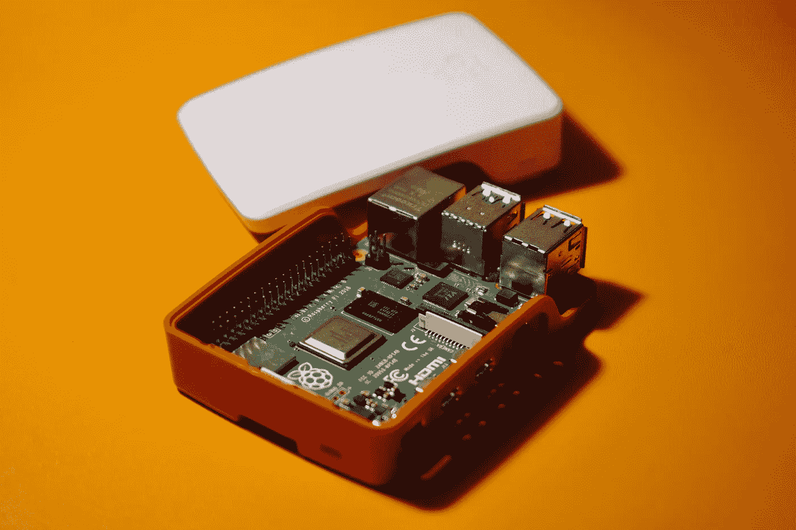

# 树莓派的 5 个项目创意

> 原文：<https://medium.com/geekculture/5-project-ideas-for-raspberry-pi-fbb0c11dde14?source=collection_archive---------4----------------------->

## 吹掉著名的迷你电脑上的灰尘，利用它

Photo by [Praveen Thirumurugan](https://unsplash.com/@praveentcom?utm_source=unsplash&utm_medium=referral&utm_content=creditCopyText) on [Unsplash](https://unsplash.com/s/photos/raspberry-pi?utm_source=unsplash&utm_medium=referral&utm_content=creditCopyText)

几乎每个软件开发人员家里都有一个树莓派。像我这样的人几年前买了它，玩了玩，然后把它放在抽屉里。其他人继续探索这个奇妙设备的功能。树莓派的美妙之处在于体积:一台功能强大的电脑不过是一个小小的盒子。