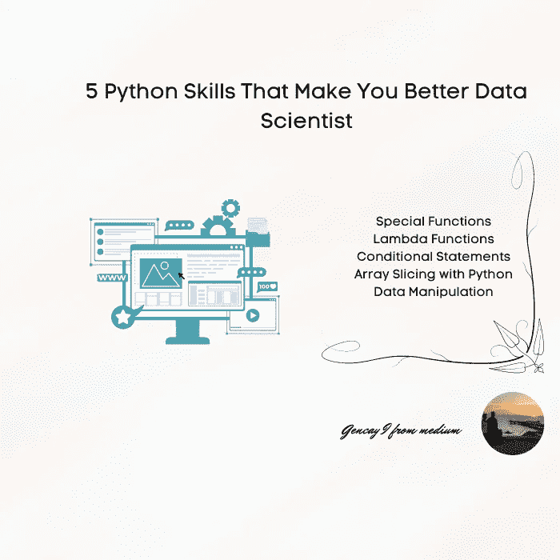

# 让你成为更好的数据科学家的 5 项 Python 技能

> 原文：<https://medium.com/geekculture/5-python-skills-that-will-make-you-better-data-scientist-1fa7b953474a?source=collection_archive---------5----------------------->

## 这里有 5 个 Python 技巧，可以让你成为更好的 Python 编程数据科学家。

Image by Author

# 介绍

数据科学是通过应用算法和使用统计方法从非结构化数据中收集有意义信息的不同技能的混合体。