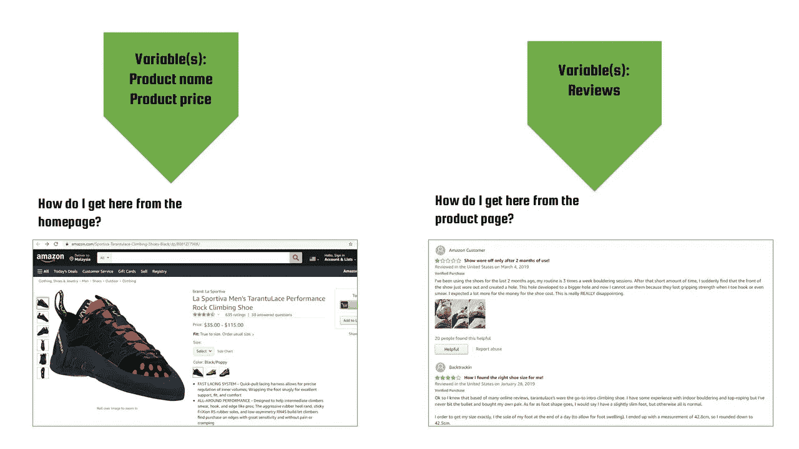

# Python 中 Web 抓取的 5 个快速技巧

> 原文：<https://medium.com/geekculture/5-quick-tips-for-web-scraping-in-python-5aa26f22af3b?source=collection_archive---------30----------------------->

## 避免网络抓取的痛苦陷阱的方法

Photo by [Nathan Dumlao](https://unsplash.com/@nate_dumlao?utm_source=unsplash&utm_medium=referral&utm_content=creditCopyText) on [Unsplash](https://unsplash.com/s/photos/spider-web?utm_source=unsplash&utm_medium=referral&utm_content=creditCopyText)

# **简介**

无论是为了工作还是为了娱乐，网页抓取是每个数据科学家都应该拥有的一项关键技能。它打开了通向无限量数据的大门，超出了你在 Kaggle 或其他开放数据网站上所能找到的限制。但是最好的部分是，当你在小范围内获得有效和自主的抓取能力时，你将能够很容易地将其转化为更大的抓取项目。

利用这些技巧，我从搜集约 1000 篇[亚马逊评论进行情绪分析](https://kokkeanshern.medium.com/analyzing-rock-climbing-shoe-amazon-reviews-cb3e12c91a67)，到搜集约 3 万篇新冠肺炎新闻文章进行疫情期间[政府与公民互动的研究。请注意，我是使用 Python 中的 Selenium 库进行抓取的。](https://www.linkedin.com/posts/keanshernkok_paper-abstract-activity-6787007234435088384-Ai0h)

# 提示 1-定义你的需求

停下来。不要打开你的 IDE。关闭所有打开的网页抓取教程标签。首先，问自己:“*我想搜集什么信息？”*。例如，当我收集亚马逊评论时，我很早就决定要收集三个变量:(1)产品名称，(2)产品价格和(3)评论。你不会总是需要很多变量来做分析。通过一些基本的功能转换，你可以将“评论”转化为“评论数量”(每件产品)、“肯定率”(VADER 情绪分析)等。

# 技巧 2-分析网站结构

现在你已经定义了你需要的信息，是时候打开网站了。从进入主页开始。检查网站的按钮和功能。记下导航在网站上是如何工作的(*即*)这个按钮会把我带到哪个页面？).接下来，试着确定你需要的信息在网站的什么地方。通常，你会发现你需要的信息分散在不同的网页上。对于我来说，产品名称和价格是在它们各自的产品页面上找到的，而评论是在一个链接到相关产品页面的独立评论页面上找到的。

下面我举一个实际的例子:

Illustration by me

现在你需要弄清楚如何到达每个网页。一旦你知道如何链接网页，你就有了自己的计划。你会在每个相关页面之间遇到许多中间页面。我的刮痧计划是这样的:

第一步:进入亚马逊主页。

第二步:搜索产品品牌(导向结果页面)。

第三步:结果页面包含多个产品页面的链接。抓取所有这些链接并存储在一个文件中。

步骤 4:迭代打开文件中的每个链接。刮产品名称和价格。单击“查看所有评论”按钮(打开评论页面)。

第五步:刮掉所有评论。

# 技巧 3-理解 URL

URL 包含了丰富的信息。例如，我设法过滤掉数据中的重复条目，因为我知道亚马逊产品 URL 的一个组成部分是产品的唯一标识符，称为 ASIN(亚马逊标准标识号)。

除此之外，URL 为链接网页提供了一种替代点击按钮的策略。如果您在尝试定位或点按链接网页的特定按钮时遇到困难，请尝试比较网页之间的 URL。不同网站之间的一个共同点是，从第一个结果页面到下一个页面可以通过在 URL 的末尾添加类似于“ *& page=n* ”的内容来完成，其中 *n* 代表第 2、3…页。

# 技巧 4——不要混淆你的“等待”

一般来说，有隐式等待和显式等待。当您编写显式等待代码时，您可以定义程序在满足某个条件之前应该等待多长时间。另一方面，隐式等待告诉 web 驱动程序在抛出异常之前等待用户定义的时间长度。

要解决的最棘手的问题之一是，即使超过了指定的等待时间，程序仍未超时。这通常是由于不知不觉地混合了隐式和显式等待。

如果您打算使用 Selenium，以下资源是不错的选择:

1.  [Python 中的 Selenium 等待文档](https://selenium-python.readthedocs.io/waits.html#:~:text=Selenium%20Webdriver%20provides%20two%20types,trying%20to%20locate%20an%20element.)
2.  [隐式-显式等待交互问题](https://www.selenium.dev/documentation/en/webdriver/waits/#implicit-wait)

# 提示 5-选择战略定位器

虽然对于应该选择哪种元素定位符类型没有硬性的规定(*例如* Xpath、CSS、ID 等)。)，你应该记住几个要点:

1.  在大多数浏览器中，CSS 往往比 Xpath 更快。
2.  [如果 ID 是选项之一，使用它](https://blog.thedigitalgroup.com/locator-strategies-in-selenium-webdriver)。
3.  如果没有写完整，一些定位器可以指向多个元素。确保您的定位器指向[精确元素](https://www.toolsqa.com/selenium-webdriver/selenium-locators/)。
4.  使用浏览器扩展，如 [Ranorex Selocity](https://chrome.google.com/webstore/detail/ranorex-selocity/ocgghcnnjekfpbmafindjmijdpopafoe) 来帮助定位元素。

# *额外提示——跟随我的教程

如果其他都失败了，请阅读我的教程。

# 结论

现在继续，重新打开所有那些关闭的标签，开始编码。一旦你掌握了窍门，你就可以随心所欲地提取定制数据了。如果你觉得这篇文章有用，如果你能留下一些掌声，会有很大的帮助。我很乐意听到你对我自己学习的想法，所以请随意回应一些意见和建议！感谢您的阅读！