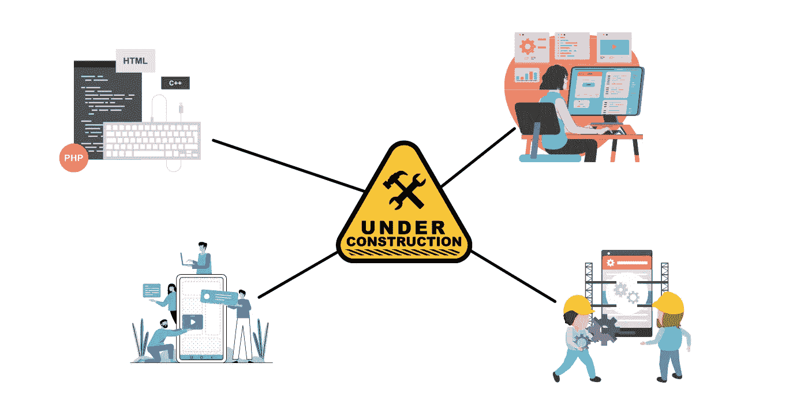

# 成为自学开发人员的 5 个快速技巧

> 原文：<https://medium.com/geekculture/5-quick-tips-on-becoming-a-self-taught-developer-98534a2cf9be?source=collection_archive---------61----------------------->

## 这些技巧是我在开始开发之旅时给自己的最好建议。

Photo by [James Harrison](https://unsplash.com/@jstrippa?utm_source=medium&utm_medium=referral) on [Unsplash](https://unsplash.com?utm_source=medium&utm_medium=referral)

我最常被问到的一个问题是，没有学位你能成为一名开发人员吗？简单来说，答案是肯定的。当然，完全有可能成为一个自学成才的开发者。许多人上不起大学，或者只是决定以后转行。

如果这是你像我一样走过的路，那么我们将看看我能提供的最好的建议，作为一个自学成才的开发人员来实现你的目标。

# 有一个清晰的学习路线图

学习成为一名开发人员并不是一个快速的过程，它非常耗时，尤其是在一些包含更多学习主题的领域。你最不希望的事情就是在几个月后意识到，你所学的一些东西与你希望从事的领域无关，或者已经过时，雇主会希望你用更好的方法来代替。

这就是拥有一个清晰的学习路线图非常有益的地方。在开始你所在领域的任何教育内容之前，研究你需要知道什么，关键的组成部分，并计划好所有主题需要完成的顺序。

从简单的在线搜索你渴望学习的软件开发领域的路线图开始。接下来记下他们推荐的主题和顺序，首先确保信息是最新的。

一旦你有了一个好的学习计划，就去找那个领域的工作。你需要了解雇主招聘的主要领域，他们希望你了解的内容，以及他们希望你了解的其他领域。这允许你在接触这些领域时更加重视它们，并确保你对它们有很好的理解。

最后，研究在你想要的领域中最常用的最佳设计模式和架构。一旦你对基础有了坚实的理解，这些可以添加到你的路线图的末尾。

# 每日编码

仅仅每周花几个小时在编码和学习上是不够的。你可能很难记住前一周的很多信息，或者你对自己以前学过的知识不太有信心。

这并不意味着你必须每天花几个小时编码。小而持续的每日编码会议非常有助于记住这些信息。争取一半时间花在教育资源上，另一半时间用一些代码来应用你从这些资源中学到的东西。最后，每天 30 分钟比周末的几个小时要好，但是你能坚持投入的时间越多，你就能越快达到目标。

# 使用不同的信息来源

无论你是从一门课程、一本书还是 YouTube 上的视频中学习，不要拘泥于一个信息来源。有了互联网，很容易找到许多信息来源，其中一些可能是不正确的或最新的。有些地方可能会被遗漏或解释不清，你可能会从一个资源中比从另一个资源中更好地理解一个概念。

最好能让你的教育资源多样化，确保你不会错过或误解任何东西。观看 YouTube 教师的精选视频，阅读几本书，阅读编程语言或框架文档。

# 建设许多项目

类似于编码日常技巧，这将有助于巩固你对主题的理解，并检验你的知识。

在学习一个新的领域后，建立一个简单的项目来实现你刚刚学到的东西。如果有必要，你可以用笔记来帮助自己熟悉需要做的事情。

一旦你完成了路线图的主要领域，是时候建立更大、更复杂的项目，你可以将它们添加到你的投资组合中，向未来的潜在雇主展示你的能力。建立这些更大的项目也可以让你看到你在哪些方面比较薄弱，需要重新审视。

# 保持动力

这个建议看起来似乎很简单，然而，很可能不可避免的是，你会觉得学习没有动力或筋疲力尽。你可能有时会觉得自己没有取得任何进展，或者觉得自己不适合成为一名开发人员。这既正常又不真实。

从学习和编码中短暂休息大约 3 天。这几天让你的大脑休息一下，但是不要再花时间了，否则很难回到你的日常生活中。

如果有一个特定的领域你很难理解，尝试从不同的资源中学习。另一个解决办法是花几天时间研究一个不同的话题，然后带着全新的心态回到这个话题。

# 摘要

自学成才的开发人员面临的许多困难来自于缺乏大学提供的组织或结构。尽管你可以创建自己的结构来推进你的学习，也可以设定自己的目标来保持动力。希望这些技巧能帮助你成为一名开发人员。

我成为一名开发人员的道路当然不是完美的，我犯了许多错误，我从这些错误中吸取了教训，使我今天成为一名更好的开发人员。我在[“我作为一个自学成才的开发者所犯的错误”](/codex/mistakes-i-made-as-a-self-taught-developer-896fcf3277b4)中进一步详述了这些。