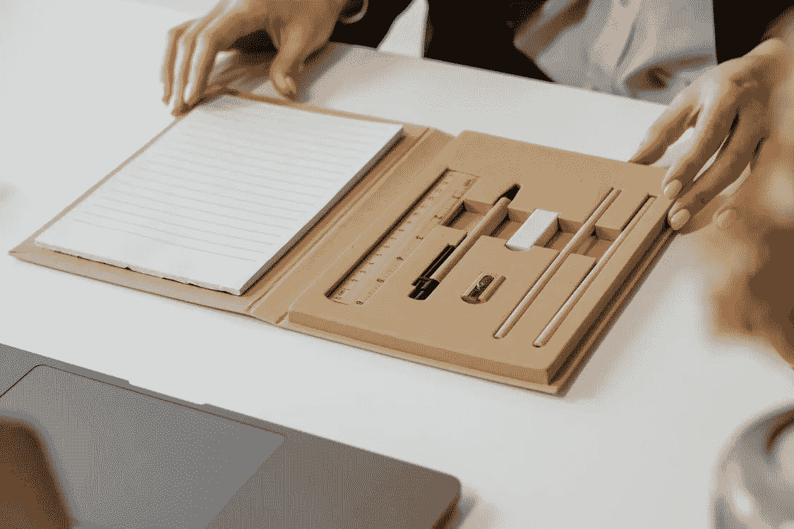
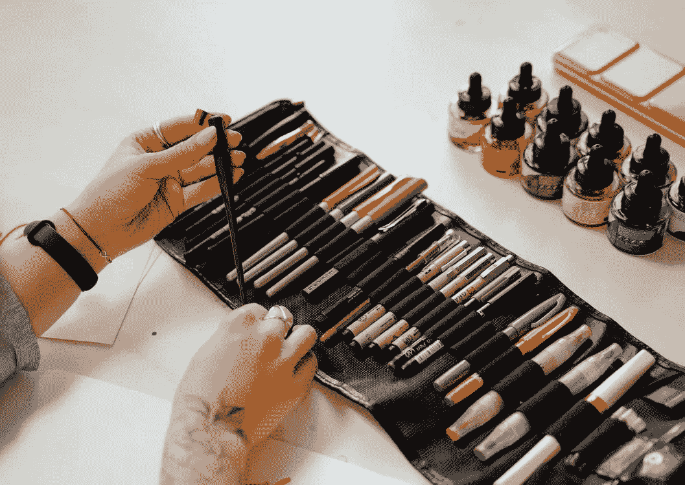
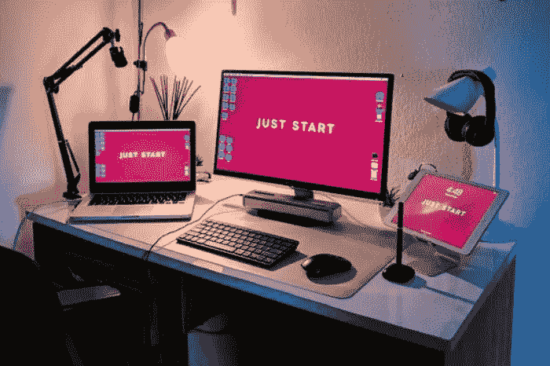

# 设计系统如何改变你的产品的 5 个理由

> 原文：<https://medium.com/geekculture/5-reasons-how-a-design-system-can-transform-your-product-642e4c059707?source=collection_archive---------4----------------------->

你的产品是不是每一页的菜单位置都不一样？或者 CTA 按钮根据动作有不同的样式？

这当然没有什么可担心的。即使是最好的企业产品也会遇到这样的问题。最棒的是，它是完全可以修复的。只需对应用程序进行全面审查，找出异常并替换它们。

但是到了紧要关头，你会意识到你希望用 2 周时间快速解决的问题已经变成了 8-10 个月的努力。这是因为应用程序中的工作流是相互关联的——一个设计糟糕的交互会对其他交互产生影响，从而影响整个用户体验。

即使你没有经历过这种特定的产品场景，你也肯定曾经是公司的一部分，在那里产品总是在进行中，或者有许多与视觉不一致相关的问题，或者设计师不得不一遍又一遍地听取相同的简报。

多项研究已经证明，好的设计是一个关键的差异化因素，可以为企业带来竞争优势。良好的 UX 设计为产品体验带来一致性，这反过来也是可信度的标志。因此，确保您的产品为用户提供一致且愉快的体验的一种方法是将它建立在可以跨工作流和过程使用的设计指南的基础上。这些设计指南应该使产品团队能够采取正确的方法进行创造性思维和决策。

# 什么是设计系统？

NN 小组将设计系统定义为一套完整的标准，旨在使用可重用的组件和模式来管理大规模的设计。它可以被称为一个可重复使用的组件库，附有清晰的文档，设计人员和开发人员可以配置和应用这些组件来构建数字产品。

Airbnb、优步和 IBM 等设计主导型企业的先驱通过创建可重复组件的定制集合和一套指导这些组件使用的标准，为他们设计数字产品的方式设定了基准。事实上，他们在创建设计系统上投入的努力已经提升了他们的产出和创新的速度。

# 投资设计系统的 5 个理由

设计系统如果实施得好，可以给公司带来很多好处:

**确保质量和一致的体验**

有一个合适的设计系统可以确保在任何情况下都有一个统一的语言。它减少了设计和开发所需的时间，因为它是管理品牌和 UX 组件、编码元素、详细文档等的单一事实来源，因此团队可以保持同步。

**加快设计过程**

支持快速决策是设计系统的一大优势。易于使用的 UI 套件和风格指南使设计团队能够快速创建和复制设计。这些中的元素被设计为可重复使用，从而避免了从头开始的需要和意外不一致的风险。通过实现相同的颜色、字体和输入元素，开发人员可以更容易地创建统一的代码来多次使用，从而节省开发时间。

**带来视觉一致性**

企业通常让他们的团队各自为政，每个产品或渠道都独立运作。这导致了支离破碎和不一致的体验。然而，作为组件、模式和风格的单一来源的设计系统可以统一脱节的体验，使整个产品在视觉上具有凝聚力。从长远来看，设计系统可以管理任何大规模的视觉品牌重塑或重新设计。

**鼓励协作**

设计系统本质上是一个集中的设计储存库，包括产品团队中所有参与者的广泛指南，无论是设计师、开发人员还是产品经理。因此，任何新加入团队的人都可以在他们的工作中轻松引用这一资产，从而确保跨时间线的一致性。通过投资设计系统，你也在努力加强跨部门的合作，在你的组织内保持一致，同时加深对你自己品牌的理解。

**开发效率**

有了完整的设计系统，开发人员可以更高效地工作，因为他们不再浪费时间寻找正确的组件。他们也不必每次创建代码时都从头开始。有了设计系统，大部分代码就准备好了，开发人员可以将精力集中在增强产品或发布更快的更新上。

设计系统带来的最大好处是它为设计者和开发者消除了平凡的、重复的任务。相反，它使他们能够专注于创造新的想法来增强产品。

要了解设计系统如何让您的产品受益，请下载我们的免费指南[关于设计系统您需要了解的一切](https://www.koruux.com/uxfreebies/design-system/)。本指南详细介绍了设计系统的各个组成部分，以及它能为您的企业带来的好处。此外，它还会建议您设计系统是否适合您的业务和产品，并为您提供提升产品体验的替代方案。