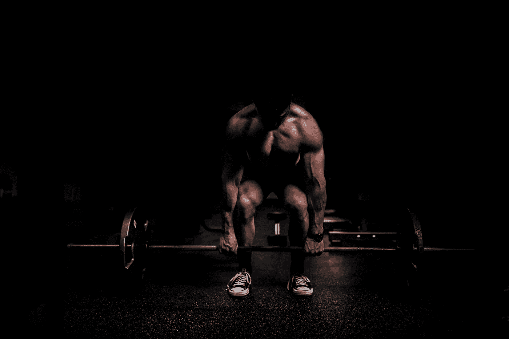
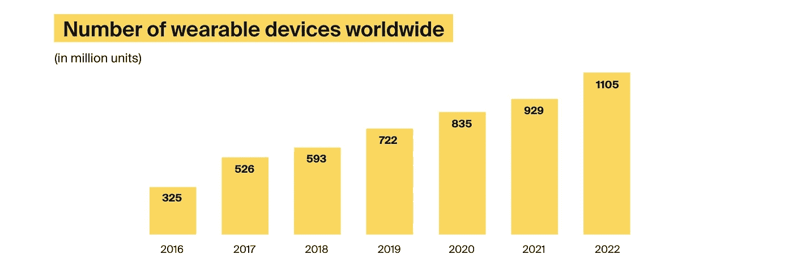

# 体育和健身领域采用物联网的 5 个理由

> 原文：<https://medium.com/geekculture/5-reasons-to-adopt-iot-in-sports-and-fitness-c09c1a1761fc?source=collection_archive---------18----------------------->

克里斯蒂·张是来自香港的击剑运动员。她退出了国际击剑联盟俱乐部。在训练期间，克里斯蒂穿着一套特殊的击剑服，上面配有记录她动作的轻型传感器。所有数据都进行了汇总和分析，以了解她的力量、灵活性、耐力和平衡能力。克里斯蒂认为，在体育运动中使用物联网会带来新的改进机会。她是这样说的:

> “很快就能看出我的方向是对还是错，这很有趣。我可以立即解决我甚至不知道自己有过的弱点。我对自己的最佳表现更有信心。”

拥有这类知识对每个运动员、比赛和康复都很有帮助。因此，体育部门利用[物联网开发服务](https://itrexgroup.com/services/iot-development-consulting/)为运动员提供分析和提高成绩的创新方法。

但这并不是物联网在健身方面的唯一贡献。如果您想探索物联网在体育和健身领域的其他应用，并为实施您自己的项目做好准备，请继续阅读本文。

# 物联网能为体育做些什么？

自从新冠肺炎·疫情事件以来，每个人都被迫呆在室内，再也不能去健身房了。由于人们仍然希望保持身材，在家锻炼越来越受欢迎。但是这种新的体育文化并不局限于简单的在家锻炼。

职业运动员以及健身爱好者转向科学和技术来收集关于他们表现的数据，进行分析，并接受改进建议，就像他们在个人面对面教练课程中所做的那样。

因此，全球体育分析市场开始增长，预计到 2028 年[将超过 100 亿](https://www.statista.com/statistics/1185536/sports-analytics-market-size/)，高于 2020 年的 22 亿。而全球体育科技产业[预计到 2026 年将达到 179 亿美元](https://www.globenewswire.com/en/news-release/2021/06/04/2241923/28124/en/The-17-9-Billion-Worldwide-Sports-Technology-Industry-is-Expected-to-Grow-at-a-CAGR-of-17-5-From-2021-to-2026.html)。此外，随着越来越多的人开始欣赏可穿戴物联网技术的优势、安全性和便利性，全球可穿戴物联网设备的数量也在迅速增长。据统计，到 2022 年底，这一数字预计将达到 11.05 亿台。

[Source](https://itrexgroup.com/blog/reasons-to-adopt-iot-in-sports-and-fitness/ww.statista.com/statistics/487291/global-connected-wearable-devices/)

那么，人们如何在健康和健身方面使用物联网呢？在更基本的情况下，用户佩戴物联网健身跟踪器，捕捉不同的参数，如用户的脉搏，以估计燃烧的卡路里数量，并监测他们的训练强度。

职业运动员选择更复杂的测量方法，如运动跟踪，当有人佩戴大量传感器来捕捉和传输用户身体位置的数据，以建立他们的骨架模型。这有助于了解这个人的身体位置，并在体育运动中取得进步，如标枪和击剑。除了身体定位和运动，传感器还可以测量强度。

例如，安装在训练设备上的传感器可以测量运动员能举起多少重量。专业人士也可以从分析他们的生命体征中受益，这将表明他们恢复的速度以及如何达到最佳表现。但可穿戴设备并不是人们在健身中受益于物联网的唯一方式。传感器还可以放置在健身房和体育场内，或者连接到锻炼设备上，以改善客户体验。物联网还为体育运动带来了其他好处:

*   允许人们在实时监测生命体征的同时检测轻微的健康恶化
*   支持健身程序定制，以实现更好的训练和更快的康复
*   方便预防性维护，因为健身房所有者可以跟踪设备的使用情况
*   授权体育组织提高粉丝参与度

# 物联网在体育领域的应用及趋势

# 集体锻炼

在体育领域部署物联网技术可以让人们足不出户就能参与集体锻炼。健身房使用这种解决方案来促进远程团体训练，并留住无法亲自参加的顾客。几个参与者同时在家里锻炼，使用无线传感器测量并与教练分享他们的数据，教练监控个人的进步，以更好地满足每个成员和整个团队的需求。

这种虚拟小组会议的一个例子来自 Peloton，一家制造健身器材的美国公司。他们制造了智能固定自行车和跑步机，让用户可以与来自同一城市的其他自行车手和跑步者一起参加虚拟训练，而实际上却呆在家里。

# 沉浸式训练

联网的物联网健身设备，加上虚拟现实(VR)技术，可以帮助用户在家中沉浸在模拟环境中。

例如，VR 头戴设备，如 [Oculus Rift](https://www.oculus.com/rift/) ，允许用户从他们的跑步机上跑虚拟马拉松，从他们的固定自行车上参加著名的自行车比赛。在连接传感器的帮助下，人们可以监控自己的心率，并将其与参与相同活动的其他人进行比较。它们还使环境能够适当地响应用户的运动并刺激他们。

[Source](https://www.einfochips.com/blog/experience-smart-fitness-with-augmented-reality-and-virtual-reality/)

# 智能体育场馆

智能体育场连接不同的物联网健身设备，如摄像机、传感器和数字标牌，以创造非凡的球迷体验。他们可以指引用户到他们的座位，提供关于停车位、卫生间可用性和促销的信息，提供个性化的体验。该技术还允许体育场工作人员对任何事故做出快速响应。物联网体育技术的一个例子来自加利福尼亚州圣克拉拉的李维斯体育场。这个场馆包括 2000 多个电池供电的信标，帮助粉丝找到座位，方便下单。

2021 年，持续三周的最大自行车赛事之一环法自行车赛(Tour de France)与一家技术合作伙伴合作，在实时数据的帮助下，创建了整个比赛的数字双胞胎。这使组织者能够持续了解车手和关键位置，使比赛更容易管理。NTT 大学体育部高级技术组的高级副总裁 Peter Gray 说，数字化这样一个巨大的事件是一个值得的挑战。下面是[他所说的话](https://www.forbes.com/sites/stevemccaskill/2021/06/30/tour-de-france-2021-organizers-use-digital-twin-to-manage-worlds-most-famous-cycling-race/?sh=2afdd08c3179)，“这是一个高度动态和不断变化的环境，需要即时访问信息以确保持续和平稳的运营，从而产生更多知情和参与的粉丝。”

# 设备维护和设施管理

有时候，仅仅通过查看库存，很难判断哪些健身器比其他健身器使用得更多。运动传感器中的物联网允许健身房所有者收集和分析他们设备上的实时数据，以了解哪些机器在锻炼过程中有发生故障的风险。此外，传感器有助于检测哪些机器需求量大，导致客户等待时间最长。在战略部署时，这种设备还可以检测基础设施的损坏，如管道泄漏和系统故障。在健身房不同位置种植的健身物联网设备将帮助所有者管理整个设施。

例如，当垃圾桶满了，纸巾用完了，消毒剂空了，传感器可以通知健身房的工作人员。物联网体育技术还可以监控健身房的环境，如温度、湿度和照明，并相应地调整这些参数。这将有助于通过优化能源使用来减少支出，并防止收入损失，因为如果客户对目前的情况不满意，他们可能会转向另一家健身房。

一项研究估计，由于人们无法处理难闻的汗味，通风不良的健身房每年会损失高达 38500 美元的收入。另一个体育领域的物联网项目来自芬兰。赫尔辛基市使用 Kaltiot 的物联网技术来[跟踪其 160 个户外健身房的使用情况](https://kaltiot.com/en/blog/tracking-outdoor-gym-usage-helsinki/)。

传统上，使用定期维护检查进行维护是非常昂贵的。Kaltiot 开发了跟踪解决方案，可以在芬兰的恶劣气候下工作，并收集设备利用率的数据。赫尔辛基户外娱乐区的首席维护经理 Harri uu simki 描述了收集数据的好处，他说:“使用 Kaltiot 的跟踪解决方案获得的数据是健身研究中尚未触及的领域。我们获得了大量的数据，这使我们能够在正确的地方安装正确数量、正确种类的户外健身设备。有了这些数据，我们就可以购买服务最好、用户最感兴趣的设备。”

# 可共享的健康数据生成和性能跟踪

物联网健身追踪传感器收集各种用户参数，у。该信息可用于创建定制的锻炼程序，以适应该特定人的需求和健康状况。

对于职业运动员来说，他们的教练可以收集和分析表现数据，这将使他们能够在节食和锻炼方面做出调整。例如，[运动科技公司 HUMANoX](https://humanox.com/en/inicio-english/) 推出了由轻质碳纤维制成的运动物联网 HX50 护腿垫。足球运动员可以在训练或正式比赛中佩戴这些护垫。该产品通过传感器得到增强，可以收集球员数据并与教练分享，教练可以分析球员的表现并提出改进意见。

# 当人工智能在体育领域遇到物联网:ITRex 的一个用例

增强基于物联网的健身解决方案性能的一种方法是用人工智能(AI)功能来增强它们。在我们的产品组合中，我们有一个令人兴奋的例子，说明人工智能和物联网在体育领域如何合作，让人们能够在家中以健身房的效率进行训练。ITRex 受雇于一家北美科技初创公司，与私人人工智能教练一起制作健身镜。

# 项目描述

我们的团队构建了一个全长墙镜，它具有自定义操作系统、硬件驱动器、摄像头、用于用户性能分析和个性化建议的训练有素的自定义机器学习(ML)模型、用于姿势估计和身体跟踪的计算机视觉以及众多传感器。我们还[提供了一个自动化测试框架](https://itrexgroup.com/services/automated-testing/)来验证系统的每个方面，包括 ML 性能。

当用户在镜子前锻炼时，传感器会收集不同类型的数据，如体重负荷、身体姿势等。所有这些信息要么被传递到镜像并在本地处理，要么被传输到云中进行进一步的分析和存储。

根据收到的信息，镜子的虚拟教练会计算正确重复的次数，并向用户提供如何改善结果的建议。例如，它可以指出握重角度错误或用户下蹲太低。传感器用的越多，建议越全面。

在处理用户数据后，这种物联网体育解决方案会创建仪表盘来可视化结果。用户可以与他们现实生活中的教练和同龄人分享他们的信息。

# 物联网组件

健身镜使用三种类型的传感器:

*   可移动的物联网健身传感器连接到设备，如重量，以跟踪总负荷，爆炸强度和紧张状态下的时间
*   镜子上有三个摄像头传感器。他们测量不同的维度，例如用户与镜子的距离，并创建锻炼者的 3D 模型，以确定运动是否以正确的形式正确完成
*   用户可以选择连接他们的可穿戴设备，他们收集的数据也将由系统处理

# 实施注意事项

在产品开发过程中，我们的团队进行了深入的研究和探索，以识别和解决潜在的问题。我们还进行了概念验证(PoC)来测试我们的假设。物联网项目经历最初的研究和发现阶段有利于预见潜在的问题并规划成功。以下是我们的团队针对该用例识别并成功解决的一些突出问题:

*   如何确保当其他人进入房间时，人工智能可以将注意力集中在锻炼的人身上
*   如何使人工智能适应不同健身水平的人，以便它不仅可以识别专业运动员的正确形式，还可以识别身材走样的初学者
*   安装后如何使系统适应房间尺寸
*   如何支持用户可能想要连接的所有常用可穿戴设备
*   如何确保不同锻炼项目的测量信号和数值达到所需的精度
*   如何恰当地平衡设备成本、可靠性和性能
*   如何实现一个用户友好的用户界面/UX，让每个用户都能找到他们想要的东西
*   如何让这款设备更具吸引力，让用户愿意花更多时间来使用镜子

# 体育和健身领域的物联网:实施技巧

如果你的创业公司正计划建立一个物联网健身解决方案，我们有一些实用的技巧给你！我们的 R&D 工程师兼物联网专家 [Yahor Paloika](https://www.linkedin.com/in/yahor-paloika-%F0%9F%87%BA%F0%9F%87%A6-53aa97122/%22) 建议在体育领域实施物联网时遵循以下步骤。

*   确定您希望收集和分析哪种类型的数据来产生价值。对于某些运动，查看心率和心电图(ECG)/光电容积描记法(PPG)很重要。在其他运动项目中，运动员的身体定位至关重要。有些参数很容易处理。例如，现有技术可以相当准确地捕捉人体脉搏。另一方面，测量血压仍然是一个挑战。
*   决定如何获取数据。想想你需要制造或购买的传感器和其他硬件设备。如果你想测量身体质量指数，你很可能需要一个人站在上面的设备，而如果你想创建一个 3D 骨架模型，运动跟踪器或强大的相机系统将被纳入西装外套。此外，还要考虑如何汇总数据，在哪里存储和处理数据。如果健身物联网设备足够强大，可以在本地处理数据。否则，您需要确保它安全、及时地转移到云或本地存储单元。
*   准备数据分析。原始数据本身没有价值。你需要想出一种方法来获得有用的见解，人们可以利用这些见解来提高他们的绩效。因此，任何物联网健身解决方案都需要依赖科学合理的数学模型，这些模型可以分析数据，并为运动员提供如何改进的想法，甚至只是帮助他们了解他们当前的状况和表现趋势。例如，有人可以在锻炼过程中使用传感器测量他们的脉搏。这些信息本身可能没什么价值，但应用数学模型来确定这个人燃烧了多少卡路里已经很有趣了。
*   想想安全问题。物联网运动设备容易受到安全威胁。卡巴斯基报告称，2021 年上半年，超过 15 亿台物联网设备遭到破坏，而 2020 年全年只有 6.39 亿起类似事件。请记住，不仅连接设备本身容易受到攻击，物联网网关、嵌入式系统和数据存储中心也可能成为攻击目标。当然，不要忘记用户的人身安全。可穿戴传感器不应该造成伤害或不适。

# 我们博客上的相关资源

随着物联网与数据分析齐头并进，您可能已经想要考虑您的[数据管理战略](https://itrexgroup.com/blog/data-management-strategy-benefits-principles-steps/)。此外，为了获得有用的见解，您可以考虑将[人工智能及其子类型](https://itrexgroup.com/blog/ai-types-subsets-use-cases/)融入您的物联网健身解决方案。根据您正在构建的产品，您可能会研究[身体网络](https://itrexgroup.com/blog/internet-of-bodies-iob-definition-benefits-examples/)(监控人体生物特征)或[人体姿势估计](https://itrexgroup.com/blog/human-pose-estimation-use-cases-implementation-tips/)(了解身体定位)。最后，[本文](https://itrexgroup.com/blog/how-much-iot-cost-factors-challenges/)将帮助您估算体育领域物联网解决方案所需的总预算。

是否考虑在体育领域部署物联网？如果有，[丢 ITRex 一行！](https://itrexgroup.com/contact-us/)！ITRex 团队将与您一起构建合适的硬件设备和软件应用程序。如果需要，最好的人工智能专家将开发和训练 ML 模型来支持您的解决方案的业务逻辑。

*原载于 2022 年 5 月 10 日 https://itrexgroup.com***。**