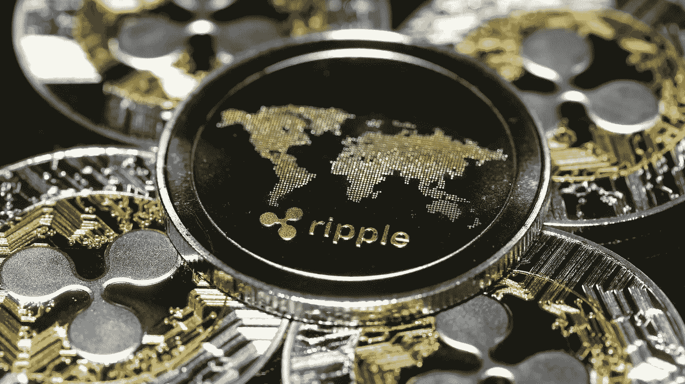
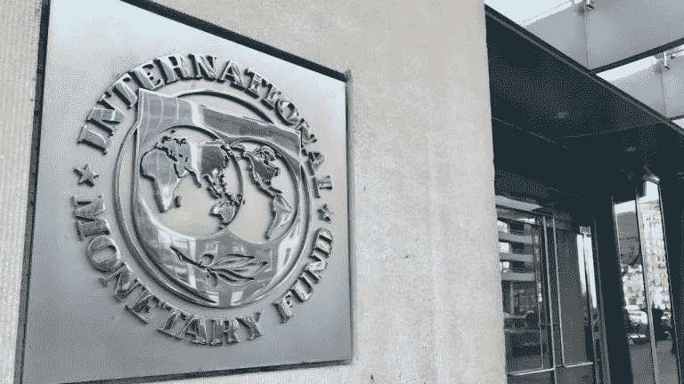
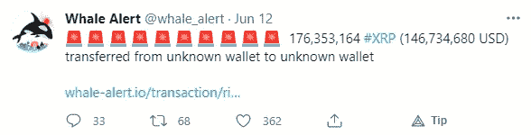
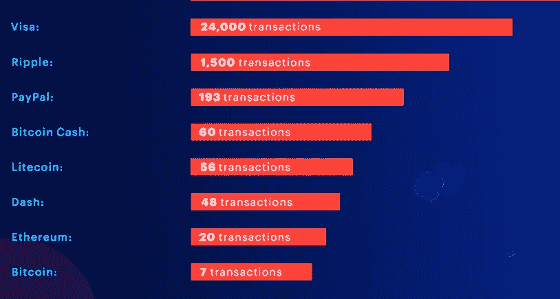
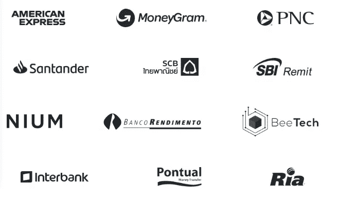
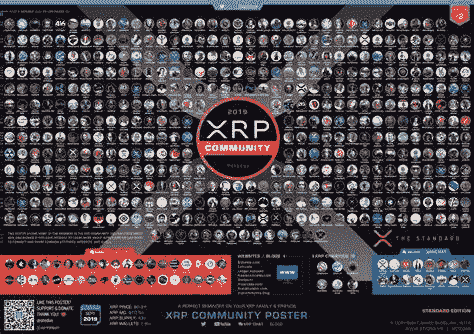

# XRP 将粉碎加密战的 5 个理由

> 原文：<https://medium.com/geekculture/5-reasons-why-xrp-will-crush-the-crypto-war-67e75c7a60d2?source=collection_archive---------26----------------------->

## 以及为什么政府想要分一杯羹

International Adoption of XRP

我想花一点时间感谢我的读者给我的大力支持。我尽我所能去理解那些报道不足的复杂话题，并把它们写下来，试图给我的读者带来价值！

所以，我再次感谢你！你是我做事的原因。

不再赘述，让我们开始讨论我最喜欢的和排名第一的加密货币: **Ripple (XRP)**

这些是**我建议在你的投资组合中增加 **XRP** 的五大理由**。

# **原因 1 —法律优先权**

IMF looking to use XRP as a “Reserve Currency”

Ripple Labs 多年来一直与大型金融机构和银行合作，支持使用他们的令牌 XRP 进行支付和结算。

他们的公司是唯一一家为银行提供资金结算服务的公司，这使得他们的代币 XRP 在效用方面遥遥领先于大多数货币。

这枚硬币最近被英格兰银行命名为“T8”储备货币。国际货币基金组织，以及许多其他世界银行，旨在使用涟漪实验室的令牌 XRP 作为法定货币的形式。这种加密货币现在被称为中央银行数字货币(CBDC)。

XRP 允许金融机构跳过通过多家子公司进行支付的路径，从而为它们节省了大量交易成本。

他们通过在区块链 Ripple Labs(Ripple net)上快速直接地发送和结算交易来实现这一目标。这为银行节省了资金，使它们能够与其他银行竞争汇款市场的公平份额，同时也降低了转账所需的流动性要求。

我想强调的是，这些都是在 XRP 活动的大玩家。看看最近的鲸鱼警报。XRP 的效用表现在频繁的信任 XRP 网络来转移数十亿美元！

XRP Whale Alert Posted June 12, 2021 on Twitter

## 但是…“那 SEC 的诉讼呢？”

SEC vs Ripple Labs

美国证券交易委员会一直并将永远卷入可疑活动，因为它与美国境内的货币自由兑换有关。目前针对 Ripple 首席执行官 Brad Garlinghouse 的诉讼，指控他出售非法 XRP 证券，完全是伪造的！

为了让 XRP 成为非法证券，Ripple Labs 公司需要知道它的产品 XRP 被认为是一种证券。美国证券交易委员会没有给予**公平的通知**，也没有公开发表任何声明，声称 XRP 事实上是一家证券公司。美国证券交易委员会仅提到，它未能通过数十年来确定某样东西是否是证券的测试，即**豪威测试**，并在其法律论据中提到了以前的首次硬币发行诉讼(ICO)和判例法。

美国证券交易委员会拒绝承认 XRP 的效用，并导致该公司及其货币持有者损失数百万美元。

最终，我相信这一案件将导致和解，并带来 XRP 硬币的整体价值上升。

证交会新任主席加里詹斯勒(Gary Gensler)尚未对这起诉讼发表评论，但以他的技术背景，应该会让这起诉讼变得更加清晰。

理想情况下，该案件将得到解决，XRP 将在美国交易所重新上市，美国证券交易委员会将专注于提供有用的监管，为该国提供创新和竞争的能力。

# 原因 2——权力下放

Fact or Fiction? XRP is Centralized

加密社区中最大的误解之一是 ripple 有一个中心党，它有权对区块链进行结构性更改。我读过无数的文章，声称 Ripple Labs 有能力发布更多的 XRP，或对代码进行任何其他更改。

XRP 代码是开源的，不允许产生新的涟漪。交易规则被写入代码。该议定书包括 XRP 的分销和供应，这是一个硬性规定。

目前，Ripple 拥有约 600 亿 XRP，这大约是所有 XRP 的 60%。他们目前有大约 350 亿 XRP 锁定在代管账户，并部署每月 10 亿 XRP 进入流通。

治理由网络上的验证器决定。每个验证者代表 XRP 的一个利益相关者，并帮助对网络进行任何可能需要的更改。目前，XRP 拥有区块链最多的验证者，同时也是地理上最多样化的。

这对 XRP 意味着什么？

这意味着 XRP 是完全分散的，由它的验证者控制。

> 万岁！

# 原因 3 —效用

当分析加密货币的不同使用案例时，我倾向于根据三个不同的标准来评估它们:**效率**、**可持续性**、**应用**。

## 效率

加密的效率可以用网络每秒可以处理的事务数量来概括。随着网络中节点数量的增加，XRP 可以扩展交易量。目前，XRP 每秒可以处理大约 1，500 个事务(TPS)，与 BTC 7 个 TPS 和 ETH 的 20 个 TPS 相比，这是相当可观的。

Transactions Per Second: Comparative Analysis

## 可持续性

> " XRP 的设计考虑到了可持续性."—大卫·施瓦茨

今天供应的大多数货币，无论是美元的 BTC，都不环保。

BTC 共识机制“工作证明”需要大量的计算能力来验证网络上的交易。有研究表明，开采 BTC 所需的能源超过了整个爱尔兰的电力输出！

你可能在想，一定有更好的方法！

幸运的是，还有许多其他共识机制对我们周围的环境几乎没有影响。

XRP 使用分布式协议来验证交易，被认为是“绿色”和可持续的。此外，所有将会存在的 XRP 都已经被创建，这就不需要使用能量来将 XRP“开采”到网络中。

## 应用

如前所述，XRP 的主要客户是大型金融机构和银行。XRP 正在花费必要的时间来开发他们的产品，同时考虑到他们的需求。

这就是 Ripple 的 [**xVia**](https://ripple.com/solutions/send-payments/) **解决方案**真正成功的地方。它旨在简化 RippleNet 上的支付，而无需安装额外的软件。xVia 解决方案为客户提供了即时结算和确认其 XRP 转账的能力，以及具有竞争力的外汇汇率。

看看下面 RippleNet 的活跃伙伴吧！

# 原因 4 —技术分析

由于 Ripple 仍在与美国证券交易委员会(SEC)打官司，许多美国交易所已将 XRP 退市，以减轻法律风险。我认为这提供了一个独特的购买机会。事实是，无论诉讼结果如何，XRP 都将继续活着。

该诉讼成功压低了硬币的价值，同时也使其难以获得。许多其他 Alt 硬币都远远超过了 2018 年的历史高点，而 XRP 仍远低于 3.31 的历史高点。

如果诉讼很快得到解决，我可以看到 XRP 超越其历史高点，甚至可能达到 5 美元以上的范围。我个人在我的投资组合中，每当 XRP 跌破一美元时，我就会增加更多，并预计一旦我们更接近法律解决方案，价格就会飙升。据我所知，唯一一家让 XRP 上市的美国交易所是 supported。如果你想在那个平台上开户，你可以点击[这里](https://uphold.com/signup?referral=d341352aa4)。

# 原因 5 —社区

The XRP Community

我最喜欢 XRP 的一部分，是推动它的奇妙社区。XRP 的开发团队一直非常开放，与社区分享路线图的后续步骤，并让用户参与决策。

该社区鼓励开发者在 Ripple 区块链的基础上进行开发，并不断寻找能够从 RippleNet 的产品中受益的企业合作伙伴。

我为 XRP 的未来感到兴奋，并鼓励每个人更深入地研究这种货币。我不认为过不了多久，这枚硬币就会突破历史高点，成为头号加密货币！

再次感谢我所有的读者。我希望你的后疫情之夏有一个美妙的开始！

约瑟夫·洛夫勒