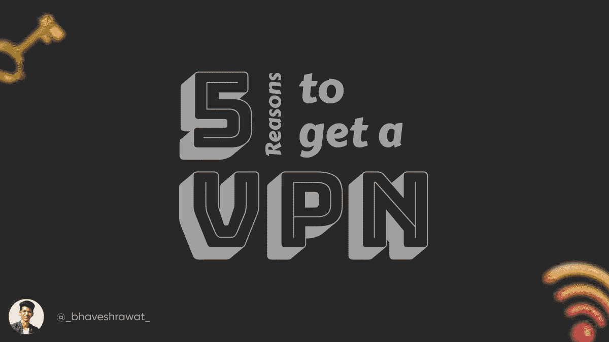
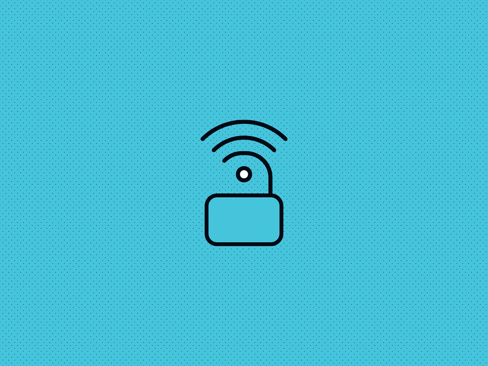
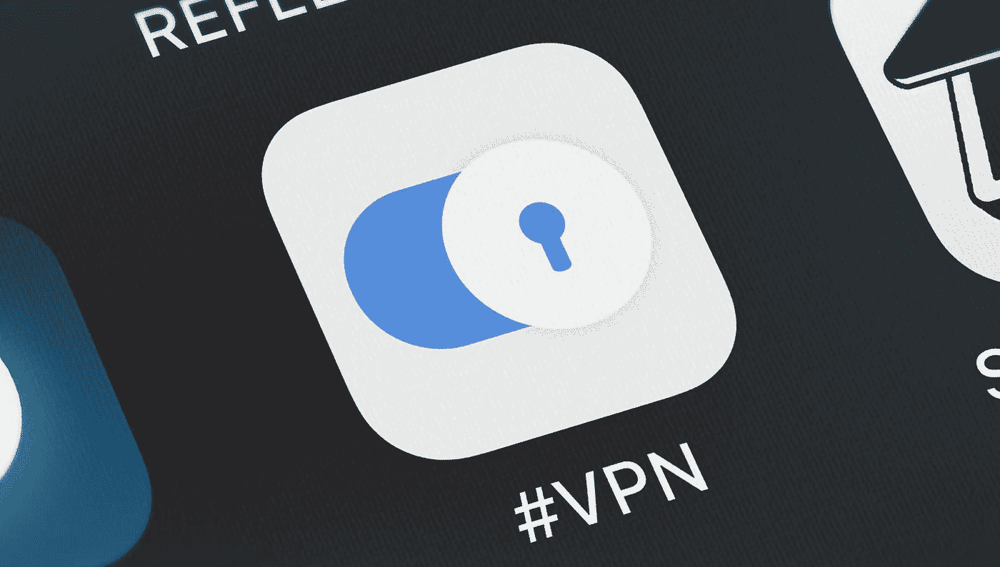
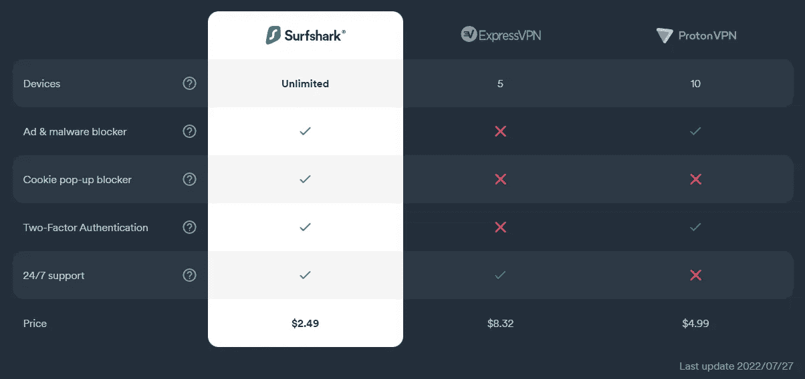

# 你应该投资 VPN 的 5 个理由。

> 原文：<https://medium.com/geekculture/5-reasons-why-you-should-invest-in-a-vpn-90e95e9524fe?source=collection_archive---------10----------------------->

VPN 或虚拟专用网络是一种加密我们与互联网连接的服务。这意味着我们可以免受黑客、间谍软件和其他可能监听我们一举一动的恶意实体的攻击。

Image Credit: [Author](https://bhaveshrawat.pages.dev)

VPN 还通过世界各地的各种服务器位置路由您的流量，因此看起来您正在连接到您本国的服务器，但实际上是连接到您想要连接的服务器。

现在我们已经讨论了 VPN 是什么，并开始讨论为什么要投资 VPN！

# #原因 1 —安全性和隐私

你在互联网上花的时间越多，你留下的数据就越多，大型科技巨头就紧随其后。你的数据就像一块吸引黑客和大公司的磁铁，因为数据就是金钱。对于普通人来说，黑客似乎有点夸张，但是普通人也必须对付跟踪者，我认为这是一个非常严重的问题。

Image Credit: Wired

对于那些以广告收入为商业模式的公司来说，他们喜欢把你活动的最小细节藏在心里。“为什么？”，你问。因为这创造了一个惊人准确的个人资料，帮助这些公司跟踪你的购买习惯，在某种程度上，他们可以预测用某个广告打击你的正确时间。

现在，投资 VPN 不会帮助你完全避免这一点。你仍然会在网上冲浪时留下数据，但现在这些数据已经无法链接回你了。对其他人来说，这些数据可能是没有公司想要或持有的随机乱码。

# #原因 2——一流的公共 Wi-Fi 用户

根据卡巴斯基安全网络进行的一项研究，世界上近四分之一的公共 Wi-Fi 热点[不使用任何类型的加密](https://securelist.com/research-on-unsecured-wi-fi-networks-across-the-world/76733/)。

Image Credit: HotBot

所以，我会马上告诉你，如果你发现自己经常使用公共 Wi-Fi，就给自己弄个 VPN 吧。任何入侵者都可以利用这个机会窥探你的连接，甚至劫持和操纵有害的信息，甚至只是扰乱你。

# #原因 3 —免费 VPN，不好！

这世上没有免费的东西。如果它是免费的，你就是产品！公司正以这样或那样的方式从你身上赚钱。免费提供 VPN 的公司可能会记录流量，然后将数据发送给大狗。或者，把你的电子邮件 ID 卖给不同的商家，这些商家最终会在你的收件箱里大肆宣传他们的产品。

Image Credit: Tom’s Guide

所以，除非你自己安装了 VPN 或者是开源的，否则任何免费提供服务的第三方 VPN 都比没有 VPN 糟糕得多。

所以，投资 VPN，这样使用 VPN 的目的是合理的。

正如你可能知道的，VPN 会影响互联网速度，因为流量必须覆盖距离，并从不同的服务器路由。这些免费 VPN 上的流媒体体验也不好，低质量的流媒体和缓冲由于带宽较少。

高级 VPN 服务可确保在您的设备和服务器之间建立的连接是快速的，具有尽可能少的延迟，并且是安全的。

# #原因 4 —取消任何地理限制

许多电子商务平台对不同的人口统计数据有不同的价格，差异可能相当大。获得 VPN 可以帮助你从这些差异中节省一些钱。

许多 OTT 平台，如网飞、Prime Video、Disney+根据您登录的位置为不同的受众提供不同的内容。VPN 将帮助您消除内容差异，并为您提供该地区的内容。

 [## 网飞用户！！！你会喜欢这个的…

### 我打赌你会喜欢这个网站的！

medium.com](/fuck-niches/netflix-users-youre-gonna-love-this-d69902c8c0c4) 

我也写了一篇关于它的故事，以及如何与内容差异作斗争。你应该好好读一读。

# #原因 5 —与您的家庭、办公室网络同步

最初开发 VPN 的原因是为了安全、快速地远程连接到世界各地不同分支机构的不同系统。

在早期，当大型科技公司在世界各地扩张时，管理数据并不容易，从一个分支机构到另一个分支机构需要花费大量的金钱和时间。微软的员工想出了这个发明，我们称之为 VPN，它改变了员工连接设备的方式。现在，进入网络比以往任何时候都容易。

Image Credit: Silent Partner Software

整个疫情的员工都在使用 VPN 连接到他们的办公系统。这是这些公司持续运转原因。如果你是旅行时需要这种空中联系的人之一。获得一个虚拟专用网将是你的最佳选择建立连接结合远程管理将是你的最佳选择。

现在，我知道你可能在想，“有这么多选择，我应该选哪一个？”让我来帮你吧。我个人使用的是 Surfshark VPN，它提供物超所值的服务，快速、灵活，他们得到了令人惊叹的客户支持，更重要的是价格实惠。我家的四个家庭成员每月使用的费用是 2.49 美元(₹200 ),因此人均费用为 0.62 美元(₹50).我得说这很适合放在口袋里。现在，如果你现在订阅他们的服务，你可以得到 81%的折扣。

Image Credit: [Surfshark](https://get.surfshark.net/SHm4)

好吧，就是这样。我希望它提供了信息，并且对您有所帮助。我不是中型合作伙伴计划的一部分，所以这种支持真的可以帮助我，或者如果你喜欢我的内容，你可以考虑给我小费。

感谢您的宝贵时间！

*上面的链接是附属链接。*