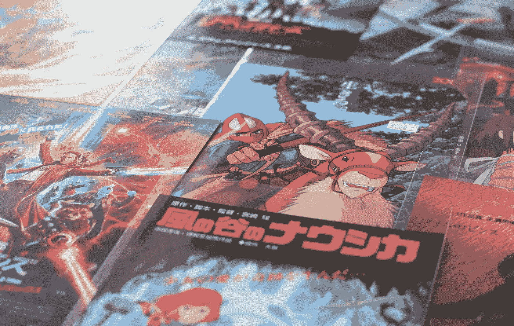

# 5 枚未来潜力巨大的可靠 NFT 硬币

> 原文：<https://medium.com/geekculture/5-reliable-nft-coins-with-massive-future-potential-b69e608c9e76?source=collection_archive---------5----------------------->

## 他们正在解决的优势和问题

Photo by [Matt Popovich](https://unsplash.com/@mattpopovich?utm_source=unsplash&utm_medium=referral&utm_content=creditCopyText) on [Unsplash](https://unsplash.com/s/photos/collectibles?utm_source=unsplash&utm_medium=referral&utm_content=creditCopyText)

正当人们用另类硬币进行投机，试图找到下一个将变得巨大的硬币，并给他们带来 100 倍或 1000 倍的倍增系数，使他们在当前的牛市中变得富有时，他们后来试图用分散的金融代币做同样的事情，当然，还有 NFT 的。现在，最大的赌注是下一个大东西——不可替代的代币。

可替换的代币可以在两个所有者之间交换，如果代币的数量相同，他们每个人都会得到相同的东西。对于不可替换的令牌，如果进行了这种交换，则两个令牌之间存在差异，每个所有者都将获得一个唯一的令牌，该令牌不同于他们给予另一个所有者的令牌。

我开始投资一些 NFT 硬币，并且我计划一旦我发现我认为可以帮助我长期获利的项目，我会继续投资。

虽然不可替代的令牌在技术方面类似于常规的加密货币，但它们也意味着不同，因为它们可以用于创建和存储独特的数字艺术品，这些艺术品也可以是现实世界收藏品的数字版本。这是第一步，但可能性是无限的。

如果我是你，我会投资以下 5 种宝石中的至少一种。但是，请记住，这只是我的观点，不应该作为财务建议。

# 金恩(ENJ)——真正成为游戏物品的主人

区块链游戏的伟大之处在于它允许玩家真正拥有他们游戏中的物品。同样，这些物品可以兑换成货币，如[【金恩】](https://enjin.io/)。

我们今天所知的金恩项目创建于 2017 年，旨在促进 NFT 在其生态系统中的使用。事实上，它的主要重点是开发用户可以真正成为所有者的收藏品。它与三星、微软和其他大公司有合作关系。

金恩解决的问题是，在常规网络游戏中，玩家实际上并不拥有他们的游戏物品。只要游戏存在，这些资产就是他们的，之后，就没有办法利用它们。金恩允许您保留游戏中的物品，并在不同的游戏中对外使用，或者用它们交换加密货币或法币。它也为此提供了必要的生态系统。

增长的潜力是显而易见的，因为区块链游戏似乎是未来，这涉及到在区块链拥有游戏项目。

对于一个游戏玩家来说，有什么比拥有自己的游戏物品更好的呢，真实的，并且想拥有多久就拥有多久？

# 奇利兹(CHZ)——全世界体育迷的硬币

Chiliz 是体育运动的象征，电子竞技也不例外。该项目于 2018 年在马耳他成立，并考虑到运动队的符号化，已经与世界上一些最伟大的足球队建立了合作伙伴关系，如巴塞罗那足球俱乐部或 AC 米兰。

在 socios.com[平台](http://socios.com)上，你可以使用代币投票，作为支持者直接对你喜欢的球队的现实生活产生影响，如球队装备设计，并获得门票折扣或其他福利。

Chiliz 解决的问题是前者不可能直接影响一个运动队的旅程。例如，不管你买了多少代表你最喜欢的球队的收藏品，你都不能影响球队的 t 恤设计。现在你可以用奇利兹代币投票。这将作为运动队球迷的角色提升到了一个全新的高度。

对于世界各地的体育迷来说，有什么比能够真正参与他们的球队并对他们的发展发表意见更好的呢？

# ecomi(OMI)——你最喜欢的漫画书和电影的数字收藏品

omi 背后的公司， [Ecomi](https://www.ecomi.com/) ，总部设在新加坡，拥有 [Veve](https://www.veve.me/) 平台，你可以在区块链的 GoChain 上用 OMI 代币购买数字收藏品。Ecomi 是一家老牌公司，1996 年以不同的形式和名称成立。

想象一下，如果一家公司获得《蝙蝠侠》、《超人》、《捉鬼敢死队》、《回到未来》或《街头霸王》的许可，制作这些知名品牌的数字收藏版，那该有多酷。Ecomi 就是这么做的。

OMI 解决的是满足超级英雄和其他流行收藏品对已经流行的品牌的数字版本的需求。通过 OMI，你可以使用智能手机，在你的 Veve 应用程序中以区块链技术的数字格式购买、出售或存储这些收藏品。

对于超级英雄粉丝来说，还有比拥有代表他们最喜爱的英雄的数字格式的永久收藏品更好的存在吗？

# 分散土地(土地)——拥有虚拟财产

[分散王国](https://decentraland.org/)创建于 2015 年，是一个由用户拥有的虚拟世界，在这里你可以使用名为 MANA 的货币在市场上购买或出售物品，例如你角色穿的物品。你也可以购买和拥有土地，你可以像在现实生活中使用房地产一样使用它进行建设。为此，你有不可替代的令牌称为土地。

虚拟世界现在仍处于起步阶段，因此有巨大的增长潜力。在这个虚拟世界中，有很多合作伙伴可以使越来越多的功能成为可能，比如有真实庄家的赌场，有 NFT 奖的体育比赛，等等。

对于游戏玩家来说，还有什么比一款代表虚拟现实的在线游戏更好的呢？在这款游戏中，你可以购买土地和房地产。

# WAX(WAXP)——艺术、游戏和收藏品的区块链生态系统

成立于 2017 年，与威廉·夏特纳、漫威、卡普空、雅达利和其他大牌公司合作， [WAX](https://on.wax.io/wax-io/) 是一种区块链和加密货币，其应用程序相互连接，以最大限度地发挥其 NFT 市场的潜力:区块链游戏，如外星世界、分散应用程序、收藏品、数字艺术、押注或交换 WAX 加密货币的可能性等。

这个平台正在满足一个完整生态系统的需求，包括 DApps、游戏、NFT，在一个友好的界面中呈现，在同一个地方将所有东西都互联起来。我们仍然处于区块链游戏领域的早期，拥有一个基础设施对 WAX 来说已经是一件大事了。

对于一个既是加密货币新手又是游戏玩家的人来说，通过一个包含游戏的友好生态系统开始学习加密还有什么更好的呢？

可以说，如果你真的想乘风破浪，投资 NFT 是目前最好的事情之一。NFT 仍处于起步阶段，它们值得被视为未来艺术、游戏、收藏品、加密货币和总体去中心化努力的一个选择。它们现在和将来都会被用于音乐行业、漫画和电影世界、体育运动以及任何可以创建数字资产来代表情感、艺术、金融或任何其他类型价值的领域。

**免责声明:** *我不是 NFT 氏症的专家，这篇文章无论如何都不应该被当作理财建议。然而，我确实有一些加密货币和 NFT 的经验，能够比其他人更好地写这些东西。任何投资于加密货币或 NFT 货币的资金都应该来自一只基金，如果这些资产的价值下降，你也要做好亏损的准备。*