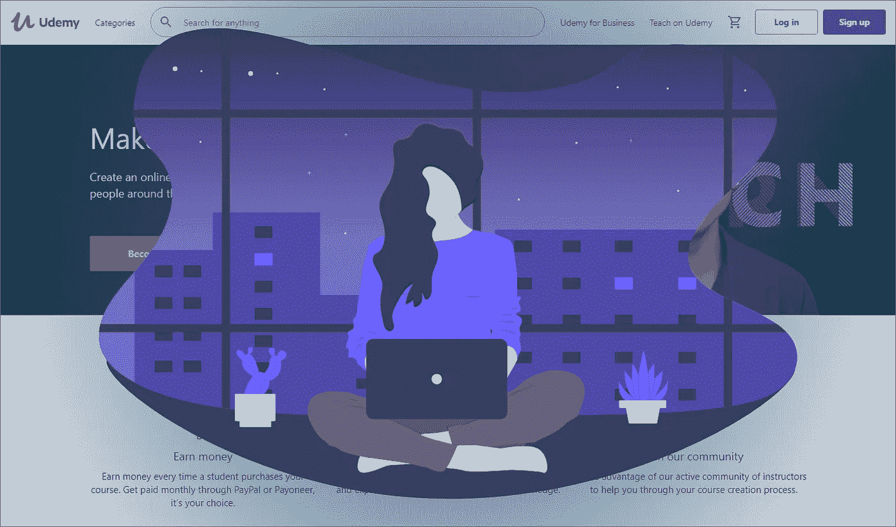

# 5 Side 为任何想赚钱的程序员提供服务

> 原文：<https://medium.com/geekculture/5-side-hustles-for-any-programmer-looking-to-make-money-75be9c7320cf?source=collection_archive---------20----------------------->

侧推的想法听起来很浪费时间。

理想情况下，这是一项不需要花费太多时间但报酬很高的活动。

我的意思是，谁不想要额外的收入来支付食物、订阅服务和房租呢？

如果你赚够了，那么你可以辞掉你的日常工作，开始投资或者提前退休。