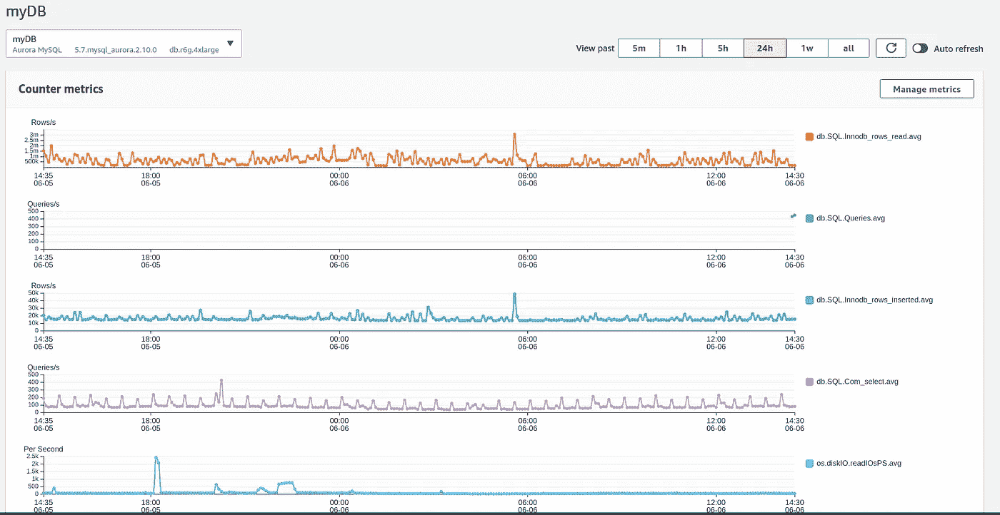
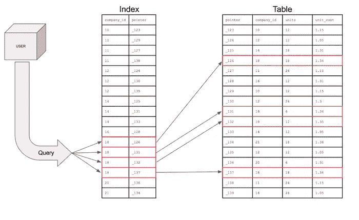
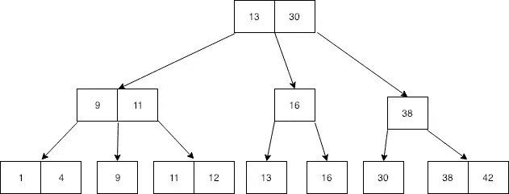
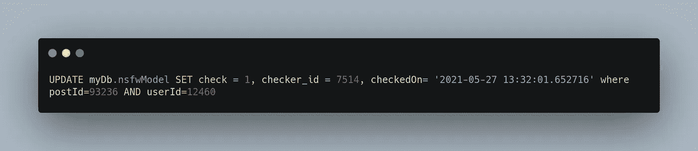
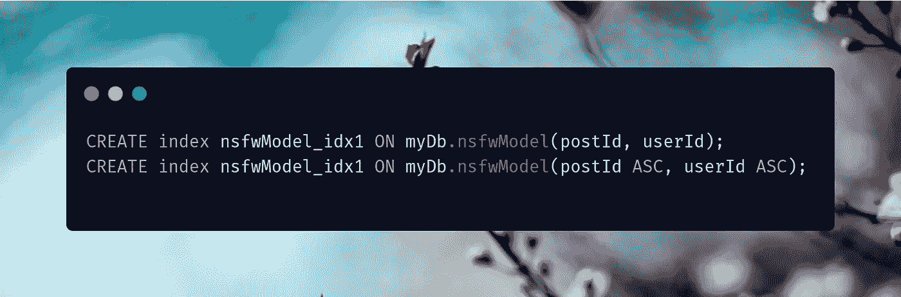
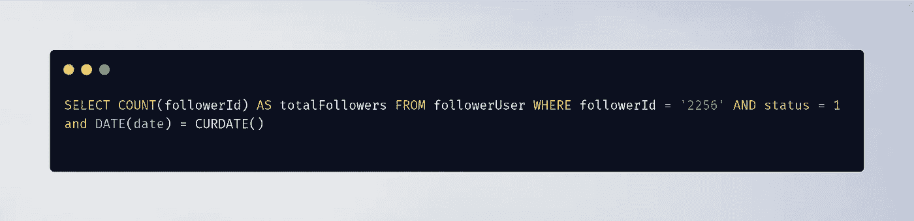
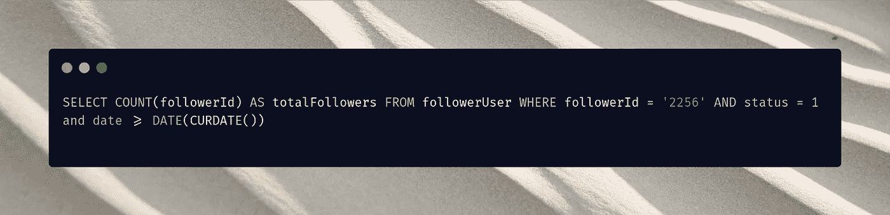

# 5 个您不知道自己需要的 SQL 索引和查询优化

> 原文：<https://medium.com/geekculture/5-sql-index-and-query-optimisations-you-didnt-know-you-need-5650d9c46f47?source=collection_archive---------11----------------------->

如果您是一名软件开发专业人员或学生，您很可能只是因为 SQL 的速度而喜欢或讨厌它，或多或少地熟悉它的技术复杂性，并在某处使用它来完成一项或另一项任务。

但是这篇文章不是关于我们对这个工具有多熟悉，这篇文章是关于对于一个开发人员来说，学习如何编写高效的 SQL 查询来减少数据库的工作负载并让您的客户满意是多么重要。

> 请注意:本文不是关于分区或分片的指南，这些是数据库分布的完全独立的过程，当然，它们会加快您的选择，但是当像策略索引和一些基本的表知识就足够了时，我们还不需要进入那个。

# 动机💪

**我为什么要写这个？** 

如果有人问我为什么要优化我写的 SQL，而我可以在我当前的表中使用一些糟糕的快速语句？:P
至少我是这样认为的，直到我糟糕的方法导致了一个 1 分钟长的 SELECT 语句被用在客户端，作为一个通用的经验法则，你的开发伙伴可能会等待，但你的客户端不会。

## 改进的开发实践🔧

总而言之，更快的查询不会有坏处，对吧？这是可以理解的，有时你在一个截止日期的紧要关头，需要尽快交付应用程序，并不能真正关心这个特定查询执行得好/坏，但请相信我，当你不必回头看这个现在需要优化的特定查询时，处理这个微小的事情将会有很大的帮助，也将有助于你在当前角色的职业生涯中成长

## 谁不喜欢钱？💰

Photo by [Josh Appel](https://unsplash.com/@joshappel?utm_source=medium&utm_medium=referral) on [Unsplash](https://unsplash.com?utm_source=medium&utm_medium=referral)

从个人的行业经验来看，无论你的预算如何，你都不能在粗心大意上花费太多，如果你可以不费吹灰之力就做一些事情，你就应该做，尤其是如果它直接影响你的技术堆栈的整体运营成本。(Psst，公司的人可能不理解，但初创公司的人知道严格控制预算的重要性。)

# 1.了解您的数据库提供商🍵

如果您正在使用本地 SQL 数据库，您可以在进程日志和`mysql.slow_log`表中记录您的慢速查询。一个这样的例子是:

如果你正在使用像亚马逊 RDS 或谷歌云数据库这样的云数据库，请留意它们的数据库监控工具。Amazon RDS 中的 Performance insights 同时也是一个救命稻草。

## 性能见解的优点

*   显示锁时间、前 10 个 SQL 和其他数据库关键统计数据(如每秒处理的行数、每秒插入的行数)的基本思想使它在可视化数据库行为方面与众不同。
*   “按主机切片”功能是我个人喜欢这个工具的一点，因为它有助于跟踪这个 IO 密集型查询是从哪里来的！
*   他们的查询分组特性是我个人推荐的，他们用一个特定的框架将相似的查询组合在一起。例如，如果您有两个高调用/秒或高平均延迟的查询，该工具将跟踪它们并将它们压缩到一个结构中。太酷了。

**绩效洞察力的缺点**

*   用户体验非常慢，重新加载中的边缘情况并不是他们真正考虑过如何正确处理的事情。
*   为什么仅仅停留在 10 个 SQL 查询上？我希望有一个 CSV 报告下载选项，其中包含所有的查询和日志时间，是的，它可以是一个收费的功能，没有问题。
*   说到账单，见解到底为什么要顺便计费:)？

# 2.索引是你最好的朋友💌

如果你在谷歌上搜索了以下问题中的任何一个

> 如何优化我的 SQL 查询？
> 如何让我的查询更快？
> 快速 SQL 查询。

那么你一定会对“**索引**”这个词很熟悉。如果你不欢迎我的索引课，他们到底是什么，为什么他们是这样的生活救星。

## 索引 101 🧑‍🏫

简而言之，索引是一种很好的方式，可以将一个无序的表格按顺序排列，从而最大限度地提高查询效率。未索引的表没有任何决定性的方法来对表进行排序(除了已经被索引的主键之外),因此强制每个查询在表中执行完整的穷举查找，例如，在一个简单的查询中，如:
`SELECT data1, data2 FROM table1 WHERE id BETWEEN 10 AND 20 LIMIT 5;`

在检查后需要返回 5 行的地方，假设有 500 万行。听起来不切实际，对吗？

**这就是索引出现的地方**

借用这个惊人来源的这段文字[索引是如何工作的](https://chartio.com/learn/databases/how-does-indexing-work/)【1】，

> 实际上，索引会导致数据库创建一个数据结构。数据结构类型很可能是一棵 [B 树](https://www.cs.cornell.edu/courses/cs3110/2012sp/recitations/rec25-B-trees/rec25.html)【2】。虽然 B 树的优点很多，但对于我们的目的来说，它的主要优点是可排序。当数据结构按顺序排序时，我们的搜索会更有效，原因显而易见，如上所述。

B-Tree

如果你上过数据结构课，B 树对你来说一定很熟悉。B 树专门用于减少获得磁盘级访问的时间。它是怎么做到的？对于在 B 树中的搜索，其时间复杂度是`O(log_m_(n+1))`，其中`m`是节点的大小，`n`是节点的数量。

**注意**:一旦创建了索引，插入和更新就会变慢，因为现在每个插入和更新操作都会产生额外的`O(Log n)`开销，而在以前，这只是一个简单的搜索和`O(1)`操作。

## 一些值得注意的例子🔍

让我们来看看我在实习任务中遇到的一些现场制作的例子，这是其中最好的例子。

在本例中，我们尝试更新一个数据科学实验表，我们希望在满足 where 条件的每一行中更新特定的一组值。
现在，为了识别我们需要更新的行，当没有索引时，查询将对表进行全扫描，这就是我们的生产数据库对这个特定查询所做的。

最初的查询时间长达 51 秒，对于一个只有不到 5 万行的表的简单更新来说太长了。

解决方案？对 **postId** 和 **userId** 应用复合索引，瞧，更新运行时间下降到个位数秒！

请注意，您可以决定索引的排序方式，默认方式是升序，因此在这种情况下，两个查询将以相同的方式工作！

# 3.多列索引？仔细想想。💭

在我们上面讨论的查询中，我们创建了一个复合索引，即，在两列的组合上创建索引，因为我们将非常频繁地组合该组合来标识特定的行并更新它。但这回避了一个问题:

## Uddeshya，我们可以对 postId 和 userId 都使用索引，对吗？

这个问题的答案是非常非常主观的，在我回答这个问题之前，我建议你浏览一下[EVI homer](https://stackoverflow.com/a/179224)[3]的这个优秀的堆栈溢出答案，它通过一个类似的例子在 **mysql** 的上下文中回答了这个问题(不能太肯定所有的 sql 提供者)。但是对于基本的覆盖范围，它是这样的:

在我们的例子中，索引`nsfwModel_idx1`是建立在`(postId, userId)`上的多列复合索引，这意味着，当我们通过以下方式进行查询时，我们希望该索引将对查询有用:

*   postid 和 userId
*   仅 postid
*   表中的一行由(postId，userId)组合唯一定义。

但是当只使用 userId 时就不行了，因为 SQL server 不会认为这有什么帮助(顺便说一下，索引列是从左到右处理的)。

回到我们的问题，如果我们要创建两个单独的索引，那么是的，SQL 查询优化器引擎将一个接一个地寻找两个索引，并降低查询速度。但是:

*   ❌:这会占用更多的磁盘空间。
*   ❌:这将进一步损害引擎的插入和更新速度，因为记住，更多的索引=更多的插入延迟。SQL 特定函数文章
*   ✔️But:如果你的系统在不同的查询中分别使用两个列，那将会非常令人惊奇。

**最终，这将取决于您的设计决策，以及您如何巧妙地利用现有的索引来优化您未来的查询。**

# 4.服务器功能是好的，但不是在索引列🛑

这实际上对我们来说是一件新鲜事，但却如此平常，我相信你也一定做过这样愚蠢的事。

这个简短的查询什么也不做，只是从一个 follower 用户表中获取 follower id 的总追随者计数，该表包含一些枚举数据类型、状态和不言自明的日期列。老实说，这个查询看起来没什么问题，对吗？在我给你答案之前，让我解释一下这个表中的指数是什么样子的。

*   followerId 列是主键，因此被索引。
*   状态是枚举，因此也是索引的。
*   日期列也被索引！

所以，从理论上讲，我们的 SELECT 语句应该利用所有这三个单独的索引，对吗？
**错。**

罪魁祸首是那个看起来很简单的 DATE() SQL 函数，在这篇 [SQL 特定函数文章](https://www.mssqltips.com/sqlservertip/1236/avoid-sql-server-functions-in-the-where-clause-for-performance/) [4]中引用了这个问题

> …当在 WHERE 子句中使用这些相同的函数时，这会强制 SQL Server 执行表扫描或索引扫描以获得正确的结果，而不是在有索引可用的情况下执行索引搜索。**这样做的原因是，必须对每行数据的函数值进行评估，以确定它是否符合您的标准。**

因此，为了避免对索引进行全面评估，我们所做的只是利用我们的查询需要最新日期这一事实，并因此在查询的右侧应用 date()函数，瞧，查询运行时间从平均 56 秒下降到几乎 5 秒！

# 5.你的桌子需要你的注意，🥺

## 🕵️‍♂️的不幸的订单好奇的情况

很多时候，为了完成简单而琐碎的任务，比如说，你想找到 10 个最近的通知，其中包括 19 个类别。

但棘手的是，我们亲爱的表是由 **categoryId** 和 **createdAt** time 按升序索引的，因此，我们运行了一个额外的 order by 操作，它的方向也与应该执行的方向相反。巧妙使用索引可以让你的生活更轻松，不负责任的索引，嗯，它们可以让你的生活变成 15 分钟**(我不是开玩笑，字面意思是 15 分钟运行时间)**运行时间地狱。选择权在你。
我们面临的问题是:

**建议阅读**来详细了解我们到底在谈什么:Markus Winad 的文章[关于 Indexing Order 的文章](https://use-the-index-luke.com/sql/sorting-grouping/indexed-order-by)【5】。

因此，我们决定利用已经存在的索引，而不是在它上面再应用一个操作，而不是修改一个列上的索引，因为修改索引会花费几个小时的时间。

我们计算了总行数，并根据页面，我们改变了偏移量，结果得到了极大的改善(老实说，没有我们预期的那么好，它仍然是 50 秒长，但它比 15 分钟长，我猜。毕竟，我们处理的是一个有 4.6 亿行的表。

## 他们存档的那个👀

我们遇到了一个非常繁重的查询，它只有一个任务，即每天存档当前的“爱情”状态，以便于将来检索和作为后备计划。对于某些上下文，这个查询运行在一个 Cron 作业实例上，并且必须一天运行 5 到 6 次。

需要注意的重要一点是，每次保存 20，000 个爱情的查询处理了大约 7000 万行，平均运行时间是多少？2-3 分钟。

如何解决这个问题？

由于我们的 loveSamples 表既有 updatedAt 作为索引，又有“loveId”作为自动递增的主键(因此类似于按升序排列的索引)，我们决定在需要存档的最早的 20，000 个 like 中找到最大的 loveId，然后使用这个最大的 Id 驱动插入，这确保了我们精确地获得 20，000 行，从而大大缩小了搜索范围。

# 资源！📚

*   [索引是如何工作的](https://chartio.com/learn/databases/how-does-indexing-work/) [1]
*   什么是 [B 树](https://www.cs.cornell.edu/courses/cs3110/2012sp/recitations/rec25-B-trees/rec25.html)s【2】
*   [索引最佳实践](https://stackoverflow.com/questions/179085/multiple-indexes-vs-multi-column-indexes/179224#179224) [3]
*   [避免索引上的 SQL 函数](https://www.mssqltips.com/sqlservertip/1236/avoid-sql-server-functions-in-the-where-clause-for-performance/) [4]
*   [按资源的索引顺序](https://use-the-index-luke.com/sql/sorting-grouping/indexed-order-by)【5】