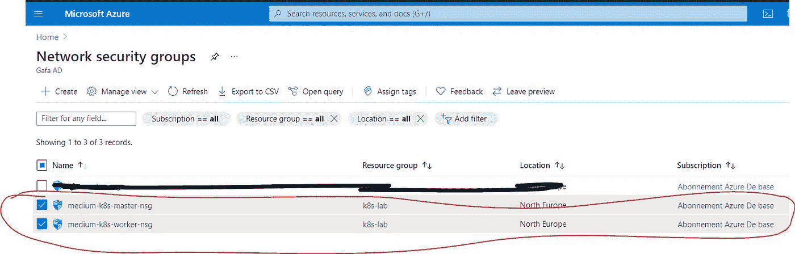
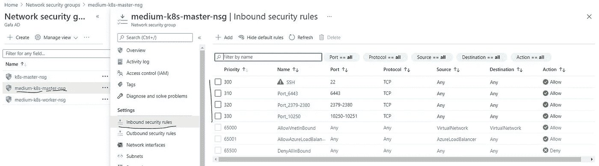
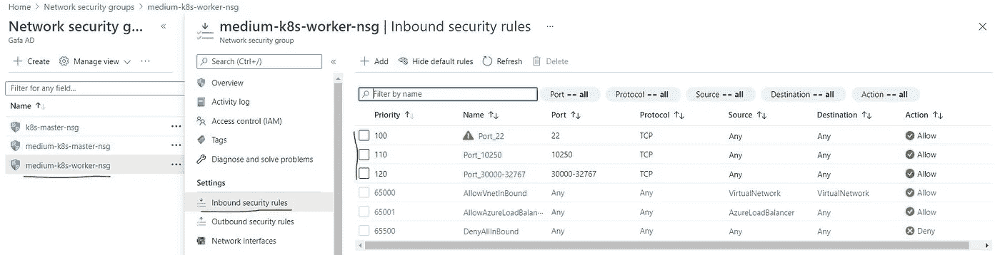
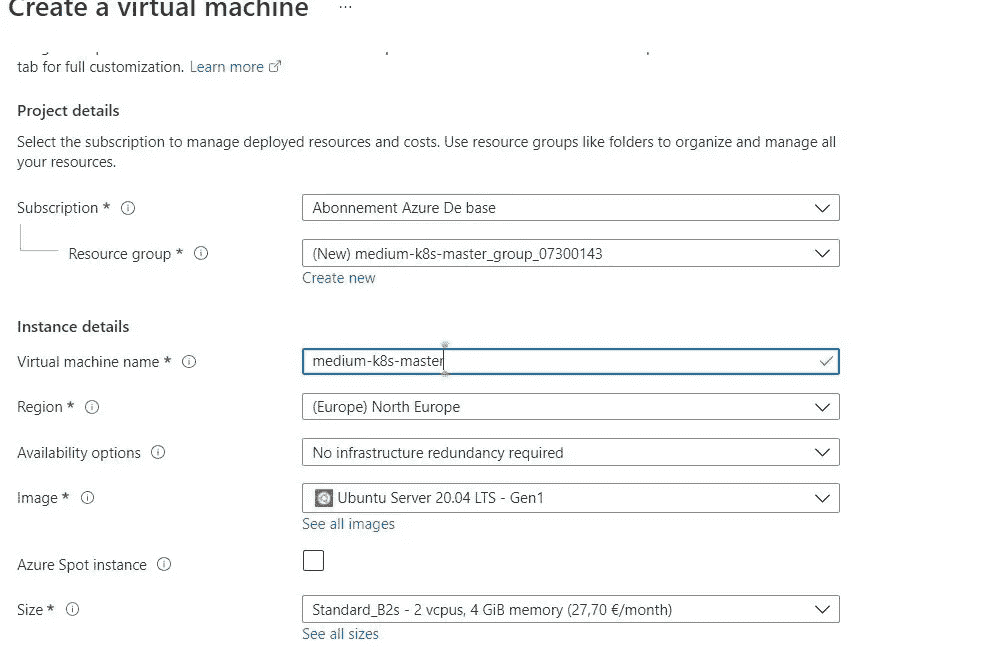
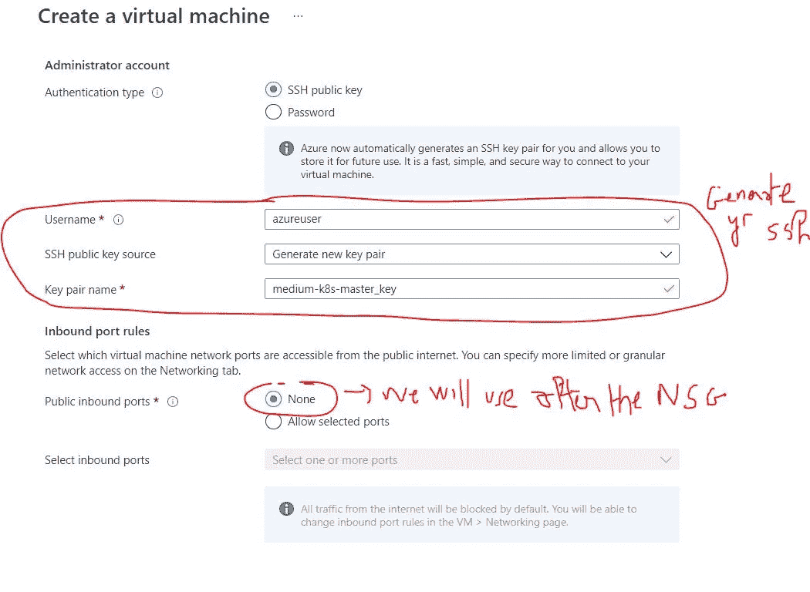
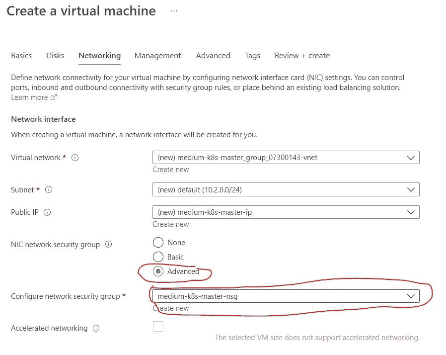
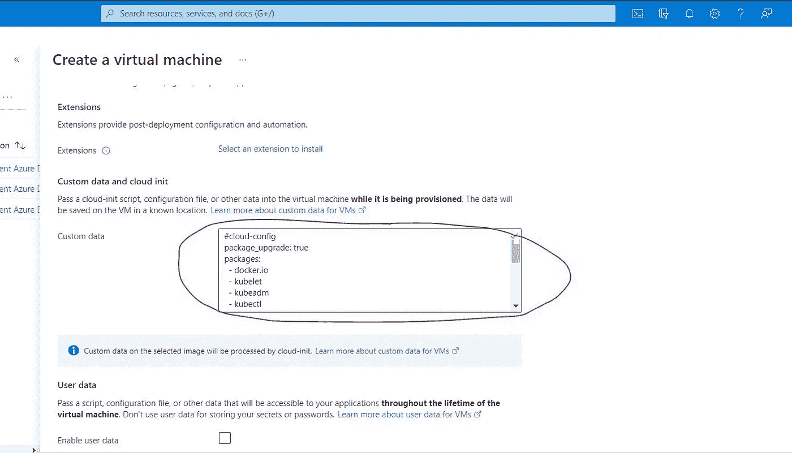
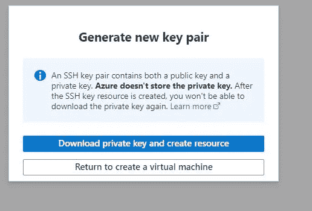

# 使用云配置自动安装 K8S 的 3 个步骤

> 原文：<https://medium.com/geekculture/5-steps-to-auto-install-k8s-with-cloud-config-ad2935c559c7?source=collection_archive---------20----------------------->

## 第 1 部分:自动安装，从头开始配置 K8S 集群“适合初学者”

> 我:“儿子，你能帮我安装一下 **K8S 集群**吗😆？?"
> 
> 儿子:"**上 Prod Env** ！😲"
> 
> 我:“Yes Plz！！这事儿**比你**想的**容易**😉"


**We'll Do It**

从头开始安装 K8S 集群是一项具有挑战性的工作😫，官方文件 **k8s** 太大，信息**的**件**分发给不同的部分😅，所以对于想从**开始学**这种**技术的人来说，要花**多**的时间去**搜索**、**了解**、**安装**、**配置**。****

我以一个与我三岁的儿子的对话开始这个故事，来证明在一个相似的生产环境中安装一个 T42 K8S 集群比你想象的要容易得多😝。

**目标**在**首先**是**通过简化 K8S 集群在**类似生产环境**中的安装和配置，让初学者**熟悉这个**环境**

你可以在这里找到奖金的例子👌：

[](https://naoufal-gafa.medium.com/3-steps-to-auto-install-k8s-with-cloud-config-1c4f9a6ba572) [## 使用云配置自动安装 K8S 的 3 个步骤

### 第 2 部分:部署额外示例 K8S 集群“面向初学者”

naoufal-gafa.medium.com](https://naoufal-gafa.medium.com/3-steps-to-auto-install-k8s-with-cloud-config-1c4f9a6ba572) 

我们开始吧😁

# 语境

对于**学习环境，**你可以使用`**minikube**` **、** `**micro-k8s**`或者`**kind**`，这三个都是快速安装配置 **Kubernetes** ，不需要一些高级的系统配置。

然而，在**生产环境**中，我们有 3 种方法可以做到:

*   `**kubeadm**`
*   `**kops**`
*   `**kubesray**`

我将通过使用**虚拟机、**和的**自定义数据**(对于其他云提供商为 [**用户数据**](https://cloudinit.readthedocs.io/en/latest/topics/format.html#user-data-formats) )上的 [**云配置数据**](https://cloudinit.readthedocs.io/en/latest/topics/format.html#cloud-config-data) 来简化设置我们的 PAAS **K8S** 和**两个 Azure 虚拟机**(您可以选择任何其他云提供商虚拟机)😇。

> 先决条件:
> 
> → Azure 帐户(或创建一个)

# 步骤 1:创建网络安全组

在创建虚拟机之前，让我们创建将用于不同机器的所需的**网络安全组(NSG)** :

*   转到网络安全组并创建这两个 NSG，如下图所示:



Network Security Group

*   `**medium-k8s-master-nsg**`将被附加到**控制平面节点(VM)的网络接口****→**入站安全规则必须满足 [k8s 要求](https://kubernetes.io/docs/setup/production-environment/tools/kubeadm/install-kubeadm/#check-required-ports)，你应该**打开**这些**端口** : **6443** ，**2379–2380**， **10250- 10251**



medium-k8s-master-nsg

*   `**medium-k8s-worker-nsg**`将被附加到**网络接口的工作节点(VM) →** 入站安全规则必须满足 [k8s 要求](https://kubernetes.io/docs/setup/production-environment/tools/kubeadm/install-kubeadm/#check-required-ports)，你应该**打开**这些**端口** : 10250，30000–32767



**medium-k8s-workers-nsg**

> 对于这两者，不要忘记打开 ssh😉

# 步骤 2:在 Azure 上创建虚拟机:

所有**虚拟机**将运行最新**版本**的 **Ubuntu** 并且根据 [**文档**](https://kubernetes.io/docs/setup/production-environment/tools/kubeadm/install-kubeadm/#before-you-begin) 它们必须至少拥有:RAM≥**2gb**&**CPU**≥**2 个 CPU**

> 如果你用 Azure 创建了一个新帐户，你将有 **12 个月**的 **750 小时**Linux 虚拟机**免费**和 **200 美元信用**用于 **30 天**测试 **Azure 付费服务**，如我们将在本教程中使用的**虚拟机**😉

转到虚拟机，点击**“创建”**、**“虚拟机”。**通过配置虚拟机创建的每个选项卡，尝试遵循以下步骤👌。

## 1.基本选项卡:



**Basic Configuration — 1**



**Basic Configuration — 2**

## 2.网络选项卡

转到“网络”选项卡，选择之前创建的 NSG:



**Link NSG**

> 现在是时候转到**高级选项卡**并将**“魔法代码”**粘贴到**自定义数据**上了

## 3.高级选项卡

这段代码将**更新** & **升级**系统，安装`**docker, kubeadm, kubelet, and kubectl**`，并 [**让**](https://kubernetes.io/docs/setup/production-environment/tools/kubeadm/install-kubeadm/#letting-iptables-see-bridged-traffic) `[**iptables**](https://kubernetes.io/docs/setup/production-environment/tools/kubeadm/install-kubeadm/#letting-iptables-see-bridged-traffic)` [**看到桥接的流量**](https://kubernetes.io/docs/setup/production-environment/tools/kubeadm/install-kubeadm/#letting-iptables-see-bridged-traffic) 。

> 为了更好地理解，我对这个文件的每个步骤和命令都做了注释👌。



**Advanced Tab**

*   全部完成后，点击**“审核+创建”**和**“创建”**
*   下载私钥并保存在~/。ssh 文件夹



*   现在**重复**同样的**事情**到**通过附加**工作器的网络安全组**创建**工作器节点机`**medium-k8s-workers-nsg**`
*   使用下载的私钥 SSH 您的机器:

```
chmod 400 ~/.ssh/medium-k8s-master_key.pem
ssh -i ~/.ssh/medium-k8s-master_key.pem k8s-user@40.127.103.3 #the ip address of your machine
```

# 步骤 3:配置您的 K8S 集群

## 配置主节点:

> Y 您必须部署一个基于[容器网络接口](https://kubernetes.io/docs/concepts/extend-kubernetes/compute-storage-net/network-plugins/#cni) (CNI)的 Pod 网络插件，以便您的 Pod 可以相互通信。
> 
> 在我们的例子中，我们将使用**法兰绒**作为`**CNI**` **附件**来实现 [Kubernetes 网络模型](https://kubernetes.io/docs/concepts/cluster-administration/networking/#how-to-implement-the-kubernetes-networking-model)。所以我们必须把它传递给`**kubeadm init**`指挥部。

*   在主节点上，通过指定 P **od 网络 CIDR** 来初始化集群

```
sudo kubeadm init --pod-network-cidr=10.244.0.0/16
```

*   **复制**和**保存**生成的**加入命令**

```
sudo kubeadm join 10.1.0.4:6443 --token 4tyt9j.uve6tfdb3a7rvb63         --discovery-token-ca-cert-hash sha256:04c3d3f38b3229fe7b8f808b02bbd48ce95d8a973882b281db579ce6734555c5
```

*   在公开的地方获取配置供`**kubectl**` 使用:

```
mkdir -p $HOME/.kube
sudo cp -i /etc/kubernetes/admin.conf $HOME/.kube/config
sudo chown $(id -u):$(id -g) $HOME/.kube/config
```

*   手动展开[法兰绒](https://github.com/flannel-io/flannel#flannel)

```
kubectl apply -f [https://raw.githubusercontent.com/coreos/flannel/master/Documentation/kube-flannel.yml](https://raw.githubusercontent.com/coreos/flannel/master/Documentation/kube-flannel.yml)
```

## 配置从属节点:

**通过添加`--node-name worker1`将**join 命令粘贴到工作者节点上。

> 如果有多个员工，也要这样做👌。

示例:

```
sudo kubeadm join 10.1.0.4:6443 --token 4tyt9j.uve6tfdb3a7rvb63         --discovery-token-ca-cert-hash sha256:04c3d3f38b3229fe7b8f808b02bbd48ce95d8a973882b281db579ce6734555c5 --node-name worker1
```

## 检查您的集群:

*   在主节点上运行

```
# to see all resources on all namespace
kubectl get all --all-namespaces# to verify the joined worker nodes
kubectl get nodesNAME                STATUS   ROLES                  AGE     VERSION
medium-k8s-master   Ready    control-plane,master   3d22h   v1.21.3
worker2             Ready    <none>                 3d22h   v1.21.3
```

> K8S 集群的安装和基本配置已经完成，现在是部署额外示例的时候了
> 
> 下一篇文章再见🙋

# 结论

**Cloud-init** 是一个初始化云实例(Azure VM)的伟大工具，它允许我们自动化软件包安装、文件创建和命令执行💪。
这种自动化限制**手动干预**到**集群的配置**。因此，在**几分钟内**，您将准备好**集群**，并且您可以开始**部署**基础示例，如 **k8s 仪表板** & **hello world** 。

您现在可以对您的集群做任何您想做的事情:安装一个 **MetalLb** 来创建类似**负载平衡器**的服务，使用**入口控制器**，挂载**卷，部署 Prometheus 和 Grafana 仪表板** …

在下一个故事中，你会看到额外的例子 ✌️

如果你对 **AWS 云架构**感兴趣，请**参考**我关于**微**和**无服务器架构**的文章

[](https://naoufal-gafa.medium.com/aws-when-serverless-and-microservice-get-married-securely-6585f7856a0f) [## AWS S3M 模式:安全结合无服务器和微服务的 5 个步骤

### “使用这种抽象模式来构建复杂的云架构，可以节省您的时间”

naoufal-gafa.medium.com](https://naoufal-gafa.medium.com/aws-when-serverless-and-microservice-get-married-securely-6585f7856a0f) [](https://levelup.gitconnected.com/aws-s3m-pattern-terraform-devops-for-a-10-years-child-dac4610017ff) [## AWS S3M 模式:适用于 10 岁儿童的 Terraform 和 DevOps

### 第 2 部分:地形和开发

levelup.gitconnected.com](https://levelup.gitconnected.com/aws-s3m-pattern-terraform-devops-for-a-10-years-child-dac4610017ff) [](/codex/aco-architecture-5-tips-to-auto-costoptimization-on-aws-67f026e3abcc) [## ACO 架构:AWS 自动成本优化的 5 个技巧

### 第 1 部分:ACO 架构

medium.com](/codex/aco-architecture-5-tips-to-auto-costoptimization-on-aws-67f026e3abcc) 

> **别忘了**拍拍**，评论、分享、订阅最新故事😜**
> 
> 如果您有任何意见，请随时通过我的 [Fb 页面](https://www.facebook.com/neogafa)、 [Twitter](https://twitter.com/NaoufalGafa) 或通过[我的网站](https://www.elgafa.com/)联系我

# 参考

*   [K8s 文档](https://kubernetes.io/docs)
*   [K8S 仪表板](https://github.com/kubernetes/dashboard/blob/master/docs/user/access-control/creating-sample-user.md)
*   [Kubernetes 从零开始](https://betterprogramming.pub/kubernetes-from-scratch-4691283e3995)
*   [K8s 云配置](https://gist.github.com/tsertkov/63592dda12d1b1818b7297fd2dccee0f)