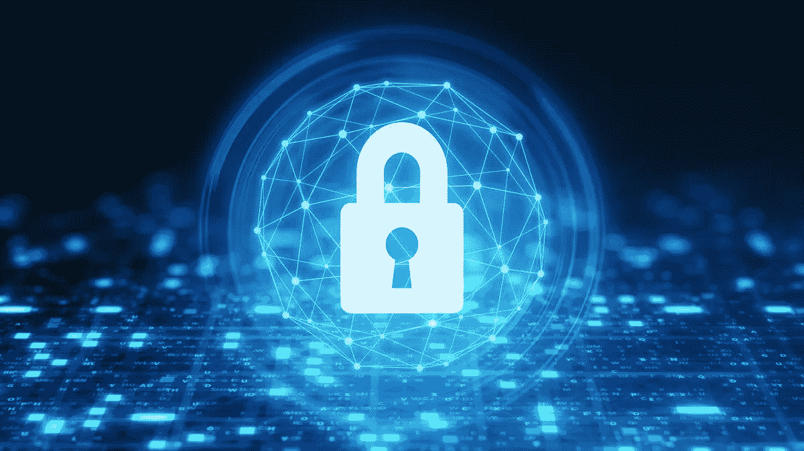

# 有效保护您的密码的 5 个步骤

> 原文：<https://medium.com/geekculture/5-steps-to-protect-your-crypto-efficiently-8eaa6284de7?source=collection_archive---------19----------------------->

## 加密投资者的安全最佳实践

在 2022 年，购买加密货币从未如此容易。[区块链技术的潜力](/geekculture/the-disruptive-potential-of-blockchain-technology-6bcb62725894)每天都在得到更好的理解，越来越多的投资者进入市场。然而，加密生态系统也是骗子和黑客的乐园。

这里有 **5 个步骤**你可以采取来有效地保护你的资产。

# 1.检查您的钱包私钥所有权🔐

您的加密货币存储在区块链上的一个账户中，该账户只能通过私钥访问。基本上，**任何知道你私钥的人都可以访问你的资金并对其执行操作**。

说到选择加密货币钱包，第一个重要的特征就是检查钱包是**保管型还是非保管型**。意思是看谁拥有私钥:*钱包提供者*(保管钱包)还是*自己*(非保管或分散钱包)。

**保管方案**为你扣留你的私钥。这意味着他们完全控制你的资金，并在你进行交易时充当中介代理。在这方面，他们的运作接近今天的银行体系。好的一面是，如果你有问题，你最终可以受益于客户支持。

**非托管解决方案**由智能合约构建和运作，无需任何中介机构，实现点对点交易。在这里，您是您的私钥的唯一所有者。除了你之外，没有人可以访问你的资金或对你的资金进行任何操作。这也意味着你要对自己的行为完全负责:如果你犯了一个错误，不会有客户支持来帮你解决。

欲了解更多信息，请参考[保管型与非保管型钱包](https://freewallet.org/blog/custodial-vs-non-custodial-wallet)。

# 2.检查您的钱包互联网连接🌐

持续连接到互联网的钱包(如网络平台、移动应用等)被称为**热门钱包**。相比之下，**冷钱包**(如硬件设备)与互联网网络隔离。

热钱包可以是保管型([Crypto.com](http://Crypto.com)、[币安](https://accounts.binance.com/en/register?ref=WPBYWVU3)、[瑞士堡](https://join.swissborg.com/r/yannIQ4K)、[比特币基地](https://www.coinbase.com/join/delclo_8)、…)或非保管型( [MetaMask](https://metamask.io/) 、 [Trust Wallet](https://share.trustwallet.com/Rg3AXdC) 、 [Argent](https://www.argent.xyz/) 、…)而冷钱包则是系统性非保管型([总账](https://shop.ledger.com/?r=795240e8c7c7)、 [Trezor](https://trezor.io/) 、…)。

如果热门钱包倾向于提供更高质量的服务(更好的用户体验，简单快捷的交易，被动的收益选择等等)，他们自然更容易受到网络攻击。

因此，从安全角度来看，冷钱包被认为更安全。

有关更多信息，请参阅[加密钱包类型解释](https://academy.binance.com/en/articles/crypto-wallet-types-explained)。

# 3.使用多个钱包⭐

现在，在安全方面，使用一个钱包是有风险的。事实上，即使钱包本身是高度安全的(例如非保管型冷钱包)，也总有可能出问题(私钥丢失、黑客攻击、网络攻击等)。

考虑到这一点，明智的做法是把你的资金分成多个钱包，尤其是当你已经进行了重大投资的时候。

我个人的做法是使用**硬件钱包进行长期投资:**

*   [总账](https://shop.ledger.com/?r=795240e8c7c7)
*   特雷佐

以及精选的**热门钱包组合，从其高质量服务中获益:**

*   [Crypto.com](https://crypto.com/app/7nhae26fvz)
*   [币安](https://accounts.binance.com/en/register?ref=WPBYWVU3)
*   瑞士堡
*   [比特币基地](https://www.coinbase.com/join/delclo_8)

# 4.实施安全最佳实践🛡️

此外，下面的**安全措施**可以帮助你阻止大多数与区块链有关的黑客攻击。

1.  使用**健壮的密码**——长的混合字符(大写/小写字母、数字、符号)，避免有意义的单词和常见的替换(例如，0 代表 O，$代表 S，…)。
2.  启用**双重认证** —也称为双因素认证(2FA)。
3.  在确认交易之前，**仔细检查地址和选择的网络**——一个愚蠢的错误会导致资金损失。
4.  对于新地址的交易，进行少量的**测试转移**。
5.  **不要把太多资产放在热门和保管钱包上**——那是你的资金最容易暴露的地方。
6.  **保护敏感数据** —例如，如果你使用电子表格来跟踪你的投资，用密码保护它。为了最大程度的安全，使用编码软件加密您的数据。
7.  **不要连接公共 Wi-Fi** 。

# 5.采取谨慎的态度💡

现在，虽然前面的措施可以帮助您防止一些攻击，**最容易获得您的资金的方法是您**。

窃贼利用人类的心理弱点，利用精神操纵来获取受害者的敏感和隐私信息。这种类型的攻击被称为**社会工程**，是目前最普遍的。

以下措施将帮助您防范最常见的诈骗:

1.  **不要在公共场合透露任何敏感或私人信息**——投资额、投资组合、利润和亏损……为你保留这些信息，尤其是如果你在社交网络上。
2.  小心**假邮件(网络钓鱼)** —虽然有些假邮件“显而易见”(丑陋且充满拼写错误)，但有些真的很有说服力。为了避免被困住，不要直接打开可疑电子邮件的链接，先检查与按钮相关的链接。如果可能，开启*反钓鱼*(可能在[Crypto.com](http://crypto.com)或[币安](https://accounts.binance.com/en/register?ref=WPBYWVU3)上)。
3.  小心**假网站**——知名网站的复制品也很有说服力。这些假冒网站可以很容易地通过检查他们的网址发现。

我希望你喜欢这篇文章！

*如果是这样，请不要犹豫，分享您的反馈*👏

***免责声明*** *:本文内容基于个人观点，不建立任何理财推荐。你只对你过去和未来的投资负责。*