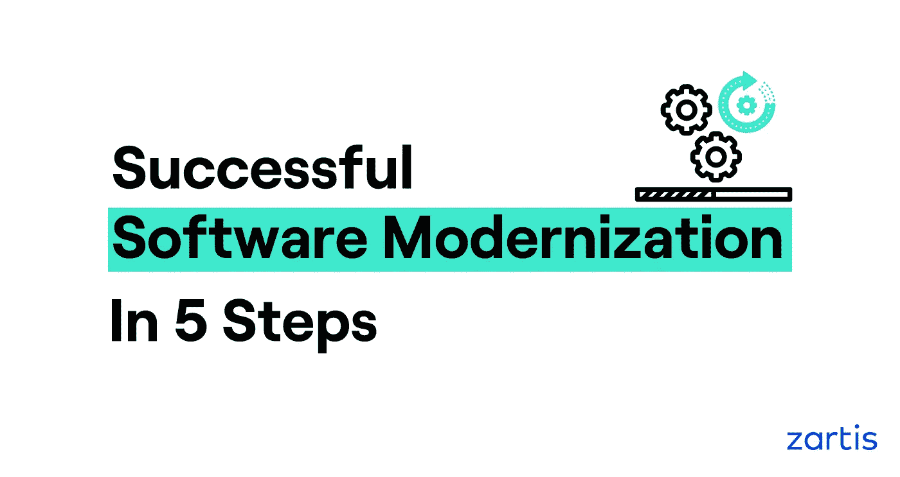

# 成功软件现代化的 5 个步骤

> 原文：<https://medium.com/geekculture/5-steps-to-successful-software-modernization-47c83141634a?source=collection_archive---------17----------------------->

## 使遗留系统和软件现代化的路线图

在当今时代，如果您依赖过时的技术，几乎不可能保持竞争优势并实现您的业务目标。为了脱颖而出，您应该开发一个经过深思熟虑的软件现代化策略来评估并最终淘汰现有的遗留系统…