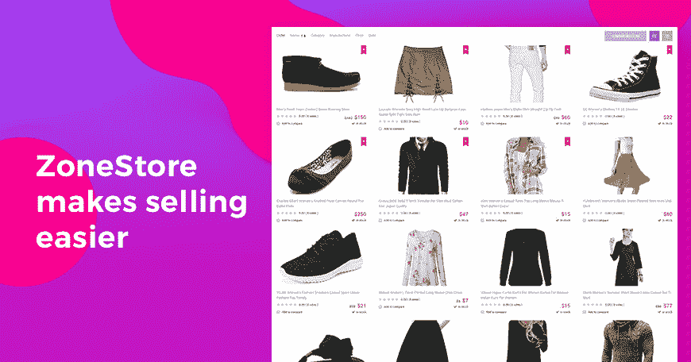
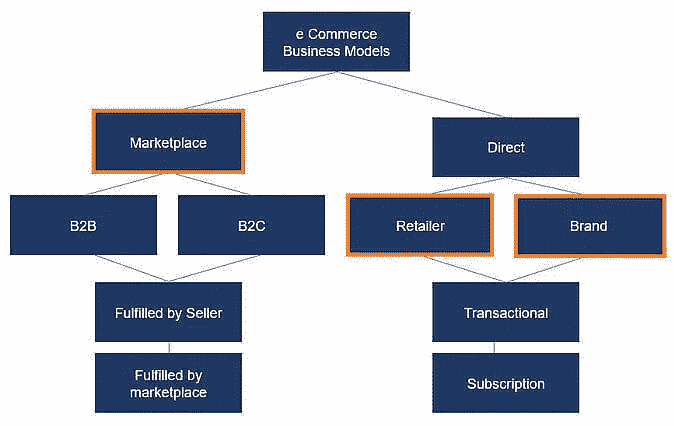
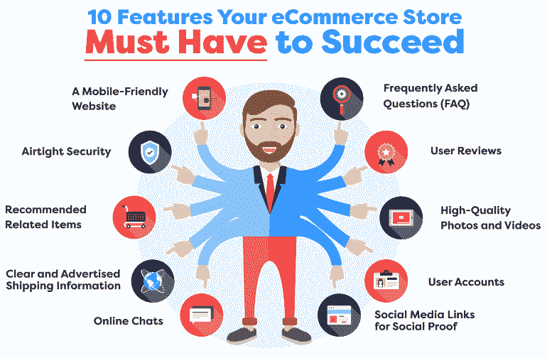

# 创建电子商务网站前你必须加入书签的 5 个步骤

> 原文：<https://medium.com/geekculture/5-steps-you-must-bookmark-before-creating-an-ecommerce-website-6e23d251f1b7?source=collection_archive---------16----------------------->

[Image source](https://blog.shift4shop.com/the-ecommerce-process)

我们周围的世界正在迅速变化，预计到 2040 年底，全球 95%的购物将在网上进行。传统商业生存的可能性很低，这就是为什么每个实体店都必须转向电子商务才能长期生存的原因。

然而，创建一个在线电子商务商店需要你了解市场的所有可能性。此外，你还需要对品牌、内容和网页设计策略有很强的把握。乍一看，感觉工作量很大；然而，战略性的计划会带来巨大的成功。

为了在整个过程中帮助你，我在这里描绘了一个路线图。所以，让我们来学习一些在开始电子商务网站开发之前你需要采取的主要步骤。

**#1。确定你要卖什么**

在创业之前，你必须知道你到底要卖什么。在创建一个网上商店之前，你需要弄清楚你的激情，因为这是你在商业中享受快乐的主要基础。你可以从事任何事情，包括精品吉他效果踏板，昂贵的手表，或鱼饵；在超越之前，你必须清楚自己的定位。

你必须认识到一个事实，即经营电子商务业务；你需要对你要销售的产品和你的目标受众进行有指导的研究。该因素将区分你的成功和一堆商品的终点。

[Image source](https://www.joomla-monster.com/blog/joomla-templates/optimal-products-list-view-for-ecommerce-website)

通过了解市场的一切，你将进入并密切关注成功的产品类型和趋势。而且，你的目标受众在寻找什么也很关键，了解他们未来的需求是什么也很关键。

在创建一个 [**电子商务软件解决方案**](https://www.valuecoders.com/ecommerce-software-solutions?utm_source=medium-creating-ecomsite&utm_medium=d7) 之前，你必须记住，你将要进入的领域不缺乏竞争，巨型公司的数量同样在增加竞争。奋斗将是旅程的一部分，但在进入这个行业之前，认识到一个利基市场是至关重要的。

**#2。确定电子商务商业模式**

知道你将采取哪种方式做生意是至关重要的。因此，两种主要的电子商务商业模式是流行的，称为企业对企业(B2B)和企业对客户(B2C)。让我们了解一下这些商业模式。

**企业对客户(B2C)**

在这种模式下，你向客户销售你的产品，你的主要关注点是客户。最主要的例子就是你在亚马逊、Zappos 或 Target 等网站上开设的商店。你可以使用这些平台，你可以利用这个平台直接向全球客户销售你的产品。

在这种商业模式中，B2C 电子商务网站上提供的东西和服务直接面向所有人，没有外人参与。

[Image source](https://corporatefinanceinstitute.com/resources/knowledge/other/e-commerce-business-models/)

**企业对企业(B2B)**

顾名思义，在这种电子商务商业模式中，企业与另一个企业进行交易。在这种模式下，组织制造一些产品，并提供给分销商和零售商进一步销售出去。没有民众的实际参与。房间是一个完美的例子，这种类型的电子商务网站。

**#3。了解你的目标受众**

在你熟悉的领域开展在线业务的一个好处是，你绝对了解你的人群，就像其中的一部分。无论如何，不管你是否完全了解你的客户，做些小工作来更好地理解他们对任何在线业务都是有帮助的。

理解你的潜在目标受众可能会接触到互联网业务发展措施的各个方面。一切都应该为你的潜在客户量身定制:客户体验和用户界面，网站架构的视觉效果，内容，等等。

你应该知道谁是你的潜在客户。他们的体验如何？他们的工资范围是多少？他们会说自己多大了？此外，他们会说他们可能会从哪些竞争者的网站上购买？这些数据的整体将帮助你进行 [**电子商务软件开发**](https://www.valuecoders.com/ecommerce-development-services-company?utm_source=medium-creating-ecomsite&utm_medium=d7) ，因为他们会喜欢和需要，与他们建立一个更接地气的联系，并创造一个更好的客户体验。

**#4。决定合适的电子商务平台**

当谈到创建一个电子商务平台时，你有许多选择，如 Magento、Shopify 和第三方插件 WooCommerce with WordPress 来启动你的电子商务网站。此外，不同电子商务产品平台之间不乏利弊。

这里有一些强大的功能，应该是你将要决定的电子商务发展战略的一部分。

**响应计划:**无论是在工作区、多功能应用程序还是其他手机上，基于网络的业务平台都应该提供可预测的体验。‍

产品管理:你要做的每一件事，比如添加、修改和监控库存，都必须很容易实现。此外，你还需要提供不同类型的项目，或在需要时处理。

**内容管理系统(CMS** ):你还需要一个内容管理系统来添加像期刊和新闻这样的内容。有一个 CMS 可以帮助你更新你的网站内容和博斯特销售。

[Image source](https://www.visiture.com/blog/10-features-your-ecommerce-store-must-have-to-succeed/)

**购物车:**准备好重做和设计一个购物篮，目标是让它始终符合购物体验。‍

结帐页面:和购物篮一样，你不应该留下一个不能更改或定制的结帐页面。‍

**支付处理:**它可以确认信用卡支付，就像电子支付模式一样，如 Pay、PayPal、Stripe、Google Pay 和其他正常的支付入口。

**#5。做有效的营销**

现在是增长所依赖的主要方面——市场营销。推广好你的电子商务，让它能被你的目标受众认可是至关重要的。以下是你必须做的主要事情。

*   确保有效的搜索引擎优化您的网站。
*   创建高质量、引人入胜的内容。
*   确定产品类别，并确保添加一个古怪而吸引人的产品描述。
*   抛出一个忠诚度政策，以保持客户参与你的平台(电子邮件营销)。
*   在你的网站上包括高质量和详细的产品图片。
*   找到合适的运输软件。

为了从你的电子商务网站获得有效的结果，你需要有效地实施营销和推广，并增加其在互联网上的客户覆盖面。此外，你网站上的产品展示应该吸引人，以赢得顾客的心。

**包装**

电子商务为小型零售商和那些希望在数字领域占据一席之地的人打开了机会之门。还有！2021 年，有效的、以目标为中心的电子商务网站开发可以成为成功的代码。

如果你想创建一个令人兴奋的电子商务网站，确保你遵循给定的要点，并熟练地执行每个步骤。此外，你可以求助于 [**电子商务网站开发服务**](https://www.valuecoders.com/ecommerce-development-services-company?utm_source=medium-creating-ecomsite&utm_medium=d7) 来帮助你走上创收之路。