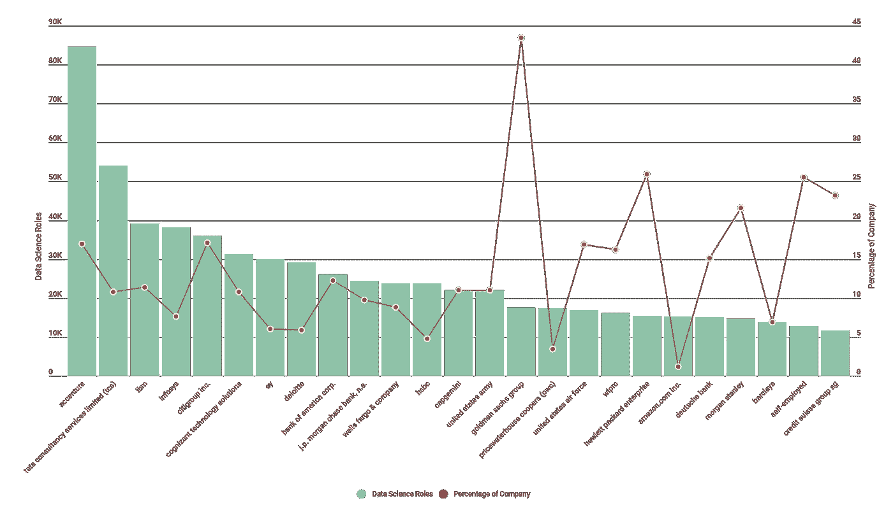
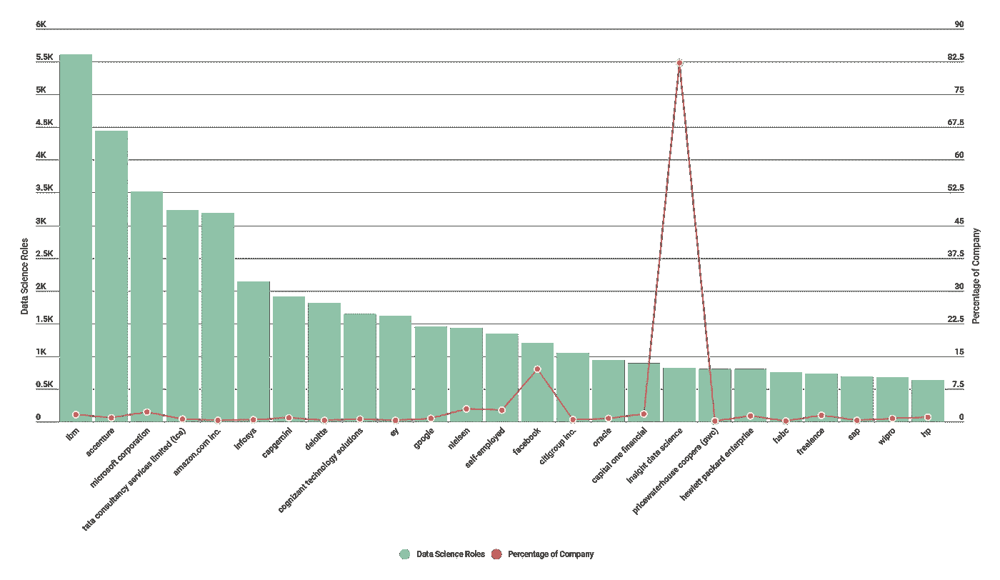
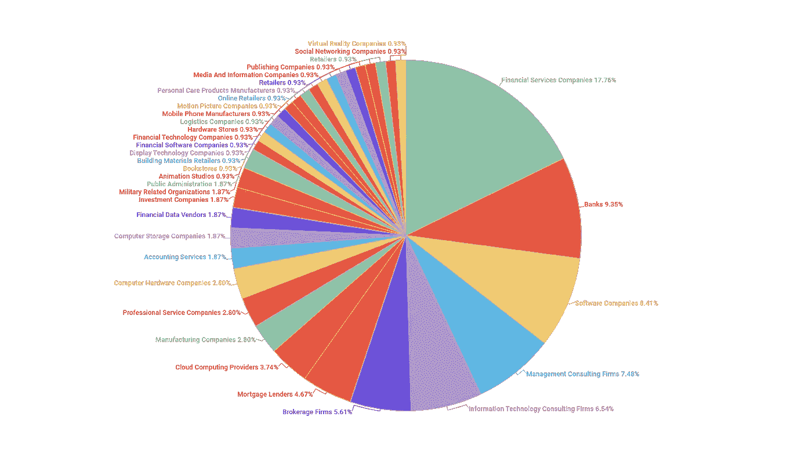
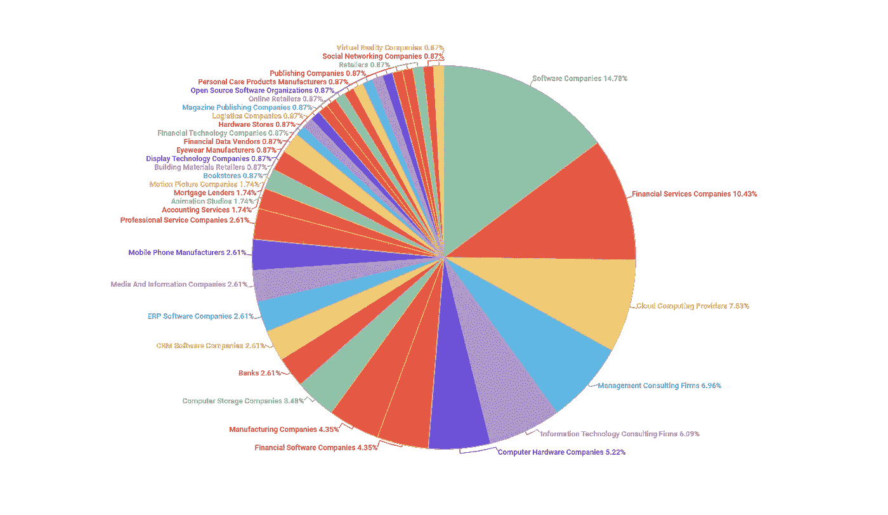
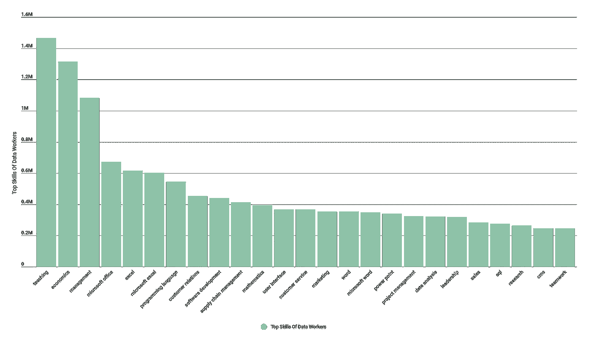
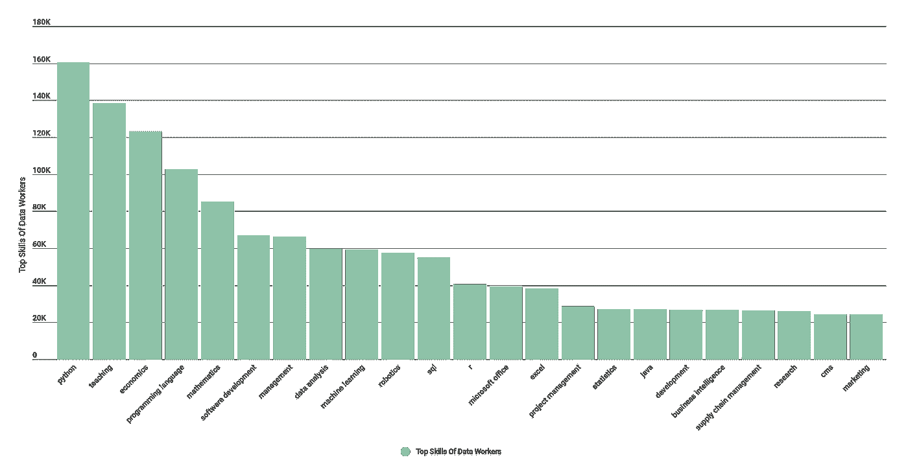
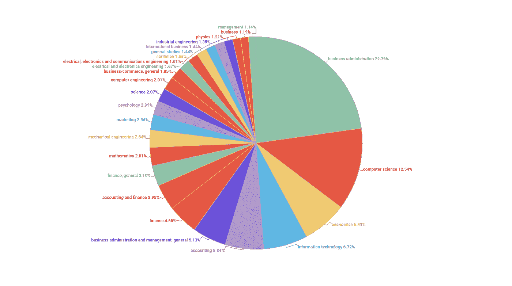
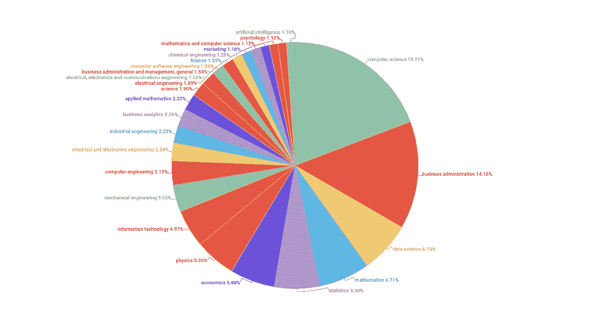
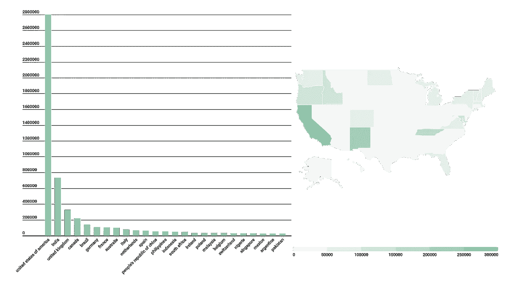
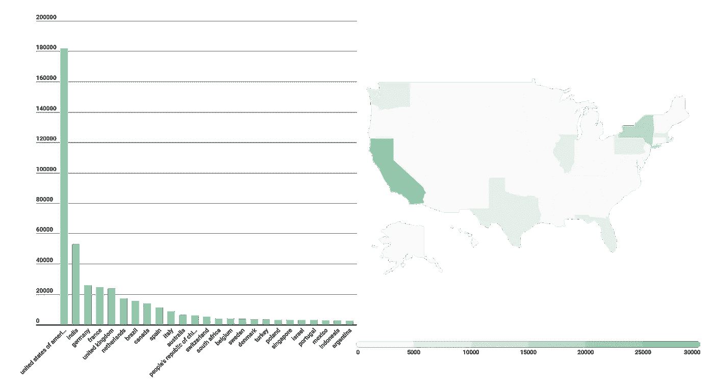

# Diffbot 的知识图可以告诉你关于数据科学角色的 5 件事

> 原文：<https://medium.com/geekculture/5-things-diffbots-knowledge-graph-can-tell-you-about-data-science-roles-d1401bf076a9?source=collection_archive---------22----------------------->

Diffbot 的[知识图](https://www.diffbot.com/products/knowledge-graph)是一个领先的外部数据源，它爬取大部分网络，以汇编关于组织、人员、产品和文章的事实和关系。

让我们看看它对数据科学的工作状态有什么看法。

# 数据科学的顶级雇主有哪些？



我从一开始就注意到的一件事是命名约定会极大地改变结果。尤其是带有“分析师”一词的职位更为普遍，显示了不同的雇主、技能、教育背景和居住地。

以上是我们最广泛的查询的结果，该查询调查了在工作头衔中带有“数据科学”、“分析师”、“数据科学家”或“商业智能”等术语的个人。

我们在这里使用的精确查询返回 person 实体的 employer 字段的一个方面(或摘要)视图。它贴在下面

```
type:Person employments.{title:or(“data scientist”,”analyst”, “data science”, “business intelligence”) isCurrent:true} facet:employments.employer.name
```

你可以在这里直接探索结果[。请注意，下面的大多数查询都是第一个查询的派生。如果没有，我还会提供可以获得这些数据的链接。](https://app.diffbot.com/search/?query=type%3APerson+employments.%7Btitle%3Aor%28%22data+scientist%22%2C%22analyst%22%2C++%22data+science%22%2C+%22business+intelligence%22%29+isCurrent%3Atrue%7D++facet%3Aemployments.employer.name&from=0&size=25&output_format=&kgversion=)



上面我们有原始的查询，但是已经删除了“分析师”的工作描述符。我们在这里看到的是一些同样的顶级公司，但总体上是金融+咨询和科技公司的逆转。当我们挖掘这里的实际数据点时，这往往是不只是数据团队中的个人，而是数据科学家。

# 数据科学的顶尖行业有哪些？



当我们按雇用数据科学角色的行业进行分类时，我们得到的范围比前几名雇主要广得多。上图中，我们看到了数百万拥有数据科学或分析师相关职位的雇主所在的行业。

分析师再次关注金融和银行业角色，上述所有行业中有近 1/3 与贷款、会计、金融、咨询或银行业相关。



与数据科学相关职位的前 25 名雇主类似，当我们从结果中移除“分析师”时，我们看到软件、计算、硬件和 IT 跃居前列。

# 数据科学家最常见的技能是什么？



我们最初的基于技能的查询展示了一个全面的群组，具有“硬”和“软”技能的平衡。与 Ruby 或 Python 相比，这个群体更可能了解 Excel 和 SQL。



我们的第二个没有“分析师”的群组显示，我们的数据科学家群体最常列出的技能是 python。此外，机器学习进入了前十名，而 python、sql 和 r 以及比 Excel 更常见。

# 数据科学家最常见的学位是什么？



根据早期的观察，当数据团队中包括分析师时，完成的学位更有可能是商业管理而不是计算机科学。包括经济学、会计学、金融学和工商管理在内的商业相关学位群占了该群体获得的所有学位的近 50%。而在这个群体中，只有大约五分之一的人拥有计算机领域的学位。



除了职位名称“分析师”之外，数据科学角色的这一概念完全颠倒了。这批人中大约有五分之一拥有非工程、计算或数学商科学位。计算机科学、数据科学和工程相关学位大约占总人数的 1/2。与此同时，超过十分之一的人获得了数学或统计学学位。

# 数据科学家住在哪里？



也许不出所料，美国是包括分析师在内的数据科学团队工作地点的榜首。印度，作为第二重要的国家，比英国、加拿大和巴西的总和还要多。也就是说，如果加州在数据科学就业方面排在各国之列，它将排在世界第三。分析师/数据角色数量最多的两个州是田纳西州和新墨西哥州。



如果将头衔中的“分析师”排除在数据科学职位之外，美国和印度再次脱颖而出，美国显然是领先者。德国、法国和荷兰以及其他一些欧洲国家的排名都有所上升。以色列也进入了前 25 名雇主国家。

在美国，纽约和加州领先，可能通常的嫌疑人如下:得克萨斯州，佛罗里达州，华盛顿，伊利诺伊州，宾夕法尼亚州。