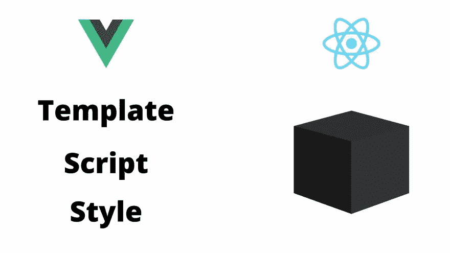
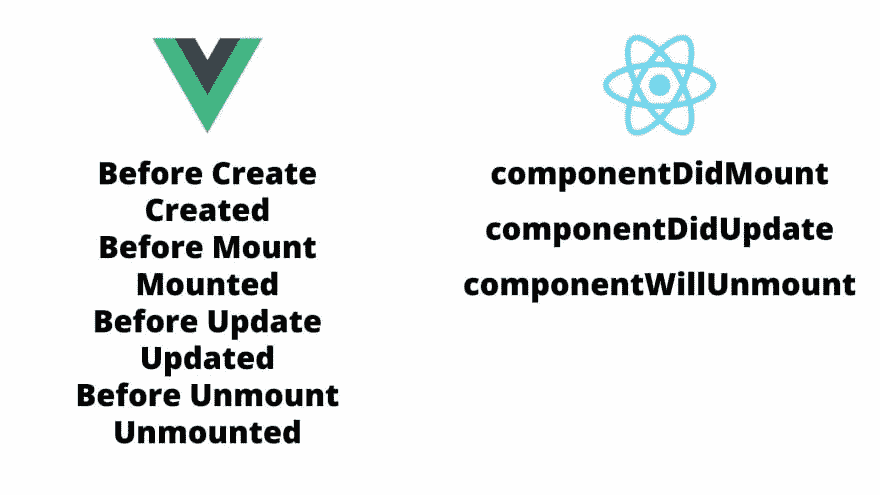
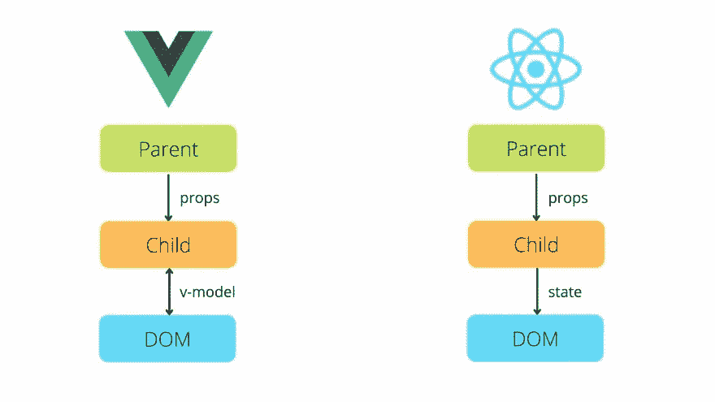
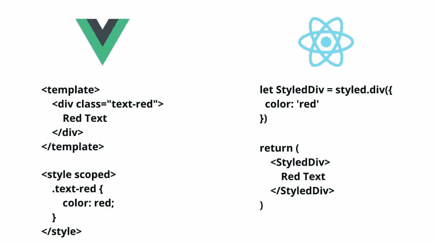

# 我在学习使用 Vue 背景时遇到的 5 件事

> 原文：<https://medium.com/geekculture/5-things-i-struggled-with-when-learning-react-with-a-vue-background-5e23fccb04d2?source=collection_archive---------7----------------------->

# 初态

在过去 3 年的大部分时间里，我都在使用 Vue，我已经非常习惯 Vue 的语法和库，并且对这个框架非常适应。Vue 很容易上手，主要有两个原因:

1.  一个清晰分割的组件结构——HTML 模板、JS 和 CSS。
2.  JS 段中直观命名的选项——组件、道具、数据、计算、方法、观察和生命周期挂钩。

可以说，任何有 HTML/CSS 背景的人在研究一个编写良好的 Vue 组件时，都可以在不参考文档的情况下很好地猜测它是做什么的以及如何工作的。编程初学者也会发现这些直观命名的选项非常有用。

# 变化

快进到一年前，我对 React 的了解仅限于我阅读的比较 Vue 和 React 以及使用哪一种的几篇文章(有很多文章，如果你从未使用过这两种语言，大部分不会立即被发现),以及一些按照入门指南在 React 中创建简单组件的涉猎。这一切看起来相当简单。我的意思是，这两个框架能有多大的不同，对吗？

然后，当我换工作的时候，我有了真正重新开始工作的机会。我愣住了。

这篇文章旨在帮助其他人(有或没有 Vue 背景)理解 React **功能组件**，并更快地掌握 React 概念。它并不试图将 Vue 和 React 作为相互竞争的框架进行比较，其目的也不是将一个框架排在另一个之上。

# 我苦苦挣扎的 5 件事

# 1.代码结构

在 Vue 中，每个组件都有三个部分:

*   `<template>` (HTML/JSX)，
*   `<script>`(在直观命名的选项内构造的 JS)，
*   `<style>` (CSS)。

它与典型的 HTML 页面布局非常相似，只是样式在“页脚”而不是“页眉”。

在 React 功能组件中，主要的底层关键是组件代码从上到下顺序运行，就像典型的 JS 脚本一样，并返回一个值，通常是 HTML/JSX。来自 Vue 的结构看起来像:

*   一大堆乱七八糟的东西(JS——钩子和方法的非结构化散布)，
*   返回(HTML/JSX)

在最初的印象中，没有 JS 段的固定结构，试图理解他人编写的代码并不容易，尤其是在没有注释的情况下。内置钩子如此专业地命名(`useEffect`、`useMemo`、`useCallback`)并没有帮助，如果不参考文档，就不可能理解上述钩子中的第二个参数是什么。因此，虽然这些钩子比它们的 Vue 对应物(`watch` - `useEffect`、`computed` - `useMemo`和`useCallback`、`mounted` -带有一个空的第二参数的钩子)更灵活，因此可重用性更高，但它们的可解释性也差得多。

也就是说，当我开始编写自己的组件时，我开始意识到虽然没有固定的结构，但有某些规则(如钩子规则)使我的代码符合非显式定义的结构。在我的所有组件中，我倾向于定义组件中使用的所有状态，并将所有设置代码放在下面。接下来，我发现自己在逻辑关注块中构建代码，非常类似于我在 Vue 中构建我的`methods`选项的方式。

然后我意识到，在我这个门外汉看来是一团乱麻的东西，实际上有一个跨项目的通用结构——我只需要更深入地理解钩子的功能和用例，然后才能破译 React 组件结构。如果你已经理解了基本的计算概念(副作用、记忆、回调)，这并不是一个陡峭的学习曲线。

对于那些来自 Vue 的人来说，这里有一个快速词汇表来帮助理解某些钩子如何转化为 Vue 概念。

React HookVue 选项`useStatedatauseEffect(, [x])watchuseCallback(, [x])computeduseMemo(, [x])computeduseEffect(, [])`、`useCallback(, [])`、`useMemo(, [])mounted`返回`useEffect(... return function(), [])unmounted`内调用的函数

对于那些没有 Vue 背景的人来说，这里有一个我在 React functional components 中学到的代码结构的总结。

*   一些方法、常量和样式可以在组件范围之外定义(通常在文件的顶部)。这些都是优化，因此不会在每次渲染时重新创建所述对象。
*   组件通常从检索道具、定义状态和导入可重用的方法/助手开始。这与 JS 文件的结构非常相似。
*   接下来通常是设置方法:设置挂载状态、计算派生值、获取数据。
*   组件中使用的所有其他逻辑——希望由逻辑关注点组织。
*   如果你想知道 CSS 是从哪里来的，React 并没有规定如何使用 CSS。你可以自由地导入 CSS 文件，定义内联样式或者使用 CSS-in-JS 库。

# 2.生命周期方法

我真正欣赏的 Vue 的关键概念之一是组件生命周期的清晰定义和文档。React 也试图记录这一点，但不像 Vue 那样，而且 API 只对类组件有效。随着 React 向功能组件的转变，生命周期方法不再那么容易获得。

当我开始使用 React 时，我想理解的第一个概念是 React 组件生命周期。已经习惯了 Vue 的生命周期挂钩，我正在 React 功能组件中寻找类似的东西，但是在官方 React 指南的状态和生命周期部分中没有这方面的文档。即使对于类组件，React 也不能像 Vue 一样让整个生命周期都是可访问的。

然而，在 Vue 中，我最常使用的生命周期方法是挂载和卸载。所以，我真的在寻找 React 功能组件的等价物。在进一步的谷歌搜索中，我发现 useEffect 钩子可以像 Vue 中的挂载/卸载钩子一样工作。虽然不那么直观，但这仅仅是适应 React API 的问题。至少我对我的安装和拆卸方法有了一个解决方案。

简而言之，我在这里学到的是，在 React 功能组件中，设置阶段(通常在 Vue 中创建/挂载)可以用 useEffect(，[])编写，而拆卸阶段(在 Vue 中卸载)可以用 useEffect(… return function()，[])编写。虽然其他生命周期方法不能在 React 中访问，但它们可能不会经常被用到，不会造成太大的麻烦。

# 3.双向绑定与单向绑定

在 Vue 中，v-model 指令允许输入元素的双向绑定。从纯粹懒惰(也许还有可维护性)的角度来看，这节省了大量样板代码。虽然我不想讨论双向绑定还是单向绑定更好，但当切换到 React 时，必须编写看起来像样板文件的方法来更新状态对我来说确实是一种烦恼。更复杂的是，做正确的反应并不意味着改变状态，而是创建副本和重置状态。这意味着 React 中表单的代码比 Vue 中的要长得多。

对于那些没有上下文的人来说，React 的核心方面之一是单向数据绑定，简而言之，这意味着数据只能单向流动。这使得 React 能够更有效地确定状态是否发生了改变以及改变的原因。

在复杂的 Vue 组件中，您偶尔会遇到 DOM 不更新的情况，尽管一个可观察的组件正在更新。很少，但是会发生，调试起来很烦。然而，React 中的单向数据绑定消除了这样的问题，因为每次调用 setState 时都要手动触发 DOM 更新。这样做的缺点是，您必须编写代码来触发重新渲染(setState)，而在使用 Vue 时您不必这样做。

事实上，当我第一次开始使用 React 时，这很大程度上只是一个烦恼。此后，我构建了可重用的组件，并且不再为表单编写样板文件。事实上，有了 [FormBlob](https://formblob.com/) ，我可以在两分钟内创建任何我需要的表单。

# 4.范围样式(CSS)

Vue 中的作用域样式非常简单。如果你熟悉 HTML/CSS，这一切都很自然——在 HTML 元素上定义一个类，在`<style scoped>`段中为该类设置 CSS 样式。

作用域样式有助于确保样式只应用于定义它的组件中。这允许我们在多个组件中重用类名，而不用担心在其他地方定义的样式会干扰。这对于构建跨多个项目使用的组件库来说尤其强大。

使用 React，没有关于如何应用 CSS 的预定义建议。你可以自由地导入 CSS 文件，使用内联样式或者使用 CSS-in-JS 库。一些 CSS-in-JS 库，如 jss 或 emotion，已经变得非常流行，并在许多 React 项目中使用。然而，与任何第三方库一样，总有一个学习曲线，尤其是在定义可重用样式时。

在我因被宠坏而被斥责之前，请记住这是我从 Vue 到 React 的经历。在 Vue 中，我不需要重新学习任何特定于 Vue 的样式库，我可以使用普通的 CSS 实现现成的可重用类名的作用域样式。在 React 中，无论是编写自己的 CSS 文件还是使用第三方库，实现类似结果的过程都可能更加繁琐。

# 5.参考资源和图书馆

支持 React 的一个理由是，React 是一个更流行的框架，有更深入的在线资源和支持，你可以利用。根据我的经验，在功能组件发布后才开始使用 React，这是不正确的。

React 已经存在了这么长时间，有这么多版本(现在是 v17 ),它有很多过时的解决方案和过时的库。我发现找到 Vue 的解决方案和相关库(现在只有 v3)比 React 容易得多。自从使用 React 后，我发现自己花了比使用 Vue 时多得多的时间来搜索解决方案。从个人的角度来看，这是我在 React 中起步时所挣扎的事情。我偶然发现的许多解决方案根本行不通，而且要花更多的时间才能找到行得通的方法。但这可能是因为我的谷歌搜索技能不足！

# 结论

我已经使用 Vue 和 React 来构建复杂的应用程序，老实说，我现在更熟悉 React，因为过去一年我每天都在使用它。如果我现在开始一个新项目，我会用 React 来做，因为我现在可以在 React 中比在 Vue 中更快地交付一个完整的应用程序。从那以后，我对 React 和它的怪癖已经适应得多了，对 Vue 或 React 作为一个框架也没有强烈的偏好。

这篇文章是个人轶事，并不意味着是 Vue 和 React 之间的客观比较。我在这里的目的是分享我从 Vue 过渡到 React 所学到的东西，并希望帮助其他正在做同样事情的人，或者希望学习 React 的人。我欢迎任何与我所经历的相反的观点和经历，我无意做任何笼统的陈述或主张(即使在文章中听起来是这样)。我是一名学习编程的学生，并将永远是，并且很高兴向任何人学习。

干杯！