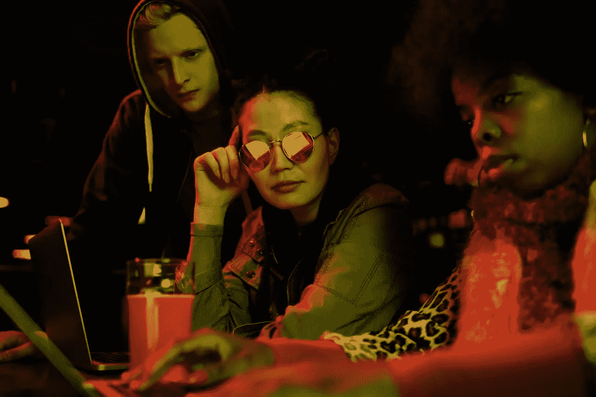

# 我希望在开始编程时就知道的 5 件事

> 原文：<https://medium.com/geekculture/5-things-i-wish-id-known-when-i-started-programming-92bc7a32c632?source=collection_archive---------8----------------------->

## 为什么编程 101 还没有教我们这些？

Three programmers are looking at a laptop screen. Source: [Pexels by Darlene Alderson](https://www.pexels.com/photo/light-fashion-man-people-4385999/)

如果你偶然发现这一点，你可能会比我在 2008 年时有一个更好的开始。大学课程教给我们所有的东西，比如数据结构、数组、面向对象编程、链表和多态，除了那些让我们为现实世界编程做准备的东西。