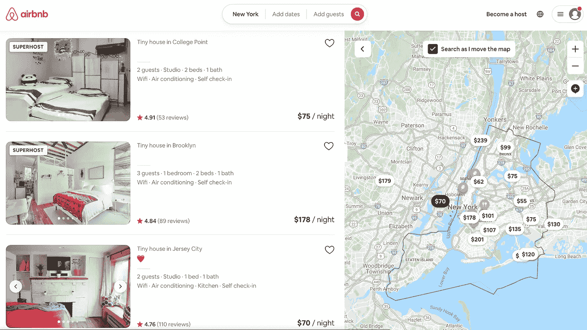
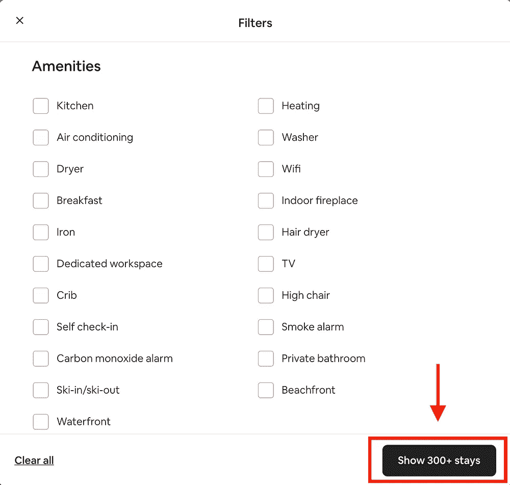
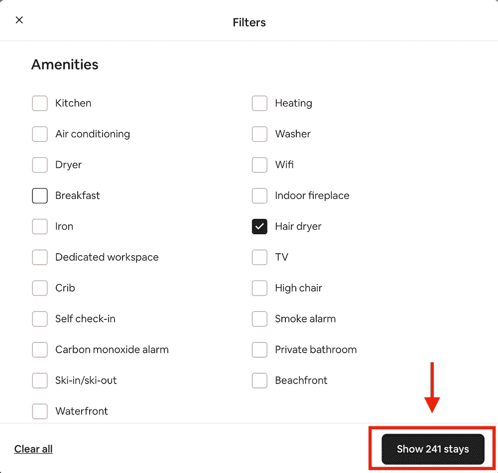
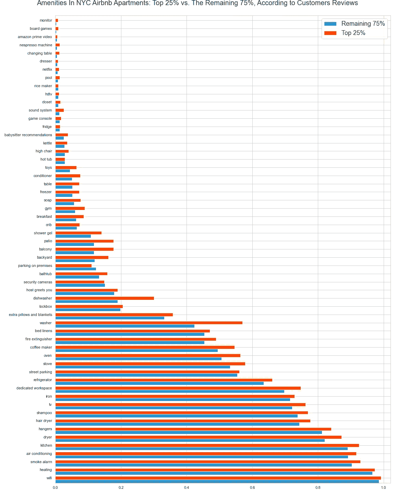
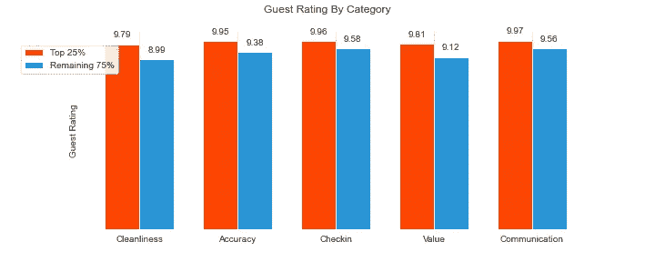

# 你现在可以做的 5 件事让你的清单脱颖而出

> 原文：<https://medium.com/geekculture/5-things-that-distinguish-highly-rated-airbnb-listings-40ecf1bbfdfb?source=collection_archive---------74----------------------->

纽约市 36000 个 Airbnb 房源的数据分析。

Screenshot of Airbnb website with covered listings names

# 简介和动机

最近，Airbnb 发布了一项重大更新，引入了 100+项升级。它们不仅通过允许灵活的日期、目的地、匹配、通过便利设施创建增强的搜索，以及添加“海景”或“固定自行车”等新属性，显著改善了客人的体验，而且它们还通过一个新的、更简单的 10 步流程，使业主更容易成为主人。

这样的更新可能会增加平台上新主机的数量。这让我想知道，我是否可以利用数据来帮助新的和现有的主机向更有经验和高评级的主机学习，以确保他们的帐户和列表对客人更有吸引力，从而更具竞争力。

作为 Airbnb 的常客，我对如何让房源脱颖而出有一个个人观点。你可能有你自己的。然而，数据说明了什么？

# 数据和方法

对于这个项目，我使用了 Airbnb 网站内部的[的](http://insideairbnb.com/get-the-data.html)详细的纽约市房源数据，汇编于 2021 年 4 月 7 日。我对近 37，000 个房源进行了数据分析，并将纽约市所有房源中最成功的 25%与其余的 75%进行了比较。

两组主机:

*   **顶级组:**纽约市拥有 3 条以上评论的前 25%的主机；
*   **增长组:**纽约市剩余 75%的主机；

# 了解你的客人

在进行分析之前，先简单说一下嘉宾。了解人们在选择 Airbnb 还是酒店，或者一个房源还是另一个房源时的动机，将有助于你创建一个针对特定受众的房源。因此，在文章 [Airbnb 与酒店业](https://irei.com/publications/article/airbnb-vs-hotel-industry/)中，Tommy O'Shaughnessy 强调了与 Airbnb 旅行者相关的研究结果。据他所说，有 5 组旅行者:

1.  寻找**实惠的选择**
2.  对家居**设施和更大的空间感兴趣**
3.  寻找**真实性**
4.  被**的新奇感吸引**
5.  对**与当地人的互动感兴趣**

> 那么，你的目标群体是哪一个？

无论你是想给你的客人提供一个实惠的选择，还是一个更舒适的有各种便利设施的选择，一些技巧将帮助你脱颖而出。因此，让我们看看可以做出哪些改变来抓住客人的注意力，更好地满足他们的需求。

# 1.吸引注意力的吸引人的标题

选择独特的、说明性的词语来描述您的租赁。例如，像*“宽敞”、“舒适”、“阳光”、“明亮”、“迷人”*这样的词是最受欢迎的词，可以适合大多数地方。它们引人注目，可能会吸引更多的新客人。

考虑用“惊艳”、“友好”、“平和”、“T5”或上面建议的任何一个词来替换像“好”、“T2”、“家具”、“T3”、“T4”、“可爱”、“不错”、“安全”这样的词。

## 想要更加突出？

看看这些词中是否有符合你的列表的:*"甲板"、"露台"、" T7 "、*"顶层公寓"、"公寓"、"豪华"、"设计师"、"艺术家"、"静修"、"花园"、"屋顶"。他们高呼奢华和舒适，他们似乎只描述顶级的房源。然而，请记住，你的列表首先应该是准确的。**

## 不要全部使用大写字母

许多在线指南建议在写标题时避免全部使用大写字母，称这类似于在互联网上大喊大叫。虽然这可能是真的，也可能不是，但纽约数据集中只有少数房源使用这种方法来吸引用户的注意力。具体来说，排名最高的列表中有 2.29%的列表和排名较低的列表中有 3.25%的列表在其标题中使用了全部大写字母。

分析还显示，一个地方的评级与标题全部用大写字母书写没有关系。评论的数量(与保留的数量相呼应)和评分之间也没有关系。因此，我建议不要全部使用大写字母，而是按照上面的建议仔细选择你的标题。

# 2.吸引人的描述有助于你脱颖而出

最成功的 Airbnb 描述倾向于描述租赁的*便利设施*和它的*社区*提供的东西，比如*健身房*、*当地餐馆*，或者*阳台*。

## 不要忘记那些寻找真实的人

也许你附近有一个古老的当地家庭经营的"*意大利* *披萨"*店，或者有一个吃著名的"*彩虹百吉饼*"早餐的好地方。也许你的家在一栋令人惊叹的*、*、*、*建筑里，或者你的*街区*因电影场景而闻名。你说吧！

## 用这些单词来描述你的邻居

记住，公寓/房间只是你想卖的东西的一部分。邻居是客人体验的重要组成部分。没有人比你更清楚这一点！所以一定要告诉他们。

你可以**用这些词**来描述你的邻居*:"最喜欢的"、"景点"、"可爱的"、"图书馆"、"极好的"、"邻近"、"海滨"、"药房"、"褐砂石"、"盛传"、"新鲜"、"顶级"、"户外"、"迷人"、"漫步"、"河边"、"树"、"海湾"、"想要"*

## 想要更加突出？

看看这些词是否符合你的清单:*、【露天】、【甲板】、【门童】、【原创】、【装修】、*豪华*、*休闲*、【摆渡】*

# 3.低成本的便利设施带来销售

便利设施一直是 Airbnb 体验的重要组成部分。对于那些对家居设施和更大空间感兴趣的人来说，它们可能是你的卖点。此外，**便利设施将为您的住所带来更多价值**。

现在，由于 Airbnb 增加了一个按特定设施筛选房源的机会，你可能想通过以下 5 种相对低成本的设施来扩展你的清单，以确保你保持竞争力:

1.  咖啡机—(40 美元)
2.  吹风机—(25 美元)
3.  衣架—(10 美元)
4.  沐浴露+洗发水+护发素—(20 美元)
5.  铁——(40 美元)

参见下面的**吹风机**过滤示例。

根据您的预算，您还可以考虑一些更昂贵的选项，例如:

1.  额外的枕头和毯子
2.  专用工作空间
3.  婴儿床、玩具、高脚椅
4.  电视(+可选网飞、Hulu、亚马逊 Prime Videos、迪士尼+等。)
5.  冰箱

请注意，上面提到的价格是一些负担得起的选择，仍然可以为你的列表增加巨大的价值。

下面的条形图显示了最受欢迎的设施的扩展列表，以及两组之间提供这些设施的列表的比例如何不同。

# 4.建立信任的个人简历

列表页面只是成功的一部分。人们对认识当地人感兴趣，你的主持人简介是展示你自己的好方法。

分析显示，两组宿主的生物切片之间没有显著差异。这意味着你只需要做你自己。谈谈你的出身，生活，家庭，兴趣，以及在 Airbnb 上做主持人的经历。

**考虑使用**这样的词来描述自己，比如*"本地人"、"旅行者"、"校友"、"友好"、"爱心"、"尊重"、"善良"、"有创意"、"专业"、"业主"、"纽约客"(用你的原籍代替)，*。你也可以谈论你去过的地方，或者你是否喜欢“*狗*或者“猫”

根据上下文的不同，**考虑替换像** *【几乎】【从不】【不能】【可能】【远】【忙】等词语。，*用一些正面的同义词。

# **5。保持公寓/房间的清洁**

最后但同样重要的是，正如我们在下面的直方图上看到的，清洁是大多数地方的一个大问题，这是降低东道主评分的最大原因。所以保持家里干净不仅能提高你的评分，还能带来更多的顾客。这是每个主持人都需要优先考虑的事情，不管他们属于哪个组。

## 结论

1.  让你的标题尽可能吸引人会帮助你抓住人们的注意力。
2.  让你的描述吸引人将有助于你从竞争中脱颖而出。
3.  包括更多的便利设施会增加你的房子的价值；此外，新的便利设施过滤器可能会增加你刊登物品的流量。
4.  让您的个人资料页面自己说话。
5.  保持最新、准确的列表将有助于提高你的“准确性”评级。
6.  保持你的地方干净是你生意成功的关键。
7.  记住，超越客人的期望永远是个好主意！

请注意，这里的发现是观察性的，不是正式研究的结果，并且仅限于纽约市的数据。因此，真正的问题仍然是:

> 是什么让你和你的财产脱颖而出？

我错过了你挑 AirBnB 时要找的东西吗？请在评论中告诉我！

要了解更多关于这个分析的信息，请点击这里查看我的 Github 资源库的链接[。](https://github.com/OlhaMaslova/airbnb)