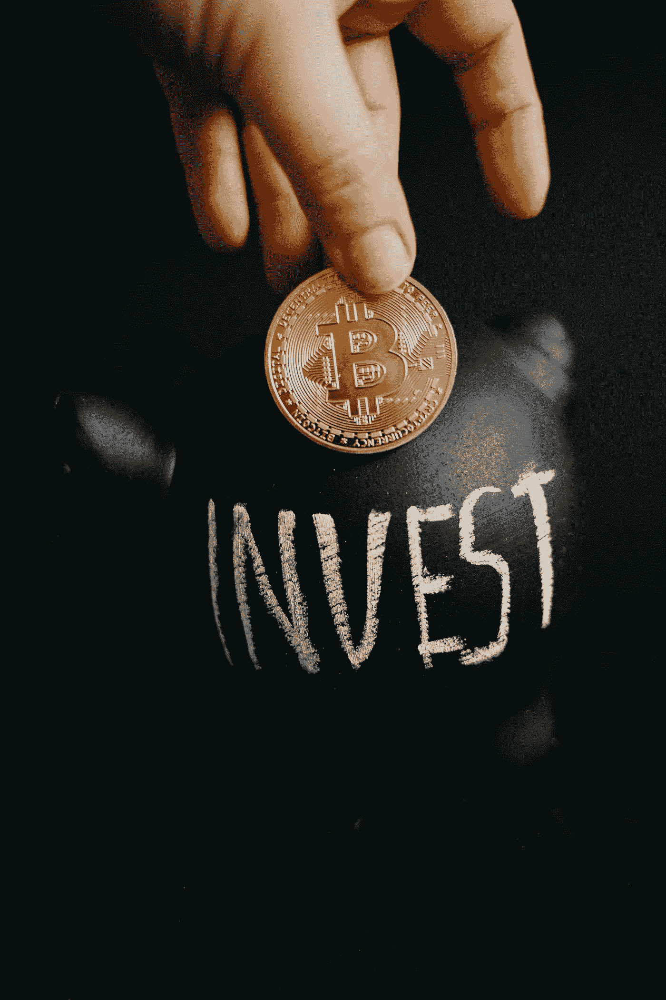

# 投资股票前要知道的 5 件事

> 原文：<https://medium.com/geekculture/5-things-to-know-before-investing-in-stocks-718947e4af47?source=collection_archive---------32----------------------->

## 了解这些事情可以获得更好的交易体验

Photo by [Alesia Kozik](https://www.pexels.com/@alesiakozik?utm_content=attributionCopyText&utm_medium=referral&utm_source=pexels) from [Pexels](https://www.pexels.com/photo/man-love-people-dark-6781365/?utm_content=attributionCopyText&utm_medium=referral&utm_source=pexels)

你一定听说过“盘中交易”、“股市崩盘”这些词这些是时下流行的词语。越来越多的人投资股市在短期内赚钱。

股市可以帮你赚很多钱，但同时，你…