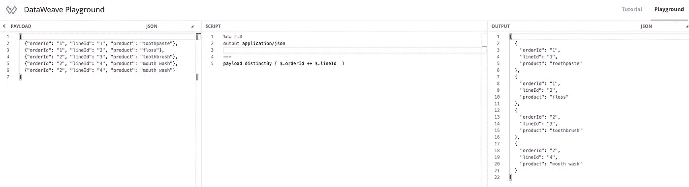

# 学习 MuleSoft any point 平台的 5 个技巧

> 原文：<https://medium.com/geekculture/5-tips-for-learning-mulesofts-anypoint-platform-76c364ab6aea?source=collection_archive---------25----------------------->

## 完整 n00b 的实用技巧

Photo by [Nick Fewings](https://unsplash.com/@jannerboy62?utm_source=unsplash&utm_medium=referral&utm_content=creditCopyText) on [Unsplash](https://unsplash.com/s/photos/direction?utm_source=unsplash&utm_medium=referral&utm_content=creditCopyText)

# TL；速度三角形定位法(dead reckoning)

这篇文章描述了我在学习 MuleSoft 的 Anypoint 平台的前 15 天中发现的有用资源。我提供了 5 个建议，假设没有以前的经验，任何链接的资源都是免费的。

如果您是一名 Salesforce 专业人员，对了解 MuleSoft 的更多信息感兴趣，但不知道从哪里开始，我也是如此。我做的第一件事是浏览最佳资源，以便尽可能多地吸收信息。以下是我学到的。

# 技巧 1:从 API 背后的 A-P-Why 开始

在你沉迷于 Anypoint 平台的功能和特性之前，我建议你问自己一些基本问题。以下是我找到的一些有用的相关资源。

*   什么是 API？

MuleSoft 是关于创建、部署和监控 API 和集成数据流的。我们最好理解什么是 API 的基本原理。

The basics of an API

*   构成 Anypoint 平台的一些关键构件是什么？

这是 2019 年的视频，但来自 Connect 的视频展示了 Anypoint 平台的主要构建模块，并有一些演示来设置什么是可能的。

# 技巧 2:开始免费试用并安装您的 IDE

你可以通过 30 天的免费试用来使用 Anypoint 平台。点击下面的链接，用电子邮件地址注册。

 [## 通过 30 天免费试用了解 Anypoint 平台

### 你只能从一本书走到这一步。动手实践。

anypoint.mulesoft.com](https://anypoint.mulesoft.com/login/signup) 

您还需要下载 Anypoint studio。Anypoint studio 是一个由 MuleSoft 维护的桌面 IDE，在教程中与一个名为 Flow 的基于 web 的集成接口一起使用。

 [## 下载并安装 Anypoint Studio

### 要下载并安装 Anypoint Studio，请根据您的操作系统按照说明进行操作:Anypoint Studio 7.x…

docs.mulesoft.com](https://docs.mulesoft.com/studio/7.6/to-download-and-install-studio) 

# 技巧 3:获得指导教程的实际操作

一旦你试用了 Anypoint 平台，你很难知道从哪里开始。幸运的是，MuleSoft 的开发人员关系团队已经策划了一些小型的教程来帮助您启动和运行

 [## 开发者教程| MuleSoft

### 通过阅读我们的开发人员教程目录，了解如何开始使用 MuleSoft 和 Anypoint 平台。获得…

developer.mulesoft.com](https://developer.mulesoft.com/tutorials-and-howtos) 

这些教程非常棒，因为它们结合了如何使用 Anypoint 平台功能的逐步说明，并将每个教程与视频配对。通常我发现每个教程不到 30 分钟。

在本教程结束时，您将不仅创建了一个 API，还为一些有趣的用例配置了端到端集成。

# 技巧 4:在操场上学习数据编织

DataWeave 是一种表达式语言，可以在 Anypoint 平台中用来访问和转换消息有效负载中的数据。因为集成总是涉及具有不同数据模型的不同系统，所以能够将消息从一种格式转换成另一种格式是关键。因此，DataWeave 是集成开发人员工具包中的一个关键工具。

The DataWeave Playground — get hands on learning about accessing and transforming message payloads

但是不要认为这不是一个有指导的练习。操场中的子选项卡包含更多实践教程。这些教程涵盖了 DataWeave 语言的基础知识。这种环境的一个很好的特点是，每个部分都有一个实际操作的挑战，以确保您已经理解了内容。

The tutorial section of the DataWeave Playground where you can learn the fundamentals and apply your knowledge

# 提示 5:报名参加一门课程

为了从参加课程中获得最大的价值，我建议用第 1-4 条建议来巩固基础。到目前为止，你的时间投入相对较少，但对于那些想要更详细内容的人来说，投资一门课程会有回报。

最好的部分是自定进度的学习是免费的。这是讲师指导课程的所有内容，适合那些时间紧张或预算有限的人。对于那些通过讲师指导课程学得更好的人来说，这些课程在您所在的时区是有价的。

 [## 课程目录-软件培训、课程和认证

### 成为多媒体软件专家，并通过灵活的课程扩展您的技能-从现场或虚拟…

training.mulesoft.com](https://training.mulesoft.com/course-catalog) 

我发现一门课程很有帮助，原因如下

*   这让我能够就我不确定的领域提出问题(讲师指导)
*   它涵盖了更深入的主题
*   讲师对主题提供了不同的观点，通常会简化内容
*   我从其他与会者提出的问题中学到了很多
*   它让我专注于确保内容被有效地覆盖
*   它帮助我完成了参加认证的准备工作

# 摘要

MuleSoft 的 Anypoint 平台可能会让新手望而生畏。我的建议是使用免费的开发人员教程，结合 30 天的软件试用，在你自己的时间内免费获得实践经验。

DataWeave 是 MuleSoft 访问和转换数据的表达式语言。它构成了 Integration Developers toolkit 的核心，并且有一个 DataWeave playground 可以用来熟悉语法和功能。

最后，对于那些希望成为 MuleSoft 认证专家或更深入地了解 Anypoint 平台的人，我们提供自定进度和讲师指导课程。