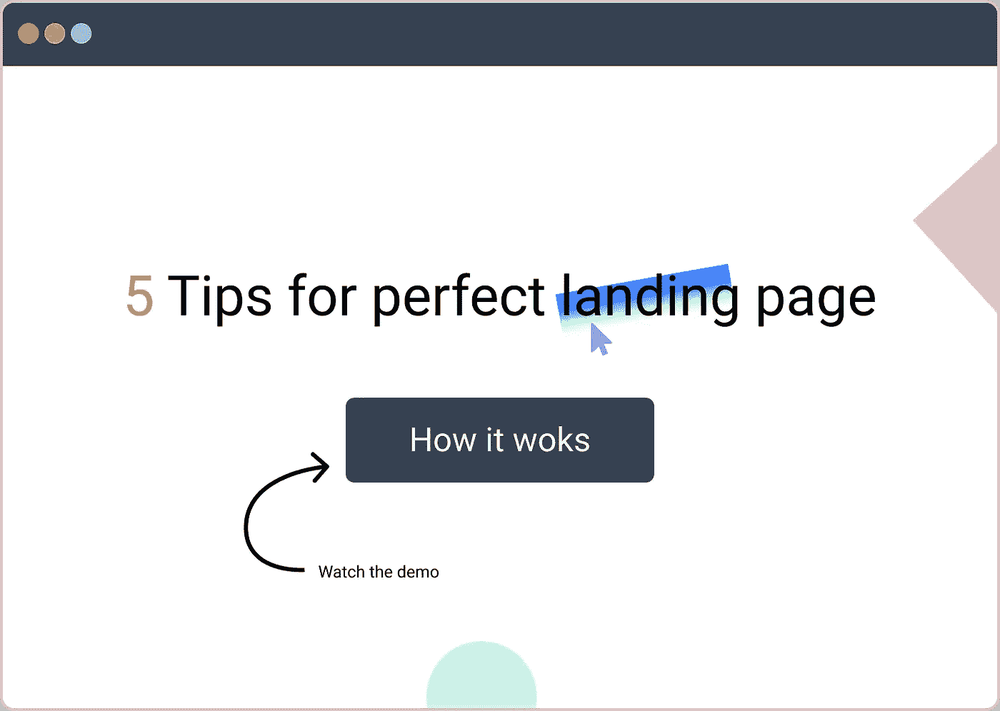

# 完美登录页面的 5 个技巧

> 原文：<https://medium.com/geekculture/5-tips-for-perfect-landing-page-b235b6bb0fb7?source=collection_archive---------70----------------------->

为了一个稳定的登陆页面，注意这 5 件事

[Landing page tips](http://ihatereading.in)

登陆页是你的应用程序中最重要的一页，它就像你房子最外层的颜色，所以你最好让它吸引人，引人注目，有吸引力和有用。以下是改善登陆页面的 5 个技巧

# 少一些行话，多一些有用的标题