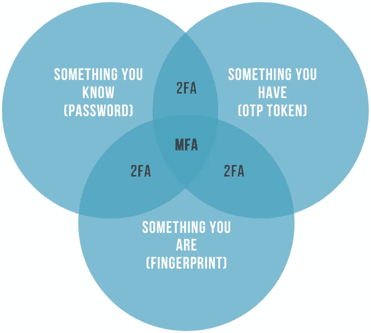
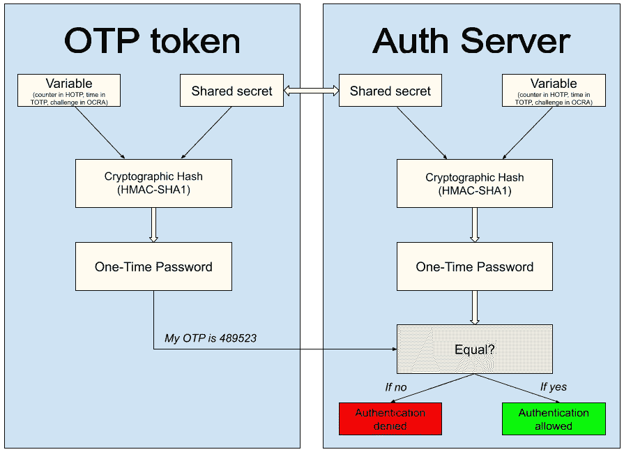
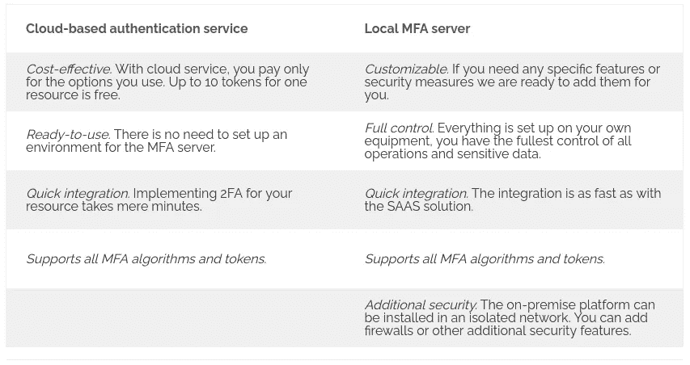
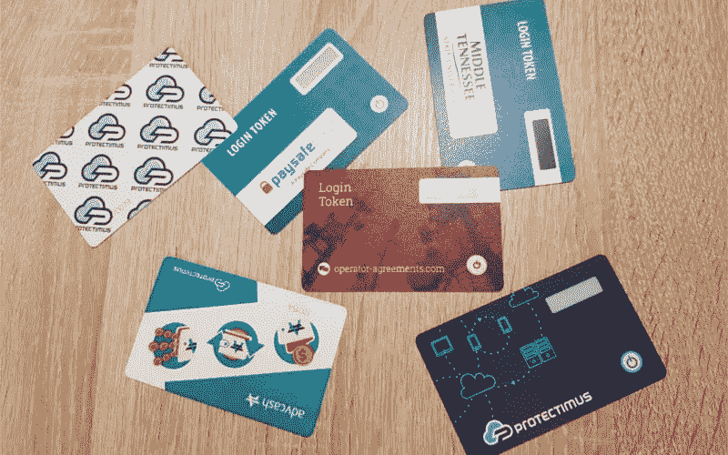
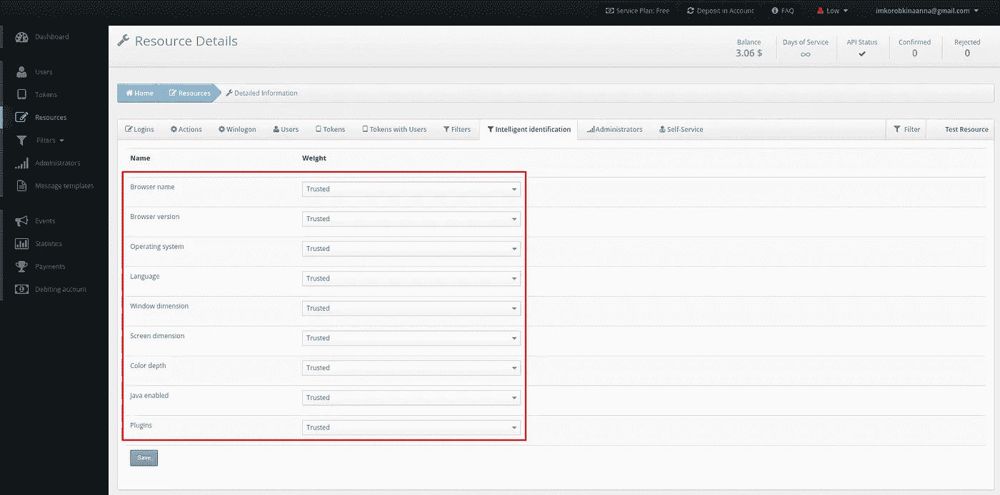
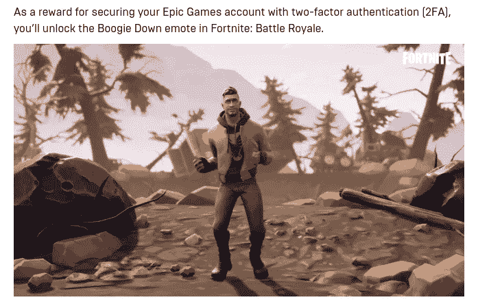

# 安全专家给你的网站添加双重认证的 5 个建议

> 原文：<https://medium.com/geekculture/5-tips-from-security-pros-for-adding-two-factor-authentication-to-your-website-a8cb70d7ab2c?source=collection_archive---------38----------------------->

## 不要重新发明轮子，使用基于云的两步认证，添加多种认证方法，使用自适应认证，并鼓励用户激活 2FA

上个月(2021 年 7 月)cybernews [报道了](https://cybernews.com/security/rockyou2021-alltime-largest-password-compilation-leaked/)84 亿个密码泄露。从数字上看，这可能是所有在线用户密码的两倍。可悲的是，像这样的报道越来越多。它们甚至不再让我们惊讶。

曾经有一段时间，强制使用强身份验证密码足以保护您客户的帐户。然而，如今多重身份认证是保护用户凭证的唯一可靠方法。尤其是当你存储敏感信息的时候。

今天，我们将分享给你的网站添加 2FA 认证的 5 个专业技巧。

# 1.不要重新发明轮子并与现有的双因素身份认证提供程序之一集成

是的，完全有可能为你的网站建立你自己的双因素认证解决方案。但是你真的想那么做吗？

请想一想:

1.  一个合适的 2FA 需要大量的认证和检查。这些可能很贵。
2.  然后，您需要考虑如何向网站访问者提供一次性密码:

*   你发短信吗？你需要找到并整合一个可靠的全球覆盖的短信提供商。
*   还是发推送通知？但是实现这样的功能需要很好地理解苹果推送通知服务和谷歌 Android 云消息服务是如何操作的。而如果用户的手机失去连接，或者无论什么原因无法接受推送通知呢？
*   保护用户最安全的方法是使用 [TOTP 硬件令牌](https://www.protectimus.com/blog/totp-tokens-protectimus-slim-nfc-faq/)进行 2FA 登录。但是你如何为你所有的网站访问者制作它们呢？

构建您自己的多因素身份认证解决方案会产生大量代码和依赖性。只有在安全软件开发方面有知识和经验的非常好且相当昂贵的开发者才能被信任去做。如果两步验证突然中断，任何人都无法登录。如果开发人员忽略了一个安全漏洞，这就为很多麻烦打开了方便之门。

与已经存在的值得信赖的提供商集成是最安全和最便宜的选择。

|另请阅读:[你应该知道的 2FA 安全漏洞](https://www.protectimus.com/blog/2fa-security-flaws/)

# 2.为了节省时间和金钱，请使用基于云的两步认证服务

基于云的二元身份认证解决方案不像本地解决方案那样需要大量资源。不需要设置任何环境、安装昂贵的设备或雇佣额外的员工来维护它。

云 MFA 解决方案作为 SaaS 模型运行。因此，与任何其他 SaaS 一样，您只需为您实际使用的选项付费。一些提供商，比如 Protectimus，免费提供多达 [10 个令牌支持](https://www.protectimus.com/pricing/)。

云解决方案的另一个优势是设置非常简单快捷。您可以在几分钟内在您的网站上激活两步认证。

|另请阅读:[本地 2FA 与基于云的身份验证](https://www.protectimus.com/blog/on-premise-2fa-vs-cloud-based-2fa/)

# 3.让您的用户从几种身份验证方法中进行选择

安全令牌的种类不止一种: [2FA 应用](https://www.protectimus.com/blog/10-most-popular-2fa-apps-on-google-play/)、[聊天机器人 TOTP 交付各种信使](https://www.protectimus.com/blog/2fa-chatbots-vs-sms-authentication/)、[硬件令牌](https://www.protectimus.com/blog/programmable-totp-token-protectimus-flex/)等。你的用户必须能够选择他们喜欢的。通过这种方式，您可以从您的客户那里获得大量积分，因为他们提高了 UX，减少了额外的登录步骤。

要在您的网站上实现这一点，您需要集成一个双因素身份认证提供商，该提供商在一个帐户中支持各种类型的令牌。

我们强烈不建议添加的唯一 2FA 令牌是 SMS。它不够安全，而且会让你付出很大代价。

|另请参阅:[不同双因素身份认证类型和方法的利弊](https://www.protectimus.com/blog/two-factor-authentication-types-and-methods/)

# 4.使用 adaptive authentication 来赢得用户的好感

没有人喜欢在每次登录网站时输入密码。尤其是如果他们每天都使用所述网站。许多用户干脆完全关闭双向认证。借助 [adaptive authentication](https://www.protectimus.com/blog/smart-identification-or-how-to-make-2fa-more-convenient-for-users/) 选项，您的客户不必每次都输入一次性通行证。仍然会受到保护。

自适应身份验证用于在用户经历授权过程时评估违规的可能性。该解决方案会检查用户的环境，只有在发现不匹配时才会要求输入 OTP 代码。就像用户从未尝试登录的新设备。

|另请参阅:[Duo Security vs protecti imus:特性](https://www.protectimus.com/blog/duo-vs-protectimus-features/)

# 5.鼓励您的用户激活双重身份认证

想象一下，你已经找到了完美的 2FA 提供商，将解决方案与你的网站整合在一起…然后呢？你如何让你的客户真正使用它？把它强加给用户并不是一个好主意。

从宣传活动开始。告诉你的客户它会给他们带来什么好处。或者更好的是，奖励他们启用 2FA。当然，如果你的商业模式允许的话。

Epicgames 就是一个很好的例子。为了通过双向认证来保护[epic games](https://www.epicgames.com/help/en-US/epic-accounts-c74/account-security-c112/what-rewards-do-i-get-for-enabling-twofactor-authentication-2fa-on-my-epic-games-account-a4443)账户的安全，玩家在堡垒之夜游戏中会获得额外的奖励。是不是很精彩？

当你的大多数用户都在使用 2FA 时，你可以让它成为强制性的。

# 阅读更多

*   [金融服务网络安全最佳保护 MFA 功能](https://www.protectimus.com/blog/protectimus-mfa-financial-services/)
*   [通过双重认证保护 VPN](https://www.protectimus.com/blog/vpn-two-factor-authentication/)
*   [如何向 Outlook Web App 添加双因素身份验证(OWA)](https://www.protectimus.com/blog/owa-two-factor-authentication/)
*   [针对 Windows 7、8、10、11 的二元身份认证](https://www.protectimus.com/blog/two-factor-authentication-for-windows/)
*   [双因素认证解决方案比较:Google Authenticator 与 Protectimus](https://www.protectimus.com/blog/two-factor-authentication-solutions-comparison-google-authenticator-vs-protectimus/)
*   [2FA 聊天机器人与短信认证](https://www.protectimus.com/blog/2fa-chatbots-vs-sms-authentication/)
*   [你仍然相信的 6 个 MFA 神话](https://www.protectimus.com/blog/mfa-myths/)