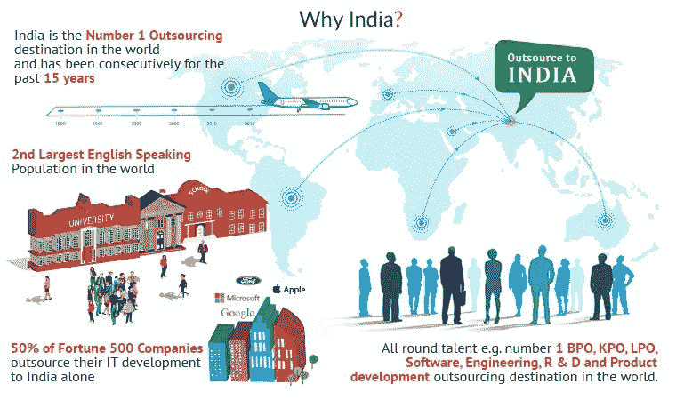
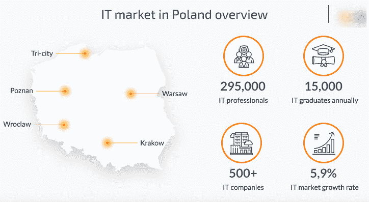
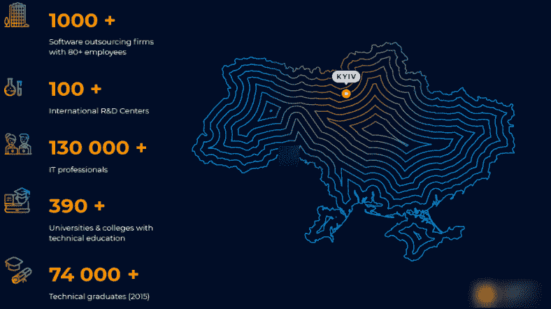
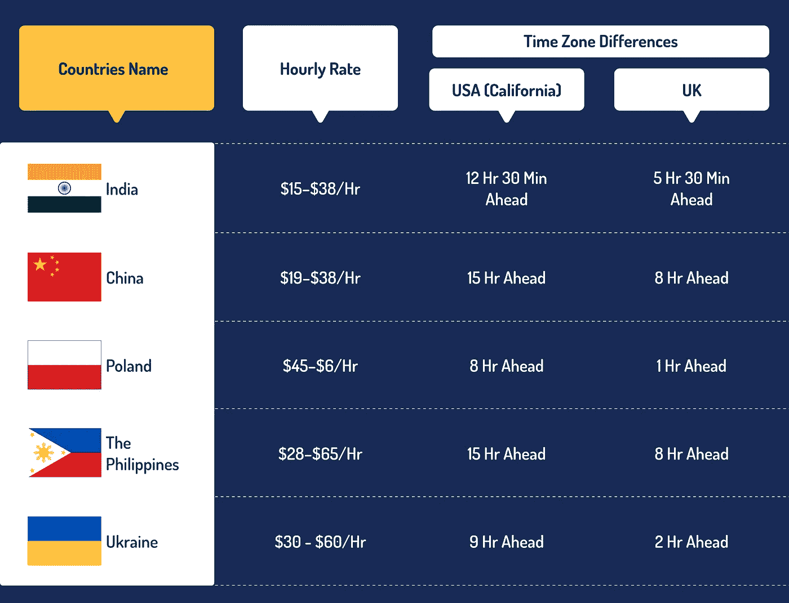

# 5 个以外包金融科技软件开发而闻名的国家

> 原文：<https://medium.com/geekculture/5-top-countries-known-for-outsourcing-fintech-software-development-d1ea5ed191d5?source=collection_archive---------32----------------------->

Image Source: Aspire Software Consultancy

众所周知，在 COVID 疫情期间，大多数企业完全关闭了他们的办公室，而更喜欢在家工作。由于这个原因，行业中的大部分转变都发生在现在，其中一个巨大的变化是，人们依赖于远程工作，因此，他们乐于外包基于 IT 的解决方案。

好吧，现在全世界都在担心 COVID 19 的第三阶段，即 Delta，所以为了安全起见，我会建议你呆在家里，通过选择外包替代方案来发展你的业务，以按时完成工作。

此外，如果我谈论金融科技行业，那么它现在完全专注于开发领先的应用程序以满足当前的市场需求。这就是为什么金融科技行业倾向于从最好的国家外包金融科技软件开发服务。

现在的问题是，哪些国家最适合外包金融科技应用开发。因此，为了回答这个具有挑战性的问题，在分析了一些因素后，我提到了一些应该知道的外包金融科技软件开发的国家。

# 列出最佳国家名称时要考虑的关键因素

在列出金融科技应用开发服务外包的最佳国家时，我考虑了以下因素。

*   外包成本
*   每个国家的局限性
*   时区差异
*   创新指数

# 外包金融科技应用开发排名靠前的国家名单

这里提到的国家名称是外包金融科技应用程序开发的最佳和最知名的名称。因此，如果你期待开发一个领先的金融科技应用程序或软件，选择任何一个国家与金融科技软件开发公司联系

*   印度

Image Source: Virtual Employee

每当提到**金融科技应用开发**服务外包这个词，大多数企业都会首先提到印度这个国家。而且，2019 年科尔尼全球服务地点指数显示，印度是外包的首选。

根据德勤的一项研究，59%的全球公司外包给印度。关于印度的事实使一个国家成为外包应用程序开发项目的最佳选择。

**为什么选择印度聘请最好的金融科技软件开发公司？**

*   雇用 Fintech 应用程序开发人员的小时定价很低，每小时 15 至 40 美元。
*   印度的时区差异主要适用于英国、美国和澳大利亚。
*   它是经验丰富的金融科技应用程序开发人员的主要枢纽，印度为其客户提供创新和具有成本效益的解决方案，以创造价值。
*   金融科技软件开发人员精通 ASP.NET、ZenCart、Codeigniter、Joomla、React Native、NodeJS、AngularJS、ReactJS、WordPress Magento 等等。

## 中国

它是全球顶尖的新兴经济体之一。资金、熟练开发人员和实物资本的可用性使其成为外包的有效来源。

此外，根据黑客排名，中国在所有国家参加编程奥林匹克竞赛的假设评估中排名第一。

## **为什么选择中国聘请最好的 Fintech App 开发公司？**

*   中国越来越注重应用最新技术提供领先的金融软件开发服务，并为客户提供卓越服务。
*   开发一个应用程序的小时价格是每小时 19-38 美元。
*   经济外包率超过乌克兰。
*   由于不断升级，外包服务在中国是最受欢迎的。

## 波兰

Image Source: N-iX

波兰的金融科技软件开发公司以在全球提供高质量和最佳解决方案而闻名。与其他西欧国家一样，波兰的应用开发商也专注于为各种垂直业务提供放大和独特的解决方案。

根据黑客排名，波兰在全球高度熟练的程序员中排名第三。

**为什么选择波兰进行外包财务软件开发？**

*   这个国家包括拥有出色项目管理技能的优秀开发人员，他们帮助初创公司、中小企业和大型企业成长。
*   波兰每小时外包费用为 45-65 美元。
*   菲律宾

菲律宾的宿务市是 IT 部门发展最快的国家，有 200 多家离岸公司。菲律宾正处于外包市场的萌芽期。专注的 Fitech 软件开发人员全面专注于为全球客户提供高效的结果。

与波兰相比，菲律宾是一个低成本的选择。此外，2019 年，它在经商便利性方面排名第 95 位，而在地理位置吸引力方面排名第 10 位。

**为什么选择菲律宾外包金融科技软件开发？**

*   菲律宾的名字归功于支持高质量和高效率开发项目的人才团队。
*   菲律宾外包的时薪是每小时 28-65 美元。
*   Fintech 软件公司利用具有编程经验的离岸远程团队，包括 Ruby、PHP、.NET、HTML.ASP、C++、Java、Python 等等。

## 乌克兰

Image Source: Mass media Group

乌克兰是顶级金融软件开发公司的所在地，这也是外包首选该国的原因。此外，乌克兰是该地区发展最快的国家之一。2020 年，乌克兰科技市场接触了 20 万名软件专业人士。

IAOP 说，乌克兰有 21 个组织名列全球外包公司 100 强。乌克兰专业人员拥有丰富的技术知识，这有助于各种企业满足业务需求。

**为什么选择乌克兰外包 Fintech 应用开发？**

*   乌克兰每小时的外包费用是 30-60 美元。
*   乌克兰开发者精通管理 JavaScript、ASP.NET、C3、Java、Xamarin、GraphQL、PHP、Python、Ruby 相关任务。

# 每个国家的局限性

这里我已经说明了每个国家的局限性；记住这些，你可以选择外包 Fintech 软件开发的国家。

*   **印度:**印度有众多的 Fintech 软件开发公司，因此选择任何一家公司都可能会导致不满，所以请选择在市场上享有良好声誉、能够为您提供合适、匹配和优质结果的最佳代理公司。
*   **中国:**因为语言不通，时区问题，对你来说，可能很难在合适的时间把项目跟进。
*   **波兰:**它正处于成长期，所以从这个国家外包软件开发不会太好。
*   菲律宾**:它还处于发展的初期阶段，仍需要引进一些改进和替代产品。**
*   ****乌克兰:**隐性成本可能是从乌克兰外包的风险。**

# **外包财务应用程序开发的最佳国家对比表**

**查看该对照表，您可以做出适当的决定，选择最符合您标准的国家。**

****

# **结论**

**你正在寻找一个外包 Fintech 软件开发的好国家吗？如果是，请浏览排名靠前的国家/地区列表，并根据小时价格和时区兼容性选择任何一个国家/地区。此后，从选定的国家外包金融科技应用开发。**

**顶尖的金融科技软件开发公司 [**的外包开发团队**](https://www.valuecoders.com/fintech-software-development-company) 可以帮助你打造一款领先且独特的应用。此外，为此，您可以达到公司目标并提高业务投资回报率。**