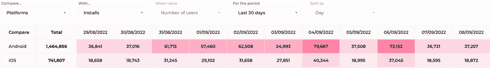
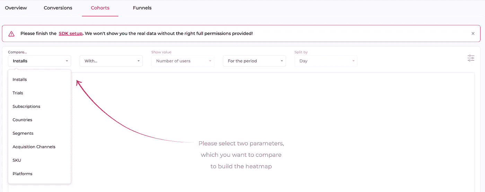

# 移动应用增长的 5 种群组分析

> 原文：<https://medium.com/geekculture/5-types-of-cohort-analysis-for-mobile-app-growth-7f6e2f4f8da7?source=collection_archive---------16----------------------->

数据会说谎。或者我应该说，你不能从一个简单的总数或平均数中获得行动的洞察力。

举个例子:如果你的 app 用户从安装到订阅平均需要 5 天，现在你需要提高这个数字。这里的关键点是找出谁需要 10 天的时间来转化，谁只需要 2 天，适用于 2 天用户的行动肯定不同于 10 天用户。于是**手机 App 队列分析**来了。

[Mobile App Cohort Analysis](https://www.appflow.ai/blog/5-types-of-app-cohort-analysis)

# 什么是手机 App 队列分析？

移动应用群组分析是一种用户行为分析，在进入分析之前将应用用户分成不同的组。这些群体被称为群组，通常在定义的时间跨度内共享应用程序中的共同特征或体验。

通过这种方式，移动应用程序产品经理和营销人员可以更清晰、更直观地可视化和比较应用程序中不同群体的用户旅程。因此，他们可以针对不同的群体采取针对性的行动，以优化他们的产品开发和营销策略。

# 移动应用群组分析的优势

查看单个指标有时并不能提供应用程序中发生异常的任何迹象。例如，下载数量在增加，但实际上，转化率在下降。此时，您可能需要群组分析来获得可操作的见解，并找到更智能的方式来营销您的移动应用。以下是群组的五个好处:

1.  **确定最有利可图的营销渠道**
    基于收购的群组呈现不同渠道/漏斗的整个用户旅程的转化和收入。它告诉我们哪个渠道的投资回报率最高，从而帮助应用营销团队在分配营销预算时做出数据驱动的决策。
2.  **提高应用程序用户转化率** 当应用程序营销人员通过群组分析发现应用程序中的一些行为模式可以带来更多转化时，他们可能会鼓励用户更有效地采取特定行动。
3.  **了解应用用户的不同生命周期** 群组分析可以让公司“清楚地看到客户生命周期中的模式，而不是盲目地分割所有客户，而不考虑客户经历的自然周期。”通过观察这些时间模式，公司可以针对这些特定人群调整和定制其服务。例如，根据时区向不同的群组发送通知可以提高应用程序的打开率。
4.  **认识应用程序用户流失的原因** 根据用户在应用程序中的行为进行队列分析，可以帮助识别用户离开的原因。例如，使用过该应用主要功能的用户倾向于订阅并成为付费用户。假设是那些离开应用程序的人甚至不知道应用程序能做什么。因此，应用营销人员应该考虑通过电子邮件或应用内消息来引导用户使用该功能。
5.  **提升 app 用户终身价值** 队列可以帮助筛选终身价值更长的 app 用户。调查不同生命值人群之间的差异，找出导致更长 LTV 的因素。然后将其应用于其他人群，这可能会延长他们的 LTV。

# 移动应用的 5 种群组分析

根据不同应用程序中要分析的重要问题，群组分析可以有多种类型。对于移动应用，至少有**五种主要类型的群组分析**需要考虑:

*   **获取群组**:获取群组根据用户的获取渠道将用户分为不同的群组。查看不同队列的订阅率和收入，以了解每个获取渠道的转化率和用户质量。
*   **行为队列**:以用户在一个时间段内，在 app 内做过或没做过的动作来划分用户。在一次用户旅程中，应用程序中可以有许多行为，例如安装、订阅、退订等。
*   **基于细分市场的群组:**基于用户细分市场进行群组划分可以让应用营销人员更加灵活地对群组进行分类。找出一群用户倾向于离开的关键时刻，并采取措施防止这种情况发生。
*   **人口统计群组:**按年龄或位置划分用户，并分析对应用增长最重要的关键指标。它有助于应用营销人员更好地了解他们最有潜力的市场在哪里，以及瞄准什么样的用户。
*   **技术群组:**技术群组通常根据用户使用的设备或平台来划分用户。研究这些不同设备的收入可能会发现一些阻碍用户付费的技术问题。

Appflow.ai — Cohort Analysis

# 如何进行队列分析？

[执行群组分析](https://www.appflow.ai/blog/how-to-perform-cohort-analysis-for-subscription-apps)有两种不同的方式:一种是手动方式，另一种是自动方式。

## 手动执行群组分析:

第一步:决定处理什么问题。分析的目的是深入了解用户数据，并提出如何解决问题的想法。所以，看看这个应用程序，找出需要处理的问题。例如，仅仅盯着收入数字来思考收入损失的原因是没有帮助的。那就把它当成一个需要处理的问题。

**第二步:**找出有助于解决问题的指标。适当的群组分析需要识别事件(如用户结账)和特定属性(如用户支付了多少钱)。在上述收入损失的例子中，停止付费的付费用户应该被视为一个需要研究的事件。

**第三步:**确定不同的群组。分析用户在应用程序中的行为，以发现用户之间的关键差异。然后列出差异，作为群组变量，将用户分成不同的组。

**第四步:**进行队列分析。使用数据可视化进行队列分析，从多个队列中找出真正的问题。例如，一群用户没有退订服务，但他们没有付费，原因可能是他们的支付方式有问题。

**第五步:**验证假设。从数据中获得的洞察力有时可能是错误的，因此有必要验证结果。例如，查看特定的应用程序用户帐户，以检查订阅状态。

## 使用自动工具进行群组分析:

以自动方式执行群组分析涉及具有群组分析特征的数据分析工具的帮助。市场上有许多工具设计有移动应用群组分析功能，不同的分析工具有不同的群组指标。以 [appflow.ai](https://www.appflow.ai/) 为例，它支持包括安装量、订阅量、国家、细分市场、获取渠道等群组指标。

使用这样的工具进行队列分析是现成的。只需选择度量标准和您想要比较的内容，然后突出显示的表格将直观地供您学习。

[Appflow.ai — Cohort Analysis](https://www.appflow.ai/cohort)

# 结论

群组分析对于移动应用的发展和增长至关重要，尤其是在用户变得难以获取的时候。一方面，它提供了对数据的深入了解，这是仅通过查看单个数据指标无法获得的。另一方面，它有助于在用户获取、用户参与、用户转化、用户保留、营销和货币化策略方面做出基于数据的决策。