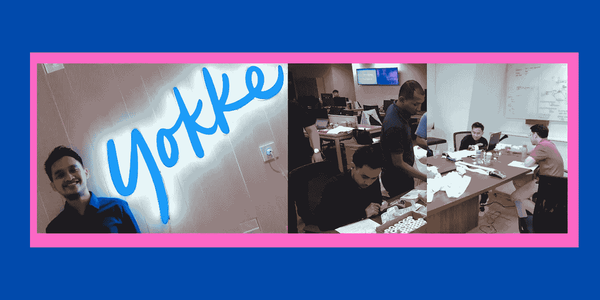
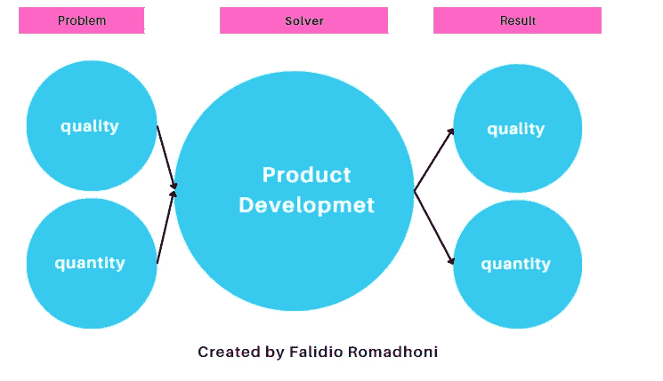
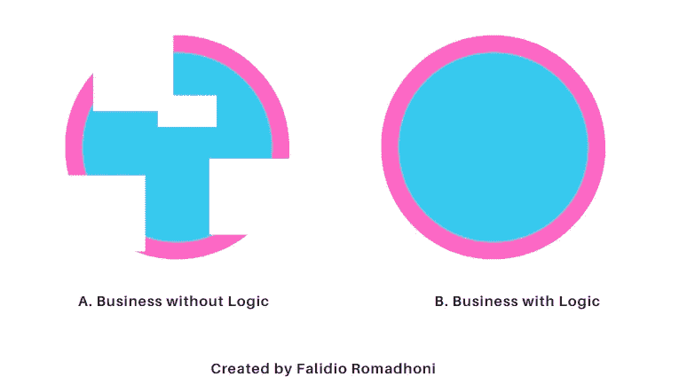
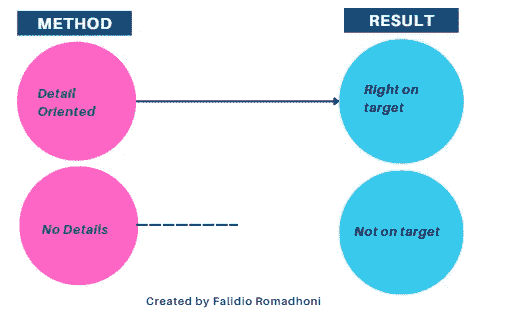
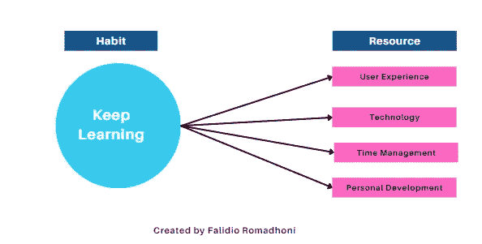

# 金融科技公司产品开发的 5 个宝贵经验

> 原文：<https://medium.com/geekculture/5-valuable-lessons-as-product-development-at-fintech-company-82298a7cd02a?source=collection_archive---------11----------------------->

## #审计

在进入一家[农业技术公司的 B2B 世界之前，](https://avericoco.com/index.html)我曾经在一家金融技术公司，即 [Yokke](https://www.yokke.co.id/id/kategori-produk/payment) 担任产品开发，其商业模式是轻松的线下和线上支付。使用 EDC 或电子商务网关进行综合支付。

Picture by [Me](https://www.canva.com/design/DAD0ogiOV8k/ZsBgqhG6YwiHFqW3XmzrdA/edit)

在产品开发的位置上，有精神锻造和知识，我得到了可以用于业务流程活动，但也用于日常生活。

# 1.灵活性

> 30 岁之前，跟着人走。去小公司。正常在大公司，学加工挺好的。你是一台大机器的一部分。但当你去一家小公司时，你会学到激情。你了解这些梦。你学会了如何同时做很多事情。“——马云

你熟悉上面的引语吗？是的，我做了同样的事情。

> **发生了什么？**

一切都乱了！我在产品开发部门的上司希望我充满活力，适应性强。

> **为什么？**

1.  你必须适应不同的部门和部门。
2.  你必须倾听并根据用户的期望完成目标。
3.  你必须愿意在某个时间完成工作规范，这个时间是变化的。

> ***影响:必须理解业务流程，沟通必须详细清晰，必须满足用户期望等等。***

如果反映到日常生活的世界中，就会形成如下这样的框架:

Created by [me](https://www.canva.com/design/DAFQKLv6Y_U/ef_C70Nflg5KOk52LOhl4w/edit) via [canva](https://www.canva.com/design/DAFQKLv6Y_U/ef_C70Nflg5KOk52LOhl4w/edit)

每天肯定都有障碍，无论是生活质量还是结果不如预期。没有没有阻碍的生活，比如，生活在不稳定的状态中。对于解决障碍的灵活性，可以控制的一部分是你自己。换句话说，你要么抱怨现状，要么下定决心去得到你期望的情况。

# 2.使用逻辑

> 你没有逻辑！你是商人。你得运用你的逻辑和商业。“雷纳迪·克里斯托珀先生

我时不时会被吼，因为我经常写下没有使用逻辑的需求，这给人的印象是它们不合适和不完整。所以基本上，逻辑和业务是一组不可分割的过程。

Created by [me](https://www.canva.com/design/DAFQKLv6Y_U/ef_C70Nflg5KOk52LOhl4w/edit) via [canva](https://www.canva.com/design/DAFQKLv6Y_U/ef_C70Nflg5KOk52LOhl4w/edit)

# 3.聚焦细节

我是那种不喜欢细节的人，即使这样做会带来坏运气。当在一个小时内完成一项任务时，在收集前 15 分钟检查一遍是至关重要的，比如标点符号、段落中断、目的的清晰性、相关性的影响，以及为什么这是必要的和为什么是现在。我花了很多时间写论文，但是因为什么原因我一直在修改它？由于缺乏细节。

1.  这是你在邮件正文中提供产品的时候
2.  为会影响 0%参与度的不当促销创建 Instagram 订阅源。
3.  同样，当发送简历，但电子邮件的正文不匹配，它将被删除。
4.  直到你想签合同但合同还没有最终格式的时候，就没有交易价值了。

所以，启动指标详细描述一切。

Created by [me](https://www.canva.com/design/DAFQKLv6Y_U/ef_C70Nflg5KOk52LOhl4w/edit) via [canva](https://www.canva.com/design/DAFQKLv6Y_U/ef_C70Nflg5KOk52LOhl4w/edit)

# 4.审计

产品开发处在发现、听取和处理用户投诉或业务流程参与者的最前沿，无论是一个单独的部门还是一个小组。
遗憾的是，如果只是寻找、倾听、处理用户问题而没有重新评估，会造成误解。当在维修文档中书写或重写导致缺乏纹理和缺乏对用户自己发生的问题的意识时，也会发生这种情况。

Picture by [Sebastian](https://www.pexels.com/id-id/foto/batang-korek-api-menyala-di-permukaan-kayu-coklat-750225/) via [Pexels](https://www.pexels.com/id-id/foto/batang-korek-api-menyala-di-permukaan-kayu-coklat-750225/)

这显然是一个危险，因为如果用户和产品开发不重新评估，就不会有达成预期产品或过程的协议。

# 5.不断学习

根据情况不断改进和发展形成了一个必须不断学习的人。你不能只是坐在那里等待指示而不采取主动..

Photo by [me](https://www.canva.com/design/DAFQKLv6Y_U/ef_C70Nflg5KOk52LOhl4w/edit) via [canva](https://www.canva.com/design/DAFQKLv6Y_U/ef_C70Nflg5KOk52LOhl4w/edit)

作为一个人，不仅要不断学习学业成绩，因为在产品开发中，你可以学到很多东西:

1.  **用户体验**:能够跨部门、跨部门理解厂商的个人能力。
2.  **技术:**你将获得技术、业务流程开发和管理方面的最新趋势。
3.  时间管理:不仅要与内部客户打交道，还要与外部客户打交道，除此之外，你还要学习如何在有限的时间管理下提高效率，比如尽量减少会议、转换活动和管理优先级。
4.  **个人发展**:但是，这个点必须在沟通、思维方式，甚至领导力上成长发展，有意识地对增加个人加值变量有重要作用。

# 结论

对我来说，产品开发这个职位不在于职位本身，而在于对业务流程本身产生影响的价值。从产品开发岗位塑造我的重要经验包括:

1.  **灵活性**
2.  **使用逻辑**
3.  **面向细节**
4.  **审计**
5.  **继续学习**

读者怎么样，你有和产品开发一样的经历吗？