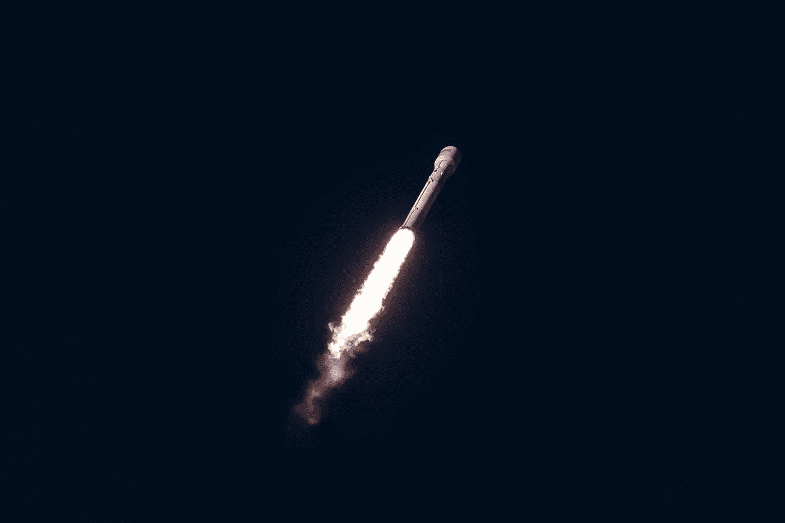
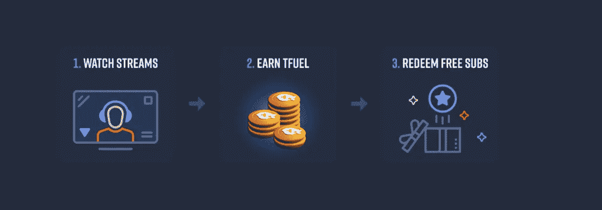
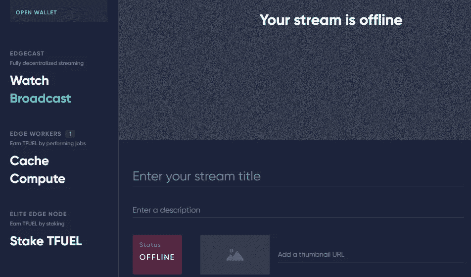

# 无需任何投资就能获得 Theta Fuel 的 5 种方法

> 原文：<https://medium.com/geekculture/5-ways-to-earn-theta-fuel-without-any-investment-eca1dcd24238?source=collection_archive---------2----------------------->

## 你可以用你的电脑或笔记本电脑来赚取燃油

Photo by [SpaceX](https://unsplash.com/@spacex?utm_source=unsplash&utm_medium=referral&utm_content=creditCopyText) on [Unsplash](https://unsplash.com/s/photos/rocket-fuel?utm_source=unsplash&utm_medium=referral&utm_content=creditCopyText)

θ网络是目前最有前途的加密项目之一。它有许多大公司作为合作伙伴，并得到了知名专业人士的认可。自从它推出 Mainnet 3.0 以来，这是 Theta Network 作为一个分散式流媒体平台的巨大进步，它允许拥有 Theta Fuel 的人入股并赚取更多。

## TFUEL 是什么？

TFUEL 是 Theta 网络生态系统中 THETA 令牌的交易令牌，就像 Gas 是以太坊区块链上以太的交易令牌一样。

## 创建 Theta 钱包

如果你想赚 TFUEL，而你还没有钱包，你可以在这里创建一个[。](https://wallet.thetatoken.org/create)

在最新的大更新后，你可以购买至少 10.000 TFUEL，并通过下注获得更多 TFUEL。目前你能下注的最低金额是 10.000 英镑。

如果您不想进行任何购买，您仍然可以使用以下方法免费获得 TFUEL:

# 1.观看 Theta 上的直播频道。电视

请注意这一点！当你在 [Theta 上观看直播时。电视](https://www.theta.tv/)，你看到的不是一个简单的流媒体频道，而是一个提供目前最高视频质量的频道，没有缓冲中断，因为不需要缓冲。原因是平台完全去中心化。

Image is taken from [theta.tv](http://theta.tv)

除了享受完整的质量，你每天只需通过观看频道就能赚到 TFUEL，你将能够使用累积的货币来捐赠或赞助你最喜欢的频道或兑换免费的 subs。如果你不愿意，你可以不这样做。

你可以不断积累 TFUEL，直到你可以用它做更好的事情，谁知道你将来能用它做什么，比如把它花在 TFUEL 商店，或者当它的市场价值上升时你可以卖掉它。

# 2.使用 Theta 的推荐程序。电视

你可以通过邀请其他人加入 Theta 流媒体网络来免费赚取 TFUEL，但是要能够做到这一点是有条件的。在你开始赚钱之前，你需要有 40 个推荐。每个月的收入可能会有所不同，也不一定都是总收入。

# 3.在计算机上运行 Theta 边节点

Theta Edge Node 是一个应用程序，您可以下载并安装在您的计算机或笔记本电脑上，在这里，您可以使用上面提到的所有选项来上传视频和广播，还可以使用其他功能来帮助您赚取更多的 TFUEL。

Image caption from the Theta Edge Node

如果你让θ边节点在你的电脑上打开，它将为你赢得 TFUEL。它将自动执行不同的任务，如视频编码作业，或网络缓存作业。事实上，这就是网络是如何被用户驱动的。

您可以选择 3 种级别的处理能力，每一种都或多或少地使用您的计算机:轻度、中度和重度。

# 4.使用 Edgecast 成为内容创作者

你可以自己成为一个流浪儿，从捐款中获得 TFUEL。你需要上面提到的 Theta 边节点。在这个应用程序中，您有广播选项，允许您流式传输。那些已经在 Twitch 等平台上进行流媒体传输的人可能已经熟悉了直播所需做的事情。

一些尝试过 Edgecast 上线的人说这并不容易。我自己试过，让它工作并不是什么大不了的事情，尤其是如果你以前流过数据的话。我是用 [OBS Studio](https://obsproject.com/) 做的，Theta 网推荐的 app，我是流媒体新手。

你也有机会上传视频，就像在 YouTube 上一样。记住你需要一个钱包来接收观众的捐款。

# 5.注意西塔上的空投。电视

空投是限时优惠或礼品，被送到 THETA 的库存。电视账户。当你收到它们时，你需要意识到并收集奖品。如果您想获得通知，可以在手机上下载[官方 app](https://play.google.com/store/apps/details?id=tv.sliver.android) 。奖品可能包括燃料，但也可能有其他惊喜。