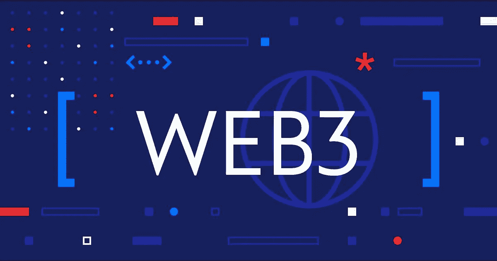

# 五大热门 Web3 开发技能

> 原文：<https://medium.com/geekculture/5-web3-developer-skills-you-should-learn-a210b9f30604?source=collection_archive---------5----------------------->

## 遵循这五个技巧来学习如何成为一名 Web3 开发者

Image by Author

毫无疑问，网络商务的新化身 Web3 将会给网络商务留下不可磨灭的印记。但是，[web 3](https://coursesity.com/blog/what-is-web3/)是什么？众所周知，区块链是加密货币的标志，而 Web3 是两者的产物。Web3 开发者开发的应用不依赖于单个云服务器，而是分布在一个分散的 P2P 网络或不受集中控制的区块链上。

我确信 Web3 会变得非常受欢迎是不足为奇的，因为它主要关注隐私和所有权。因此，本文将讨论你需要学习的关于 Web3 的技能。

# 1.区块链

要成为 web3 开发者，首先要了解区块链。记住这是最关键的一步。借助区块链，你可以轻松构建和优化智能合约。对于那些不知道区块链是什么的人来说，它是一个共享的、不可变的账本，用于商业网络中记录交易和跟踪资产。有形资产可以是看得见的(如房子、汽车、现金、土地)，也可以是无形资产，如知识产权(如专利、版权、品牌)。数据以块的形式存储，因此得名区块链。

Photo by [Hitesh Choudhary](https://unsplash.com/@hiteshchoudhary?utm_source=medium&utm_medium=referral) on [Unsplash](https://unsplash.com?utm_source=medium&utm_medium=referral)

# 2.以太坊基础

就像区块链一样，以太坊基础知识对学习 Web3 也很重要。本质上，以太坊是一个用于处理智能合约的区块链。在 2022 年最受欢迎的创建智能合约的区块链中，以太坊无疑是最受欢迎的。它使用 Solidity 作为其开发智能合同的编程语言。

# 3.分散式应用程序

DApps 或分散式应用程序是建立在区块链之上的应用程序。DApps 中使用的主要技术有:

*   **前端:** JS 框架像 React，Svelte，Vue
*   **后端:**以太坊和坚固，或者铁锈和索拉纳

DApps 用于托管、记录和支付等行业。让我们稍微详细地讨论一下每一点。首先说一下代管。在买卖房子时，很大程度上取决于是否相信买方会按时付款或把钱交给第三方保管。但是，如果买家不付款，或者第三方携款跑路怎么办？DApps 是这个问题的解决方案。使用 DApps 可以安全地转移资金。

其次，我们来谈谈记录。一旦添加到区块链中，就无法编辑或删除某些内容。因此，DApps 有助于跟踪房屋记录、医疗记录等。

最后，我们来谈谈支付。有可能使用加密货币容易且安全地转移价值。

# 4.智能合同

Photo by [Pierre Borthiry](https://unsplash.com/@peiobty?utm_source=medium&utm_medium=referral) on [Unsplash](https://unsplash.com?utm_source=medium&utm_medium=referral)

当谈到智能合同时，这些是区块链上执行合同的不可改变的代码。这些类似于 JavaScript 中的类，DApps 依赖于它们。因此，学习如何创建智能合同与理解概念一样重要。因此，坚固性在这里起着关键作用。它是一种面向对象的高级编程语言，主要用于构建智能合约。

# 5.前端 Web 开发基础

虽然 DApps 使用区块链技术作为后端，但是他们的前端是 JavaScript。以下是你应该知道的事情:

*   常见的 HTML 标签
*   基本 CSS 属性，Flex，Grid。
*   JavaScript 变量、函数、类、ES6 等。
*   重要的 JS 框架如 Vue、Svelte、React。
*   还可以学习类似 Bootstrap、语义 UI、Tailwind 等 CSS 框架。(可选)

这就是全部了！我希望你喜欢 Web3 上的这篇文章。如果你热衷于学习 Web3，请遵循这 5 个技巧。有了适量的奉献，你很快就会到达那里！