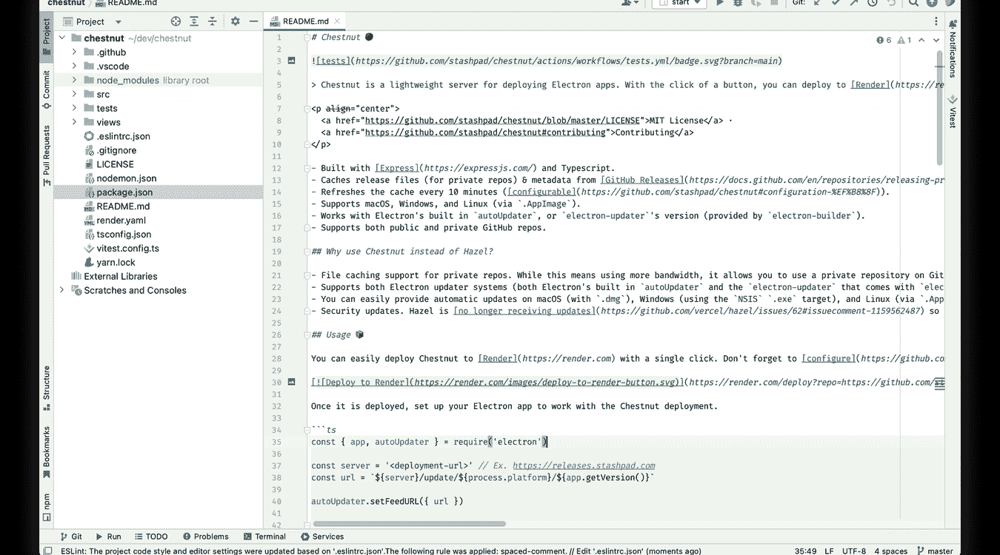
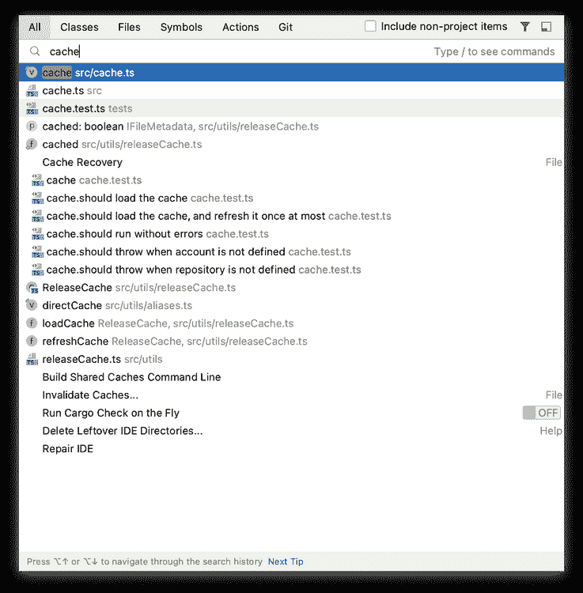
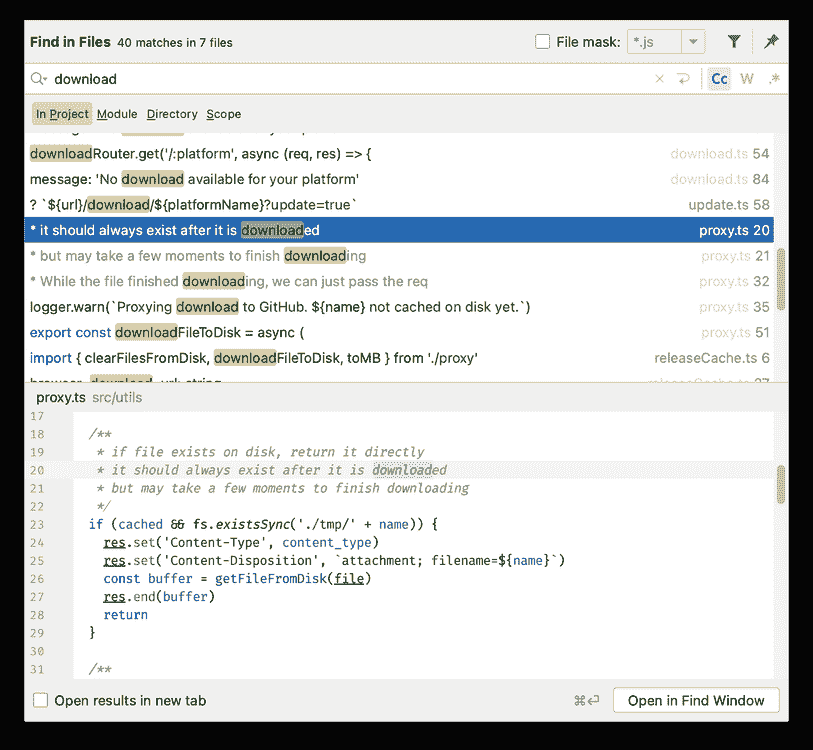

# 没有 5 个 WebStorm 快捷方式我就无法编写 JavaScript

> 原文：<https://medium.com/geekculture/5-webstorm-shortcuts-i-cant-write-javascript-without-8d82e0bf6896?source=collection_archive---------11----------------------->

当你写代码时，没有什么比打破流程开始点击不同的标签来找到你需要的东西更糟糕的了。使用键盘快捷键可以帮助你移动得更快，保持流畅，但是掌握无数的快捷键会有很大的开销。我发现这是在使用 JetBrains 的 JavaScript IDE web storm 时保持心流的五个最有效的键盘快捷键。

# TL；博士:

*   `Shift + Shift` -到处搜索，做任何事
*   `Cmd + [`和`Cmd + ]` -浏览光标的位置历史
*   `Shift + Enter` -换行而不必在行尾
*   `Cmd + Shift + F` -在项目中查找文本
*   中键单击—转到定义/显示用法

# ILTR(我喜欢阅读):

# `Shift + Shift` -到处搜索

这个快捷键打开了“到处搜索”模式，你可以把它想象成你键盘上的一把瑞士军刀。在这个模式中，你可以找到任何东西，并执行 WebStorm 能够执行的任何操作，只需输入你想要的内容。

在“到处搜索”模式的顶部有六个标签，指示可以用来缩小搜索范围的项目类别。第一个标签页，也是你第一次打开模态的时候进入的标签页，是“全部”。当您在这个选项卡中键入您要查找的内容时，列表中会填充您的项目中与您的查询匹配或接近匹配的任何内容—类、变量、文件、目录—全都在那里。在我自己的工作中，我最常使用它在文件间导航；我将点击`Shift + Shift`，开始输入文件名，通常在三到四个字符内输入 my file(或 class/function/等),而不是用鼠标在项目树中寻找文件。我在那个文件中寻找的)在顶部被选中，点击`Enter`将把我带到我需要的地方。

如果您正在专门查找类、文件或符号，您可以使用`Tab`或`Shift + Tab`在选项卡之间切换，并根据类型缩小搜索范围。当我不知道或者只是不记得键盘快捷键时，我喜欢使用“动作”标签。在该选项卡中，您可以找到 IDE 能够执行任何操作。如果指定了快捷键，动作会和快捷键一起显示，你甚至可以方便地指定快捷键，而不用离开“到处搜索”模式。

# `Cmd + [`和`Cmd + ]` -后退和前进导航

当你工作时，WebStorm 会在一个非常方便的导航历史中跟踪光标所到之处，你可以使用`Cmd + [`和`Cmd + ]`在历史中来回跳转。例如，将光标放在一个新文件中并创建一个类。然后打开一个现有文件，对顶部的导入进行一些更改，然后向下滚动到底部并添加一个新函数。如果你想快速回到你创建的新文件，你可以点击`Cmd + [`两次，WebStorm 会带你回到你离开那个文件的地方，必要时重新打开它。再快速点击两次`Cmd + ]`，你就会回到创建函数的另一个文件的底部。

WebStorm 在区分有用位置和单个光标位置方面做得非常好；因此，当您键入时，光标在每个字符后的位置不会添加到历史记录中，光标在箭头键上的短暂移动也不会添加到历史记录中。我发现这非常有用，因为我正在处理一个涉及几个不同文件中几个不同位置的任务，特别是如果没有屏幕空间来一次显示所有内容的话。

# `Shift + Enter` -任何地方的换行符

这个真的很简单，但是我经常用*。我工作中的一个常见场景是，我编辑了一些代码，将光标放在代码行中间的某个地方，我想添加一个新行。与其跳到行尾按下`Enter`，`Shift + Enter`会添加一个新行，并一次将光标下移。*

*我还映射了`⌥ + Shift + Enter`以在当前行前添加一个新行*并将光标移动到那里。虽然我不经常使用它，但在我决定要向刚刚编写或编辑的代码添加注释或文档行的情况下，这是一个特别有用的方法。**

# *`Cmd + Shift + F` -在文件中查找*

**

*这种方法在功能上与“到处搜索”有点重叠，因为使用这两种方法都可以找到很多东西，但是在决定使用哪种方法时有两个关键的区别。首先，`Cmd + Shift + F`本质上是对整个项目进行强大的字符串搜索；因此，如果你正在寻找一个命名变量或存在于注释或实际字符串变量中的特定文本，这就是你需要使用的，因为它很可能不会出现在“到处搜索”的结果中。第二，模态界面是一个拆分视图，上半部分显示结果列表，下半部分是一个打开到包含当前所选结果的文件的编辑器，突出显示包含匹配文本的行。拥有大约 20 行代码的额外上下文对于准确定位您正在寻找的内容非常有用，并且由于下半部分是一个成熟的编辑器，所以进行快速更改轻而易举。*

# *中键单击—转到定义/显示用法*

*虽然从技术上来说不是键盘快捷键，但我还是把中键列在了这个列表中，因为我几乎和实际的键盘快捷键一样经常使用中键，这也是我实际使用鼠标的主要原因之一。在 WebStorm 中点击鼠标中键(点击鼠标滚轮)，例如一个变量名称，将把你带到该变量的定义，或者如果你在变量定义上点击鼠标中键，将弹出一个使用该变量的位置列表。如果变量只在一个地方使用，WebStorm 只会带你去那里，而不是弹出列表。*

*这个功能适用于*的一切*。所以如果你遇到变量/字符串/函数调用/类实例化/库导入/等等。并且你不确定它是什么，中击它总是一个开始挖掘更多信息的好地方。*

*在我的工作中，我经常将中击键与`Cmd + [`和`Cmd + ]`导航快捷键结合使用。一个典型的用例是，我点击几次鼠标中键，找到我需要引用的几个文件，使用`Cmd + [`导航回我的起点，然后我就出发去比赛了。*

*—*

*我希望您觉得这很有用，并希望了解哪些键盘快捷键对您的工作流程至关重要。感谢阅读。*