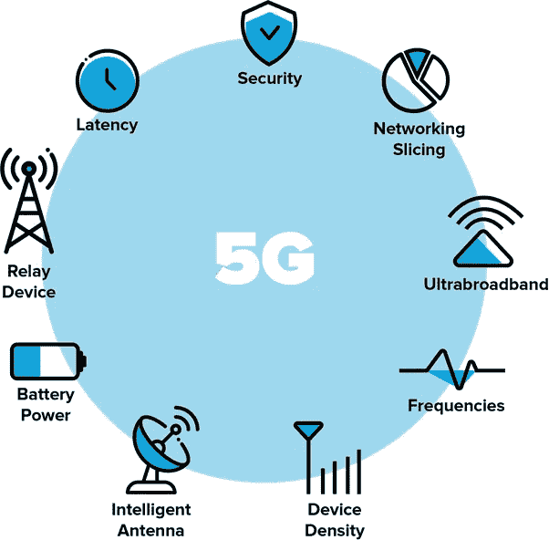

# 5G 改变教育格局

> 原文：<https://medium.com/geekculture/5g-transforming-the-education-landscape-776095ed8414?source=collection_archive---------0----------------------->

## 新兴的移动技术 5G 将改变你的学习方式

在过去的几年里，由于 4G 互联网，我们已经见证了高速数据的广泛使用。随着第五代移动技术(5G)的出现，这将进一步实现更高的带宽和更高的速度。5G 技术将比 3G 和 4G 更彻底地改变数字世界。

> 下一个可能改变整个行业和工作场所的颠覆性浪潮将是 5G。

21 世纪，信息和通信技术(ICT)的革命也推动了教育技术(EdTech)的巨大进步。今天，教育技术的发展对教育服务产生了积极的影响；无论是正规教育、远程教育、电子学习、MOOCs、成人教育还是终身学习。随着 5G 网络的到来，这些教育领域有望通过包括 AR/VR 在内的高视听内容变得生动起来。

> 5G 网络的三个独特特征是(I)无处不在的接入，(ii)难以置信的低延迟，以及(iii)极高速度的数据传输。5G 网络将实现巨大的互联网流量和大量的宽带链接。

不同的数据流量要求具有不同的服务质量(QoS)要求。5G 移动网络的目标是解决以前无线标准(2G、3G、4G)的限制，并成为物联网未来的主要推动者。

**什么是 5G 技术？**

5G 是第五代无线技术。这是世界上有史以来最快、最强大的技术之一。

无线技术的根源可以追溯到 20 世纪 80 年代。后来，多年的进步推出了电子邮件、浏览和视频通话等项目。5G 从 4G 手中接过了接力棒，并进一步加强了传递。没有任何滞后或故障，5G 为消费者提供了更快、更稳定和更好的技术。

## **5G——一些优势和挑战**

5G 网络支持各种各样的技术，如智能家居、自动驾驶汽车、无人机飞行、健康和关键任务应用、工业物联网和娱乐及多媒体。根据最终用户的体验，几个 5G 网络被分为交互式 5G 服务、直观 5G 服务、无处不在的 5G 服务、自主 5G 服务和公共 5G 服务。

快速的技术进步对高等教育领域产生了重大影响。因此，随着全球化趋势的变化，教育的变化也在发生变化。电子学习是一种影响国家教育界的现象，如 5G 连接。然而，在发达国家，它早已成为一种应用，因为它被认为能够在教学和学习会话中具有不同的优势。

还发现了一些挑战，如 5G 基础设施开发或适应现有蜂窝基础设施的高成本，由于不兼容的电池技术进步，5G 设备上的高电池消耗，短波引起的范围问题等。然而，随着系统变得越来越完善，这些最初的缺点和挑战可以得到纠正。

## **5G 对高等教育机构的影响**

5G 对高等教育的影响可能是增强现实(AR)和虚拟现实(VR)的沉浸式课程混合现实内容和视频需要高带宽和低延迟的最佳输出。延迟是指一组数据在两点之间传递所花费的时间。类似地，相对于 4G，5G 预计将延迟降低到几毫秒(ms)，延迟时间为 50 到 80 毫秒(ms)。虚拟现实/增强现实、远程医疗和远程手术等新服务需要低延迟；在某些情况下，不超过 1 毫秒的延迟至关重要。因此，5G 网络的体验将是流畅和无缝的。学生可以通过人体在 VR 中游览或参观其他星球。在 AR 的帮助下，他们甚至可以通过触摸、挤压和缩放来探索地球的各个层面，他们可以像想象的那样轻松地发现想法。虚拟教室的概念可以通过使用高性能 AR 和 VR 技术的 5G 技术得到增强。

另外，另一个领域是通过 5G 实现的 AR/VR 应用进行音乐教育。音乐意味着共享多媒体信息，至少以高质量音频流的形式，以促进技术应用。本质上，网络音乐教育对网络特征施加了一系列限制，除此之外，AR/VR 方法还结合了其他信息层。

***智慧课堂:*** 物联网为老师节省时间。即使一切运行良好，也需要时间来设置设备并在课堂上接受评论。通过 5G 上的物联网(IoT)，教师只要一到达教室就可以自动登录。随着 5G 更高带宽的推出，手动管理活动实现了自动化，学生可以在线提供评论。在整个讲座和演示过程中，更高的带宽可以帮助信号保持稳定，避免间歇性掉线和注意力分散。

***秒下载视频*** *:* 新一代喜欢视频，由于 YouTube 也是他们最喜欢的教育资源，这是有道理的。目前，在 4G 网络上下载一个高清视频需要几分钟到几小时。然而，随着 5G 的推出，下载一个正片长度的视频将需要几秒钟，也许更短。5G 支持 20 Gbps 或以上的网络速度，例如，允许用户在几秒钟内下载全高清(HD)电影和高分辨率(8K)视频流。

***为能力不同的学生提供更多的帮助* :** 有特殊需要的学生需要更多的帮助，因为他们需要老师更经常或全职的帮助。为了帮助解决问题，有机器人应用程序，但它们不像它们应该帮助的孩子那样敏感。通过自动响应以帮助学习课程，5G 将鼓励机器人成为全职助手并支持教师。

***更适应的学习* :** 每个学生的学习风格和能力都不一样。5G 将使学生能够在学校继续学习，为他们的手机或笔记本电脑提供与课堂上相同的数据水平和响应能力。无论距离或位置如何，5G 都鼓励学习者访问与同龄人相同的数据和活动。

***使软件工程师能够更好地构建教育应用:***5G 技术在教育领域的应用将使开发人员能够构建需要低延迟和更快信息处理的应用。因此，通过使用 5G，软件工程师将在各种背景下不受限制地扩展他们所有的专业领域。

***启用触觉叠加:*** 低延迟触觉互联网可以通过教师和学习者的触觉叠加来鼓励远程学习和学校教育。触觉互联网意味着具有极高可用性、可靠性和安全性的超低延迟。对于这些相同的多模态人机界面，可感知的视觉、听觉和触觉交互允许 5-10 毫秒的往返延迟。触觉互联网将允许从遥远的地方演奏乐器。

***全息讲师成为现实* :** 在 5G 智能教室中，可以使用全息讲师，他将引导专业主题的对话；无缝增强现实环境可以帮助更好地吸引具有不同学习需求的学生，或者互联技术可以帮助缩小国际学生的教育障碍。

**结论**

所有这些改善不会马上发生。许多教育科技公司已经开始开发应用和资源，以利用 5G 新兴技术实现智能教室、全息教学机器人和广泛的基于 AR/VR 的数字教学学习方法。然而，智能手机和其他能够使用 5G 网络的数字设备以及超高速的实现仍然需要几年的时间。为了成为主要的无线基础设施，4G 花了 10 年时间，5G 可能需要更长的时间。但是一旦它完全到位，它将真正改变我们学习和教学的方式。

— — —

图片来源:谷歌图片