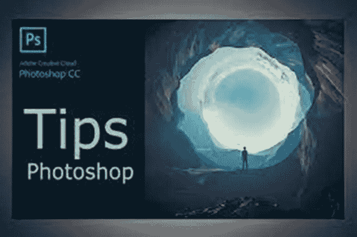

# 适用于初学者的 6 个 Adobe Photoshop 技巧和窍门

> 原文：<https://medium.com/geekculture/6-adobe-photoshop-tips-and-tricks-for-beginners-852910907249?source=collection_archive---------17----------------------->

如果您是 Adobe Photoshop 的新手，您可能会对屏幕上显示的大量面板、图标和工具感到有点不知所措。Adobe 创造了一些市场上最强大和复杂的软件，Photoshop 也不例外。但是，不要气馁！通过一点实践和耐心，您将能够掌握这一行业领先计划的基础知识。

