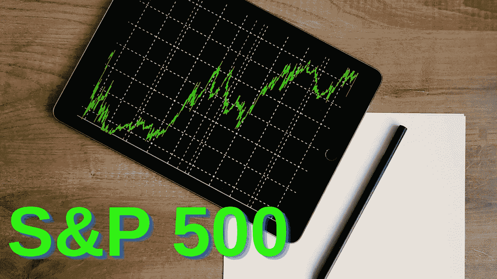

# 2022 年投资 6 只最佳标准普尔 500 ETF？

> 原文：<https://medium.com/geekculture/6-best-s-p-500-etfs-to-invest-in-2022-6ae2f8266f2b?source=collection_archive---------12----------------------->

Photo by [Burak Kebapci](https://www.pexels.com/@weekendplayer?utm_content=attributionCopyText&utm_medium=referral&utm_source=pexels) from [Pexels](https://www.pexels.com/photo/graphs-display-on-an-ipad-187041/?utm_content=attributionCopyText&utm_medium=referral&utm_source=pexels) and edited by the author on Canva

你如何开始投资股票市场？你可能听说过很多关于股票市场的事情，但却不知道如何或从哪里开始。投资股市似乎有风险，你不知道哪些公司可能适合。范围广泛的标准普尔 500 交易所交易基金可能会让你感兴趣，尤其是如果你是投资新手，并希望分散你的投资组合。