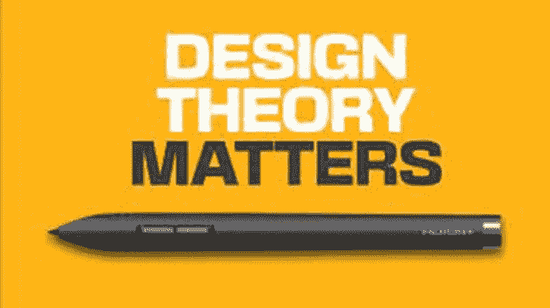

# 学习平面设计的 6 个最佳理论

> 原文：<https://medium.com/geekculture/6-best-theory-to-learn-graphic-design-ae41e63e6b3c?source=collection_archive---------16----------------------->

## 查看我们的理论部分开始吧！我们涵盖了设计和色彩理论的基础，这样你就可以开始创造美丽的设计！

平面设计是使用一种或多种印刷、摄影和插图进行视觉交流和解决问题的过程。该字段被视为…的子集