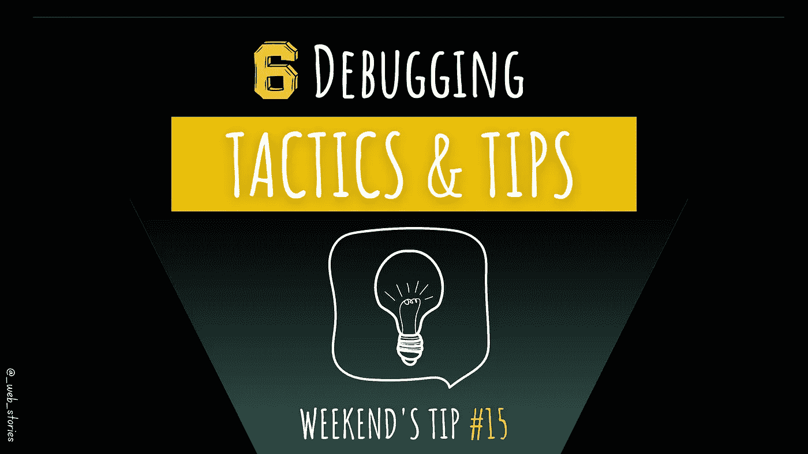

# 6 调试策略

> 原文：<https://medium.com/geekculture/6-debugging-tactics-f2546647b20e?source=collection_archive---------8----------------------->

## 不调试就不能编码

By FAM

## 你好👋

调试是开发过程的一部分。没有调试，就不可能编码。要想在编码任务中取得成功，锻炼肌肉是必不可少的。

本文收集了调试代码的最有效策略！

# 1 个控制台