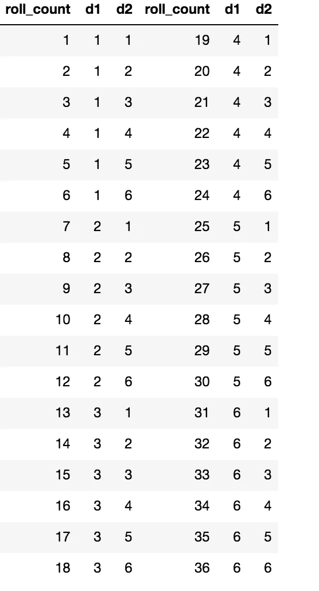
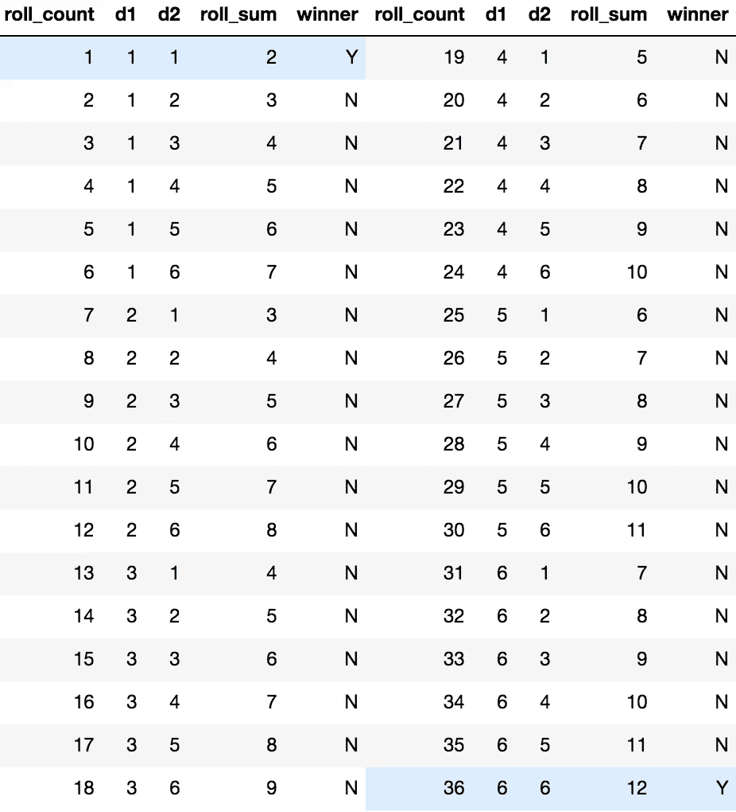
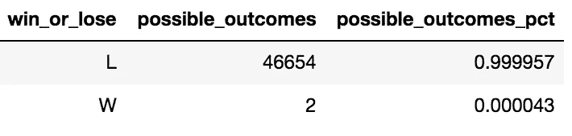

# 6 个骰子，1 次掷骰，1 或 36 的总和=大奖

> 原文：<https://medium.com/geekculture/6-dice-1-roll-sum-of-1-or-36-grand-prize-408eadb1403b?source=collection_archive---------25----------------------->

## 不要落入这个陷阱

Photo by Guillermo Velarde via Unsplash

当我还是一个年轻小伙子并开始收集运动卡时，我在一个购物中心的小亭子里遇到了一个人，他提供了一个赢得当时价值约 400-500 美元(90 年代中期)的棒球卡的机会。实际上，有两张价值差不多的卡片，都很难被偶然发现。试图赢得这些奖品的成本仅为 1 美元。

规则很简单:你掷出 6 个骰子。如果所有骰子的总和是 6，您将获得一份价值极高的奖品。如果骰子的总数是 36，你会得到另一个！

你说得太对了，我试了几次。我带走了一些超级便宜的安慰奖。奖品是根据骰子的总数给出的，更普遍的预期是价值几分的卡片。

## 概率是多少？

概率被定义为一个事件可能发生的程度，用有利情况与所有可能情况的比率来衡量。

超级简单的案例:你有一个公平的双面硬币。你有 0.5 或 50%的机会抛硬币正面着地，就像你有 50%的机会反面着地一样。

## 总计 6 或 36

赢得这些超级惊喜大奖的几率有多大？23328 个中的 1 个！

回想起来，我会说这可能不是最明智的投资。

## 我们如何得到这个答案？第一部分

首先，我们来看看两个骰子。每个骰子有 6 个面。考虑这一点的一种方法是，每行有两个值为 1–6 的列，然后使用 SQL 交叉连接。这是因为第一个骰子可以是 1，第二个骰子可以是 1–6，或者第一个骰子可以是 2，第二个骰子可以是 1–6，依此类推。

下面显示了掷出两个骰子的结果的可能组合。

Photo by Author

让我们设计一个类似的问题，但是只用两个骰子而不是六个。掷出两个骰子，它们的和不是 2 就是 12 的概率是多少？

Photo by Author

从这幅图中，我们可以看到 36 个组合中有 2 个获胜组合，或者说大约有 5.56%的获胜几率。

## 我们如何得到这个答案？第二部分

本质上，对于我们掷骰子中包含的每个骰子，我们能够得到 6 的 n 次方。一个骰子有 6 种可能的结果(6)。两个骰子将有 36 种可能的结果(6)。这可以持续 n 个骰子。

使用数据框架来回答这个问题，为所有六个骰子创建列。得到的数据帧有 46，656 种组合！我们来看看和 6 或者 36 的中奖几率:

Photo by Author

我被骗了！不要犯和我一样的错误。利用数字优势，不要成为一次骗走小孩几美元的人。丢人！

## 愿机会永远对你有利！

概率有许多不同的用途。我想举这个例子来说明编码是回答一些概率问题的一种非常强大的方法。请看一下 [Jupyter 笔记本](https://www.kaggle.com/josephburton06/probability-with-6-dice-in-python)，上面显示了创建数据框架的代码以及一些回答的问题。

我希望这篇文章能帮助人们从不同的角度看待这个问题，并有助于保留更多的概念。我知道在写作的过程中，我提高了自己。请随意查看我的其他文章。请评论或留下你可能有的问题。祝大家学习愉快！