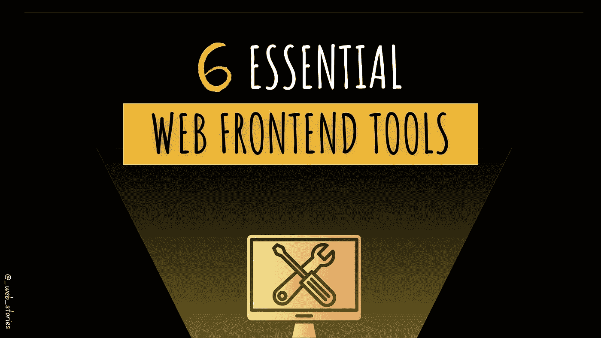

# 6 个基本的前端工具

> 原文：<https://medium.com/geekculture/6-essential-frontend-tools-a95995f85eee?source=collection_archive---------10----------------------->

## 装备好也是保证成功！

By FAM

## 你好👋

在接下来的章节和文章中讨论更高级的主题之前，我们需要做好充分的准备！

## VS 代码(代码编辑器)

对于每个程序员来说，都需要一个编辑代码的工具。对于前端开发人员，最好的…