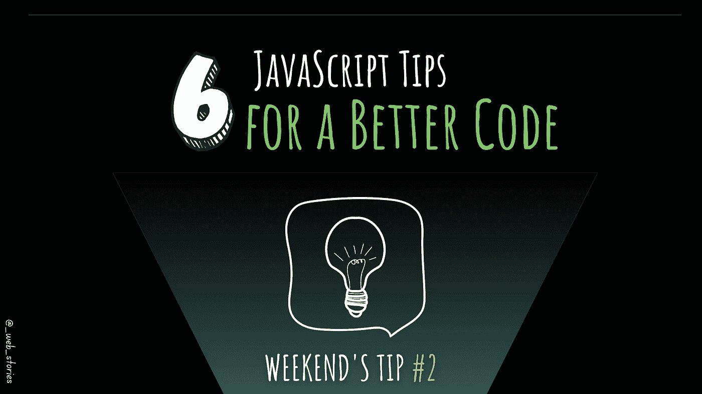

# 提高代码质量的 6 个 JS 技巧

> 原文：<https://medium.com/geekculture/6-js-tips-for-a-better-code-382ea73bee84?source=collection_archive---------5----------------------->

## 周末提示:如何写出更好的 JavaScript 代码？

By FAM

## 你好👋

这个周末的技巧是关于通过在编码时考虑一些基本的事情来编写一个更好的 JS 代码。

开始吧！

# #1-变量的命名

*   变量名应该揭示它的意图