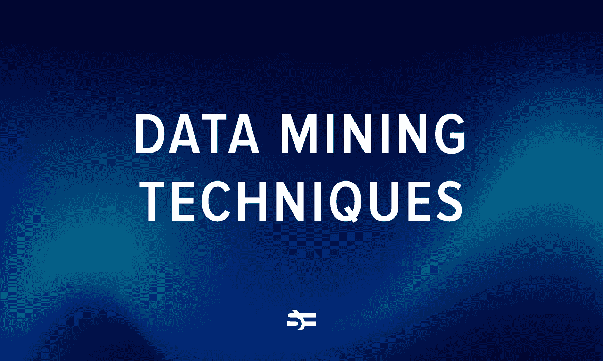

# 6 种关键的数据挖掘技术

> 原文：<https://medium.com/geekculture/6-key-data-mining-techniques-cef5fe7234a?source=collection_archive---------7----------------------->

数据挖掘技术在从商业到科学和治理的所有领域都有应用。公司使用数据挖掘来分析记录的数据，如用户偏好、销售数字和历史库存水平。如果他们能够识别这些数据中的趋势和重复模式，他们就能做出更好的决策。如果管理得当，这些信息可以成为推动品牌认知、产品开发的有效工具